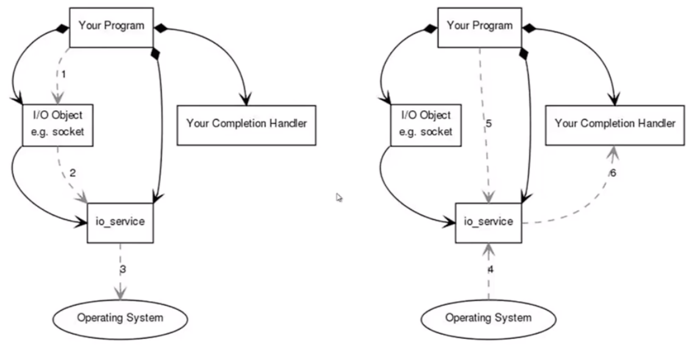

# asio-api
## 基本思想
### 同步编程图解

### 异步编程图解


在异步编程中, 调用完毕后(完成1,2,3), 操作系统完成任务, 会进行4, 当应用程序再次调用某个特定api时(步骤5), 会出发回调, 进行步骤6

## 关于同步异步的测试
``` C++
#include <iostream>
#include <boost/asio.hpp>
#include <boost/date_time/posix_time/posix_time.hpp>

void sync_timer()
{
    boost::asio::io_service io;
    boost::asio::deadline_timer t(io, boost::posix_time::seconds(5));
    t.wait();
    std::cout << "Hello World!" << std::endl;
    return;
}

void callback(const boost::system::error_code&)
{
    std::cout << "Hello World!" << std::endl;
}

void async_timer()
{
    boost::asio::io_service io;
    boost::asio::deadline_timer t(io, boost::posix_time::seconds(5));
    t.async_wait(callback);
    std::cout << "start run" << std::endl;
    io.run();
    std::cout << "finish run" << std::endl;
    return;
}

int main()
{
    std::cout << "start program" << std::endl;
    //sync_timer();
    async_timer();
    return 0;
}
```

在函数async_timer中, 将回调函数给了t, 函数t.async_wait会直接结束, 进入io.run()
在run将阻塞程序, 当t时间到达, 触发时, io.run()才会由于没有注册的事件而退出(唯一注册的t已经触发)
