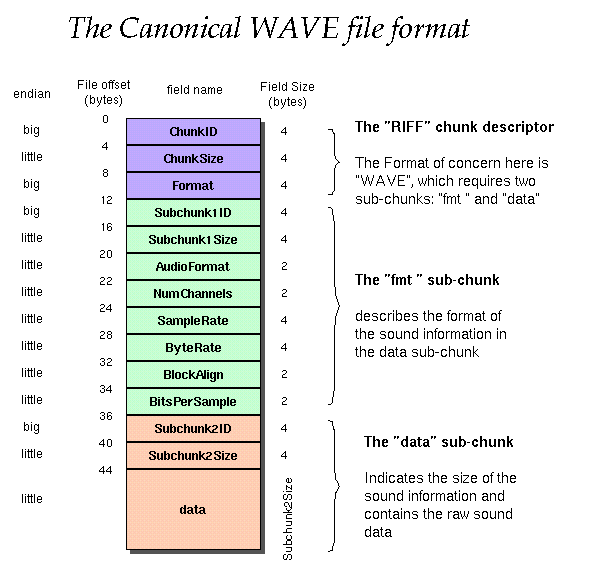

# 解析wav文件
wav文件解析代码参见附件
[WavFileUtils.rar](_v_attachments/20181118205442911_25625/WavFileUtils.rar)

理论基础:
WAV文件是在PC机平台上很常见的、最经典的多媒体音频文件,最早于1991年8月出现在Windows 3.1操作系统上,文件扩展名为WAV,是WaveFom的简写,也称为波形文件,可直接存储声音波形,还原的波形曲线十分逼真。WAV文件格式简称WAV格式是一种存储声音波形的数字音频格式,是由微软公司和IBM联合设计的,经过了多次修订,可用于Windows,Macintosh,Linix等多种操作系统,详述如下。

 

波形文件的基础知识
2.1 波形文件的存储过程

声源发出的声波通过话筒被转换成连续变化的电信号,经过放大、抗混叠滤波后,按固定的频率进行采样,每个样本是在一个采样周期内检测到的电信号幅度值;接下来将其由模拟电信号量化为由二进制数表示的积分值;最后编码并存储为音频流数据。有的应用为了节省存储空间,存储前,还要对采样数据先进行压缩。

2.2 WAV文件的编码

编码包括了两方面内容,一是按一定格式存储数据,二是采用一定的算法压缩数据。WAV格式对音频流的编码没有硬性规定,支持非压缩的PCM(Puls Code Modulation)脉冲编码调制格式,还支持压缩型的微软自适应分脉冲编码调制Microsoft ADPCM(Adaptive Differential Puls Code Modulation)、国际电报联盟(International Telegraph Union)制定的语音压缩标准ITUG.711 a-law、ITU G.711-law、IMA ADPCM、ITU G.723 ADPCM (Yamaha)、GSM 6.10、ITU G.721 ADPCM编码和其它压缩算法。MP3编码同样也可以运用在WAV中,只要安装相应的Decode,就可以播放WAV中的MP3音乐。

 

表 1

块标识(4Bytes)
块长度(4Bytes)
数据
 

表 2 WAVE 文件结构

RIFF 块
文件格式类型“WAVE”
fmt 块
fact 块(压缩编码格式要含有该块)
data 块
 

表 3 WAVE 文件头格式

偏移地址 | 字节数 | 数据类型 | 字段名称 | 字段说明 
-----|------|------|------|------
00H | 	4	 | 字符	| 文档标识	| 大写字符串"RIFF",标明该文件为有效的 RIFF 格式文档。
04H	| 4	| 长整型数	| 文件数据长度 | 从下一个字段首地址开始到文件末尾的总字节数。该字段的数值加 8 为当前文件的实际长度。
08H	| 4	 | 字符 |	文件格式类型	| 所有 WAV 格式的文件此处为字符串"WAVE",标明该文件是 WAV 格式文件。
0CH	| 4	 | 字符 |	格式块标识	| 小写字符串,"fmt "。
10H	| 4	 | 长整型数 |	格式块长度。| 	其数值不确定,取决于编码格式。可以是 16、 18 、20、40 等。(见表 2)
14H	| 2	 | 整型数 |	编码格式代码。| 	常见的 WAV 文件使用 PCM 脉冲编码调制格式,该数值通常为 1。(见表 3)
16H	| 2	 | 整型数 |	声道个数	| 单声道为 1,立体声或双声道为 2
18H	| 4	 | 长整型数 |	采样频率	| 每个声道单位时间采样次数。常用的采样频率有 11025, 22050 和 44100 kHz。
1CH	| 4	| 长整型数 |	数据传输速率 | 该数值为:声道数×采样频率×每样本的数据位数/8。播放软件利用此值可以估计缓冲区的大小。
20H	| 2	| 整型数	| 数据块对齐单位 | 采样帧大小。该数值为:声道数×位数/8。播放软件需要一次处理多个该值大小的字节数据,用该数值调整缓冲区。
22H	| 2	| 整型数	| 采样位数	| 存储每个采样值所用的二进制数位数。常见的位数有 4、8、12、16、24、32
24H	|  |     | 	 	|  	对基本格式块的扩充部分(详见扩展格式块,格式块的扩充)
 

表 4 常见的压缩编码格式

格式代码	格式名称	fmt 块长度	fact 块
1(0x0001)	PCM/非压缩格式	16	 
2(0x0002	Microsoft ADPCM	18	√
3(0x0003)	IEEE float	18	√
6(0x0006)	ITU G.711 a-law	18	√
7(0x0007)	ITU G.711 μ-law	18	√
49(0x0031)	GSM 6.10	20	√
64(0x0040)	ITU G.721 ADPCM	 	√
65,534(0xFFFE)	见子格式块中的编码格式	40	 
 

表5

偏移	长度	数据类型	字段名称	字段说明
24H	2	整型数	扩展区长度	22
26H	2	整型数	有效采样位数	最大值为每个采样字节数*8
28H	4	长整形数	扬声器位置	声道号与扬声器位置映射的二进制掩码
32H	2	整型数	编码格式	真正的编码格式代码
34H	14	 	 	\x00\x00\x00\x00\x10\x00\x80\x00\x00\xAA\x00\x38\x9B\x71
 

表 6 fact 块结构示意图

字段	长度	内容
块标识	4	"fact"
块长度	4	4(最小数值为 4 个字节)
采样总数	4	采样总数 (每个声道)
 

表7

8位PCM

 	样本 1	 	样本 2	 
8 位单声道	0 声道	 	0 声道	 
8 位立体声	0 声道(左)	1 声道(右)	0 声道(左)	1 声道(右)

2.3 PCM编码格式

PCM编码是直接存储声波采样被量化后所产生的非压缩数据,故被视为单纯的无损耗编码格式,其优点是可获得高质量的音频信号。
基于PCM编码的WAV格式是最基本的WAV格式,被声卡直接支持,能直接存储采样的声音数据,所存储的数据能直接通过声卡播放,还原的波形曲线与原始声音波形十分接近,播放的声音质量是一流的,在Windows平台下被支持得最好,常常被用作在其它编码的文件之间转换的中间文件。PCM的缺点是文件体积过大,不适合长时间记录。正因为如此,又出现了多种在PCM编码的基础上经改进发展起来的编码格式,如:DPCM,ADPCM编码等。

2.4 与声音有关的三个参数

(1)采样频率:又称取样频率。是单位时间内的采样次数,决定了数字化音频的质量。采样频率越高,数字化音频的质量越好,还原的波形越完整,播放的声音越真实,当然所占的资源也越多。根据奎特采样定理,要从采样中完全恢复原始信号的波形,采样频率要高于声音中最高频率的两倍。人耳可听到的声音的频率范围是在16Hz-20kHz之间。因此,要将听到的原声音真实地还原出来,采样频率必须大于4 0k H z 。常用的采样频率有8 k H z 、1 1 . 02 5 k H z 、22.05kHz、44.1kHz、48kHz等几种。22.05KHz相当于普通FM广播的音质,44.1KHz理论上可达到CD的音质。对于高于48KHz的采样频率人耳很难分辨,没有实际意义。
(2)采样位数:也叫量化位数(单位:比特),是存储每个采样值所用的二进制位数。采样值反应了声音的波动状态。采样位数决定了量化精度。采样位数越长,量化的精度就越高,还原的波形曲线越真实,产生的量化噪声越小,回放的效果就越逼真。常用的量化位数有4、8、12、16、24。量化位数与声卡的位数和编码有关。如果采用PCM编码同时使用8 位声卡, 可将音频信号幅度从上限到下限化分成256个音量等级,取值范围为0-255;使用16位声卡,可将音频信号幅度划分成了64K个音量等级,取值范围为-32768至32767。
(3)声道数:是使用的声音通道的个数,也是采样时所产生的声音波形的个数。播放声音时,单声道的WAV一般使用一个喇叭发声,立体声的WAV可以使两个喇叭发声。记录声音时,单声道,每次产生一个波形的数据,双声道,每次产生两个波形的数据,所占的存储空间增加一倍。

3 WAV文件结构

在Windows环境下,大部分多媒体文件都是按照资源互换文件格式(Resources lnterchange File Format) 存放信息,简称RIFF格式。构成RIFF文件的基本单位称之为块(chunk)。每个RIFF文档是由若干个块构成。每个块(chunk)由块标识、块长度及数据等三部分所组成,其结构如表1。

其中,块标识保存的是由4个ASCII码字符组成的块名字。如不满4个字符则在右边以空格充填。块长度字段,占4个字节,保存的是当前块数据的长度,不包括块标识和块长度字段。所以一个块的实际长度为块长度字段内的数值加8。RIFF格式规定,只有 RIFF及LIST块可以含有子块,其它的块不允许包含子块。一个RIFF格式文档本身就是一个块。其前4个字节为文档标识“RIFF”,同时也是RIFF的块标识,标明该文档是一个有效的RIFF文档;第二部分为文件的数据长度,占4个字节,其数值为文件长度-8;第三部分为RIFF块数据,其中,前4个字节为文件格式类型标识,如:“WAVE”,“AVI”等,后面其它部分为RIFF块的子块。

WAV文件采用的是RIFF格式结构。至少是由3个块构成,分别是RIFF、fmt 和Data。所有基于压缩编码的WAV文件必须含有fact块。此外所有其它块都是可选的。块fmt,Data及fact均为RIFF块的子块。WAV文件的文件格式类型标识符为“WAVE”。基本结构如表2。

4WAV文件头格式

WAV文件由文件头和数据体两部分组成。其中,文件头是由文件标识字段与格式块两部分组成,后者保存的是编码参数和声音参数,格式如表3。

4.1 扩展格式块

当WAV文件采用非PCM编码时,使用的是扩展格式块,它是在基本格式块fmt之后扩充了一个的数据结构。该结构的前两字节为长度字段,指出后面区域的长度。紧接其后的区域称之为扩展区,含有扩充的格式信息,其长度取决于压缩编码类型。当某种编码格式(如ITU G.711 a-law)使扩展区的长度为0时,长度字段还必须保留,只是长度字段的数值为0。因此,扩展格式块长度的最小值为基本格式块的长度16加2。

4.2 格式块的扩充

当编码格式代码为0xFFFE时,为扩充标识码。此时格式块扩展区长度为24字节,包含了新增的格式字段和真正的编码格式代吗,格式如表5。

4.3 fact块

采用压缩编码(修订版Rev.3以后出现的编码格式)的WAV文件必须有含有fact块。块标识符为“fact”。块长度至少4个字节。目前fact块只有一个数据项,为每个声道采样总数,或采样帧总数。该数值可由data块中的数据长度除以数据块对齐单位的数值计算出。虽然基于压缩编码的文件含有fact块,然而,实测中发现,将文件转换成PCM编码格式后,原fact块仍然存在(如表6)。

5 WAV文件语音数据的组织结构

WAV文件的声音数据保存在数据块中。块标识符为“data”,块长度值为声音数据的长度。从数据块的第9个字符开始是声音波形采样数据。每个样本按采样的时间先后顺序写入。样本的字节数取决于采样位数。对于多字节样本,低位字节数据放在低地址单元,相邻的高位字节数据放在高地址单元。多声道样本数据采用交替方式存储。例如:立体声(双声道)采样值的存储顺序为:通道1第1采样值,通道2第1采样值;通道1第2采
样值,通道2第2采样值;以此类推。基于PCM编码的样本数据排列方式如表7-9。

6 实例分析

 

（1）“52 49 46 46”这个是Ascii字符“RIFF”，这部分是固定格式，表明这是一个WAVE文件头。
（2）“22 60 28 00”，这个是我这个WAV文件的数据大小，这个大小包括除了前面4个字节的所有字节，也就等于文件总字节数减去8。16进制的“22 60 28 00”对应是十进制的“2646050”。
（3）“57 41 56 45 66 6D 74 20”，也是Ascii字符“WAVEfmt”，这部分是固定格式。
以后是PCMWAVEFORMAT部分

（4）“12 00 00 00”，这是一个DWORD，对应数字18，这个对应定义中的PCMWAVEFORMAT部分的大小，可以看到后面的这个段内容正好是18个字节。一般情况下大小为16，此时最后附加信息没有，上面这个文件多了两个字节的附加信息。
（5）“01 00”，这是一个WORD，对应定义为编码格式（WAVE_FORMAT_PCM格式一般用的是这个）。
（6）“01 00”，这是一个WORD，对应数字1，表示声道数为1，是个单声道Wav。
（7）“22 56 00 00”对应数字22050，代表的是采样频率22050，采样率（每秒样本数），表示每个通道的播放速度
（8）“44 AC 00 00”对应数字44100，代表的是每秒的数据量，波形音频数据传送速率，其值为通道数×每秒样本数×每样本的数据位数／8（1*22050*16/8）。播放软件利用此值可以估计缓冲区的大小。
（9）“02 00”对应数字是2，表示块对齐的内容。数据块的调整数（按字节算的），其值为通道数×每样本的数据位值／8。播放软件需要一次处理多个该值大小的字节数据，以便将其值用于缓冲区的调整。
（10）“10 00”数值为16，采样大小为16Bits，每样本的数据位数，表示每个声道中各个样本的数据位数。如果有多个声道，对每个声道而言，样本大小都一样。
（11）“00 00”此处为附加信息（可选），和（4）中的size对应。

（12）“66 61 73 74” Fact是可选字段，一般当wav文件由某些软件转化而成，则包含该项，“04 00 00 00”Fact字段的大小为4字节，“F8 2F 14 00”是fact数据。

（13）“64 61 74 61”，这个是Ascii字符“data”，标示头结束，开始数据区域。
（14）“F0 5F 28 00”十六进制数是“0x285ff0”,对应十进制2646000，是数据区的开头，以后数据总数，看一下前面正好可以看到，文件大小是2646050，从（2）到（13）包括（13）正好是2646050-2646000=50字节。

7 结语

对WAV格式影响最大的参数是编码格式。采用不同的编码的WAV格式是不同的,PCM是最常见的编码格式,其它的为压缩编码格式,一般很少使用,有的已经废弃。随着人们认识的进步可能还会有新的编码格式出现。今后对WAV文件格式的更多的研究是压缩编码格式。