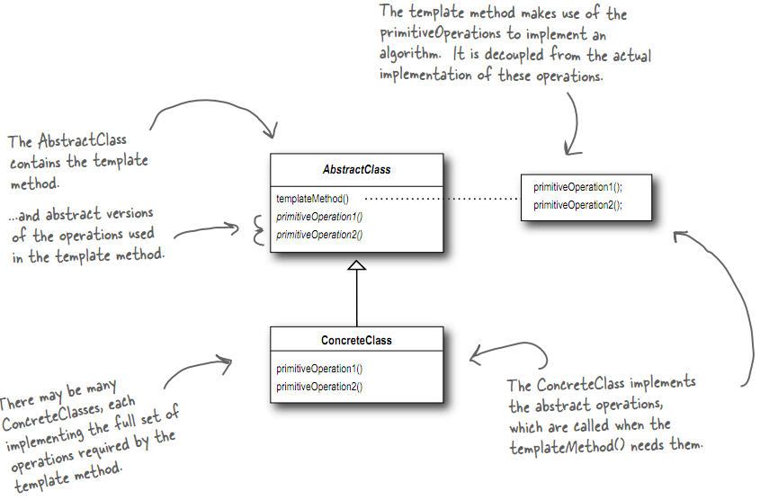

# 模板方法模式
在一个方法中定义一个算法的骨架, 而将一些步骤延迟到子类中.
模板方法使得子类可以在不改变算法结构的情况下, 重新定义算法中的某些步骤

## 类图


## 例子
下例中, 制作茶和咖啡的步骤是大体类似的
包括:
煮开水(boilWate)
泡(brew)
倒进杯子(pourInCup)
添加佐料(addCondiments)

但是泡和添加佐料两步, 咖啡和茶又有些许区别.
使用模板方法模式如下:
CaffeineBeverage, 对应类图中的AbstractClass, 规定了模板方法prepareRecipe(类图中的templateMethod())
类图中的ConcreteClass对应Tea和Coffee, 并自己实现了brew和addCondiments进行特殊处理

```
#include <iostream>

using namespace std;

class CaffeineBeverage
{
public:
    void prepareRecipe()
    {
        boilWater();
        brew();
        pourInCup();
        addCondiments();
    }
    
    void boilWater() { cout << "Boiling water" << endl; }
    void pourInCup() { cout << "Pouring into cup" << endl; }
    virtual void brew() = 0;
    virtual void addCondiments() = 0;
};

class Tea: public CaffeineBeverage
{
public:
    void brew() { cout << "Steeping the tea" << endl; }
    void addCondiments() { cout << "Adding Lemon" << endl; }
};

class Coffee: public CaffeineBeverage
{
public:
    void brew() { cout << "Dripping coffee through filter" << endl; }
    void addCondiments() { cout << "Adding Sugar and Milk" << endl; }
};

int main(int argc, char* argv[])
{
    Tea myTea;
    myTea.prepareRecipe();
    
    Coffee myCoffee;
    myCoffee.prepareRecipe();
    return 0;
}

```


