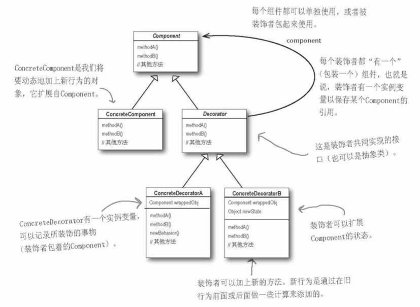

# 装饰者模式

装饰者模式:
动态地将责任附加到对象上, 若要拓展功能, 装饰者提供了比继承更有弹性的替代方案.
目标: 不改变接口, 但加入责任



装饰者和被装饰者要有相同的基类, 使之能够在任何需要原始对象(被包装的)的场合, 可以用装饰过的对象来替代它

装饰者可以在所委托行为之前/之后, 加上自己的行为, 从而达到特定目的

例子:
组件基类Component是饮料Beverage
实体组件ConcreteComponent是各种星巴克饮品, 例如Espresso, HouseBlend
Decorator是添加品类, CondimentDecorator
ConcreteDecorator是具体的添加品, 例如Mocha(摩卡), Whip
```C++
#include <iostream>
#include <string>
using namespace std;

class Beverage
{
protected:
    string description; //让继承者可用, 而外界不可用, 故使用protected
public:
    virtual float cost() = 0;
    virtual string getDescription() { return description; };
};

/* drink */
class Espresso: public Beverage
{
public:
    Espresso() { description = "Espresso"; };
    float cost() { return 1.99; };
};

class HouseBlend: public Beverage
{
public:
    HouseBlend() { description = "HouseBlend"; };
    float cost() { return 0.89; };
};


class CondimentDecorator: public Beverage
{
public:
    //virtual string getDescription() = 0;
};

/* Condiment */
class Mocha: public CondimentDecorator
{
private:
    Beverage* beverage;
public:
    Mocha(Beverage* pBeverage)
    {
        beverage = pBeverage;
    }
    float cost()
    {
        return 0.2 + beverage->cost();
    }
    string getDescription()
    {
        return beverage->getDescription() + ", Mocha";
    }
};

class Whip: public CondimentDecorator
{
private:
    Beverage* beverage;
public:
    Whip(Beverage* pBeverage)
    {
        beverage = pBeverage;
    }
    float cost()
    {
        return 0.3 + beverage->cost();
    }
    string getDescription()
    {
        return beverage->getDescription() + ", Whip";
    }
};
```

使用装饰者模式
这里先制造了一个Espresso饮品, 打印信息
再制造了一个HouseBlend饮品, 添加了摩卡Mocha和Whip, 再打印信息
```C++
int main(int argc, char* argv[])
{
    Beverage* pBeverage = new Espresso();
    cout << pBeverage->getDescription() + " $" << pBeverage->cost() << endl;
    
    HouseBlend houseBlend;
    Mocha mocha(&houseBlend);
    Whip whip(&mocha);
    cout << mocha.getDescription() + " $" << mocha.cost() << endl;
    cout << whip.getDescription() + " $" << whip.cost() << endl;
    
    return 0;
}
```

输出为:
```
Espresso $1.99
HouseBlend, Mocha $1.09
HouseBlend, Mocha, Whip $1.39
```
