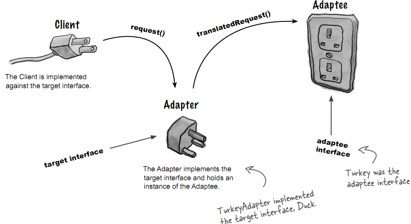
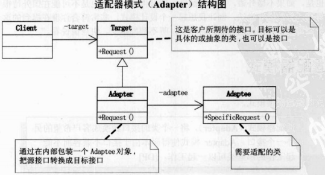

# 适配器模式
## 理念
将一个类的接口, 转换成客户期望的另一个接口. 适配器让原本接口不兼容的类可以一起工作
目标: 将一个接口转换为另一个接口
形象的比喻:



## 类图


## 例子
下例中, 中国人(Chinese)是自己长期使用的类, 对应类图中的Target
美国人(American)是需要配适的类, 对应类图中的Adaptee
AmericanAdapter即类图中的Adapter, 将美国人变成中国人用
```
#include <iostream>
using namespace std;

class Chinese
{
public: //如下两个函数必须加virtual(获得多态特性)
    virtual void NiHao() { cout << "你好" << endl; }
    virtual void ZaiJian() { cout << "再见" << endl; }
};

class American
{
public:
    void Hello() { cout << "Hello" << endl; }
    void Bye() { cout << "Bye" << endl; }
};

class AmericanAdapter: public Chinese
{
private:
    American* pAmerican;
public:
    AmericanAdapter(American* pAmerican)
    {
        this->pAmerican = pAmerican;
    }
    void NiHao()
    {
        pAmerican->Hello();
    }
    void ZaiJian()
    {
        pAmerican->Bye();
    }
};

void saySomething(Chinese *pC)
{
    if (pC != NULL)
    {
        pC->NiHao();
        pC->ZaiJian();
    }
}

int main(int argc, char* argv[])
{
    Chinese xiaoming;
    American Tom;
    
    saySomething(&xiaoming);
    
    AmericanAdapter aa(&Tom);
    saySomething(&aa);
    
    return 0;
}
```

输出:
```
你好
再见
Hello
Bye
```
