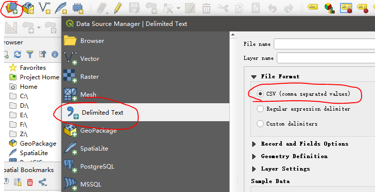
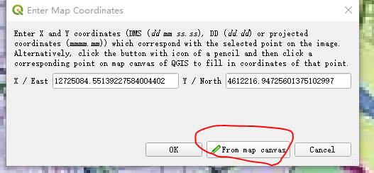
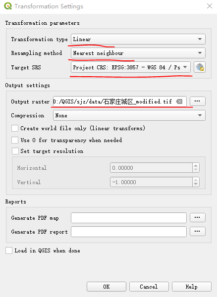
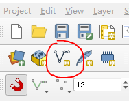
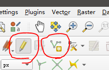
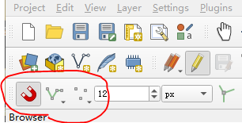
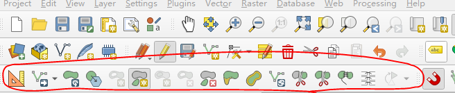

基于QGIS 3.4版本

# 1. 需要解决的问题
1. 离线加载地图
2. 在地图上加载坐标点等
3. 3D, 2D展示地图

# 2. 计划
## 2.1. 2020/2/11(火)
### 2.1.1. 今日计划
[完成] 熟悉QGIS原生程序的界面和功能, 为二次开发做准备
[完成] 能够添加基本的点, 线, 面, 标注
[完成]基于石家庄地图追加相关点, 线, 面和标注

### 2.1.2. 明日计划
尝试将模型导入QGIS中
熟悉二次开发的方法
开始调查如何3D化

## 2.2. 2020/2/12(水)
### 2.2.1. 今日计划
[暂时放弃]尝试将模型导入QGIS中
[完成]安装QT的VS开发环境, 调试环境
[漫长下载中]安装QGIS C++动态库
阅读QGIS开发文档
熟悉二次开发的方法
开始调查如何3D化

### 2.2.2. 明日计划
# 3. QGIS软件的使用
## 3.1. QGIS相关文件
.gqs 文件中存储的是样式
.shp shape文件中存储的是数据

## 3.2. 离线数据的加载
### 3.2.1. *.shp格式文件
在工程中直接双击shp的文件即可
如下网址可以下载北京市相关地理数据
`https://data.beijing.gov.cn/`

### 3.2.2. *.csv格式文件
数据资源管理器


踩过的坑:
导入csv时, 建议使用的几何投影为Default CRS: EPSG:4326
否则可能会把东经识别为西经, 导致坐标不正确


## 3.3. 加载在线地图(XYZTiles)
XYZTiles 开源的瓦片地图接口, 可以加载在线地图
原生自带一个OpenStreetMap
可以添加一个谷歌地图
`http://mt2.google.cn/vt/lyrs=m&scale=2&hl=zh-CN&gl=cn&x={x}&y={y}&z={z}`

## 3.4. 加载栅格数据(图片)并校准
有时需要将一张图片导入到QGIS中, 可以对照图片对行政区进行划分或补充地图中不存在的元素
而图片没有地理坐标信息, 故需要对图片进行校准

具体步骤如下:
保证开启了相关插件Georeferencer, 如果没有开启, 在菜单Plugins下开启
在Raster->Georeferencer打开此插件
在插件中打开相关图片
增加相关点, 在图片上选择后, 在弹出窗中选择From map canvas, 在地图上再次选择点

在插件的菜单中, 选择Settings->Transformation Settings
选择相关的变换算法, 坐标信息和输出目录, 会将图片对应的坐标信息输出为tif文件


最后点击执行按钮即可生成


## 3.5. 画线
新建一个Shapefile Layer, 将线段画在此图层中


使用划线的工具进行画线


画线时可以使用吸附工具(需要在ToolsBar上显示此工具才会出现, 默认没有)


画线过程中出现问题, 可以使用BackSpace键进行撤销, 不能使用Ctrl+Z

对线或面的修补可以通过Advanced Digitizing ToolBar来进行增减, 分离等操作


## 3.6. 由线生成面
打开Processing Toolbox面板
在里面Vector geometry中的Polygonize工具, 可以将线生成面, 并存入另一个文件中

踩过的坑
经过此插件生成的面的Layer是临时的, 关闭工程后不会保存, 需要在Layer右键, 选择永久存储

## 3.7. Layer的符号化
在图层Panel双击会弹出图层属性界面, 其中选择符号化(Symbology)
### 3.7.1. Single Symbol

### 3.7.2. Categorized
### 3.7.3. Graduated
分段上色
对各个项目(点, 线, 面)的某个数字属性, 对其分段上色

### 3.7.4. Rule-based
### 3.7.5. Inverted polygons
### 3.7.6. 2.5D

## 3.8. 表连接
将两个表格通过某个字段进行连接


## 3.9. PrintLayout
可以新建一个PrintLayout
类似PPT, 可以对地图添加标题, 比例尺等内容

# 4. 地址解析(GeoCoding)
通过如下网址可以进行地址解析, 将地名: 如XX公园 转换为具体的经纬度
`http://www.gpsspg.com/latitude-and-longitude.htm`

将目标地址的经纬度存成csv文件, 导入, 注意要选择"点坐标"


# 5. QGIS二次开发
## 5.1. 环境搭建
### 5.1.1. Python开发环境搭建
QGIS装在如下目录: `D:\QGIS 3.4`
将如下目录写入Path变量
```
D:\QGIS 3.4\bin
D:\QGIS 3.4\apps\qgis-ltr\bin
```

将如下目录写入PYTHONPATH环境变量
```
D:\QGIS 3.4\bin
D:\QGIS 3.4\apps\Python37\Lib
D:\QGIS 3.4\apps\qgis-ltr\bin
D:\QGIS 3.4\apps\qgis-ltr\python
D:\QGIS 3.4\apps\qgis-ltr\python\qgis
D:\QGIS 3.4\apps\Python37\Lib\site-packages
D:\QGIS 3.4\apps\Python37\DLLs
```

验证是否成功
在Python命令行中输入如下内容, 如果不报错则成功
``` Python
import qgis.user
import qgis.gui
import qgis.core
import console
```