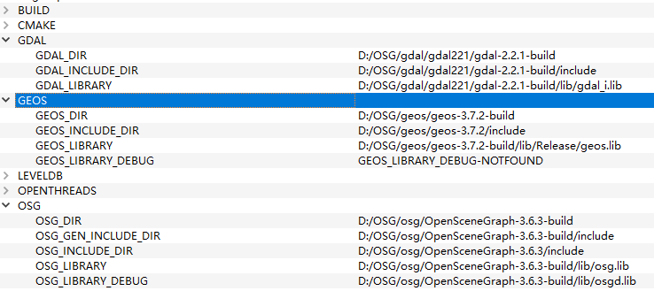

# 整体概述
OSG 三维场景图渲染与调度引擎
osgEarth, 具有GIS功能的, OSG拓展
VPB 一个可以生成高效动态调度地形的OSG拓展

# 环境准备
## 下载OSG
在中文官网`http://www.osgchina.org/`
下载OSG源码`OpenSceneGraph-3.6.3.zip`
基础数据`OpenSceneGraph-Data-3.0.0.zip`
第三方库`3rdParty-vs2015-64-Full.zip`

## 解压
解压缩即可, 其中第三方库可以使用环境变量OSG_3RDPARTY_DIR 来指定第三库目录从而让CMAKE自动寻找到

## 编译OSG
解压源码包, 启动cmake, Configure
设置ACTUAL_3RDPARTY_DIR 为第三方库的路径
设置CMAKE_INSTALL_PREFIX为最终生成物放置的目录
设置GDAL_INCLUDE_DIR为第三方库里的gdal的include路径或自己编译的gdal的include路径
GDAL_LIBRARY 设置为gdal_i.lib文件
GDAL_LIBRARY_DEBUG 可以不设置
GIFLIB, GLUT, JEPG, PNG, TIFF, ZLIB在设置了ACTUAL_3RDPARTY_DIR后, 再次点击Configure, 能够自动填好

在CMake中Generate, OpenProject, 编译Release和Debug即可

## 环境变量的设置
`OSG_FILE_PATH` 设置为OSG数据的目录, 即`OpenSceneGraph-Data-3.0.0.zip`解压后的目录, 这里是`D:\OSG\data\OpenSceneGraph-Data-3.0.0`

`OSG_SCREEN` 设置为0 表示使用多个显示器时, 使用第0个显示器

`OSG_WINDOW` 设置为`100 100 800 600`
这个参数表明在默认状态下, 窗体显示在哪个位置

`PATH`中加入OSG编译出来源码的bin目录, 这里是
`D:\OSG\OpenSceneGraph-3.4.0\bin`

`OSG_ROOT`设置为OSG文件夹目录, 此目录内应该有bin, include, lib子文件夹.
这里设置为`D:\OSG\OpenSceneGraph-3.4.0`

测试是否OSG环境完备:
`osgviewer glider.osg`

如果出现一个紫色飞行器, 则表示成功


## 编译sqlite
因为gdal3.0.1版本必须依赖geos库和sqlite，所以首先得把sqlite库编译完成。
### 下载
下载地址
`https://www.sqlite.org/2019/sqlite-amalgamation-3300100.zip`
`https://www.sqlite.org/2019/sqlite-dll-win64-x64-3300100.zip`
`https://www.sqlite.org/2019/sqlite-tools-win32-x86-3300100.zip`

### 建立空工程
使用VS2015创建一个Win32应用程序的项目, 将sqlite3.c、sqlite3.h、sqlite3ext.h、sqlite3.def四个文件添加到工程中

### 设置工程属性
预处理设置：C/C++ --> 预处理器 --> 预处理器定义：设置预定义处理
将内容改为:
```
_USRDLL
SQLITE_ENABLE_RTREE
SQLITE_ENABLE_COLUMN_METADATA
SQLITE_ENABLE_FTS5
SQLITE_ENABLE_UNLOCK_NOTIFY 
```


设置模块定义文件,链接器 --> 输入 --> 模块定义文件：sqlite3.def
修改模块定义文件:在最后追加sqlite3_unlock_notify

配置类型改为静态库lib


### 生成解决方案
x64\Release文件夹可以找到生成的lib库。在SQLite目录中分别创建include和lib和bin文件夹,将刚才生成的.lib文件放入lib文件夹中,将sqlite3.h、sqlite3ext.h放入include中，将sqlite-tools-win32-x86-3280000.zip中的sqlite3.exe放在bin文件夹中以备后用。

### 遇到的问题
#### 错误	C1853	“x64\Release\sqlite_project.pch”预编译头文件来自编译器的早期版本，或者预编译头为 C++ 而在 C 
解决方法:
关闭预编译头


## 编译proj
下载proj`https://proj.org/download.html`
解压
打开CMAKE, 到proj解压后的目录
CMAKE_INSTALL_PREFIX
EXE_SQLITE3
SQLITE3_INCLUDE_DIR
SQLITE3_LIBRARY
需要如图修改


Configure后Generate
之后OpenProject
编译即可

## 编译geos
下载geos
`http://download.osgeo.org/geos/`
解压后执行如下命令

```
cd C:\Program Files (x86)\Microsoft Visual Studio 14.0\VC\bin\amd64 （vcvars64的目录）
vcvars64
cd 到geos目录下
autogen.bat
nmake /f makefile.vc
nmake /f makefile.vc install
nmake /f makefile.vc devinstall
```
最后一条命令会出错, 但似乎不影响最后结果

打开CMAKE, 配置CMAKE_INSTALL_PREFIX的目录为存放编译生成产物的地方


Configure, Generate, OpenProject
编译完成

## 编译gdal
下载gdal
`http://download.osgeo.org/gdal/2.4.4/gdal244.zip`

解压缩, 修改nmake.opt文件
第41行左右，找到MSVC_VER=设置为1900(VS2015版本应该为1900及以上，视自己编译器而定)。

第57行左右找到GDAL_HOME =将生成文件的路径设置成你想要的位置。

第194行左右找到WIN64=YES，如果生成64位版本取消注释本行。

第218行左右找到DLLBUILD=设置为1启动动态编译、 0为静态编译。这里一定一定要是动态编译!因为osg依赖于动态生成的gdal_i.lib,静态编译生成的好像没有带i结尾的库，这也是我最后编完之后但是无法使用osg或osgearth调用gdal的原因，因为一开始我编译的是静态的。

第238行左右，找到PROJ_INCLUDE PROJ_LIBRARY,分别设置成你刚才生成PROJ时的include和lib文件夹(其中PROJ_INCLUDE的-I后为地址），并将.lib的名称改对。

第613行左右，找到GEOS_DIR,分别设置成你刚才生成GEOS时的include和lib文件夹，并将.lib的名称改对。

第509行左右，找到SQLITE_INC SQLITE_LIB,路径设置同上。至此设置完成，保存文件。
(SQLITE的内容貌似可以不进行编译, 不用设置SQLITE_INCLUDE和SQLITE_LIB)

启动VS2015的"VS2015 x64本机工具命令提示符"


cd到gdal的解压目录
输入以下命令进行release版本编译
```
nmake /f makefile.vc
nmake /f makefile.vc install
nmake /f makefile.vc devinstall
```
如果要进行debug版本就在下面命令makefile.vc后面加上DEBUG=1
```
nmake /f makefile.vc DEBUG=1
nmake /f makefile.vc install
nmake /f makefile.vc devinstall
```

## 编译osgEarth
下载`http://osgearth.org/`
解压, 使用CMake进行编译
需要设置的量:
THIRD_PARTY_DIR 第三方库的目录
CMAKE_INSTALL_PREFIX 最终生成物放在那个目录
GDAL_DIR                   gdal目录
GDAL_INCLUDE_DIR   gdal的include目录
GDAL_LIBRARY           gdal的库, 应该指向一个gdal_i.lib文件

GEOS, OSG的目录同理进行设置, 如下图


设置好OSG后, 再次在CMake点击Configure, OSGDB, OSGGA等自动会被设置好
之后, Generate, Open Project, 编译Debug和Release即可

## 编译OsgQt
下载OsgQt
解压缩
在CMakeLists.txt中加入如下内容
```
SET(DESIRED_QT_VERSION "5.12.0" CACHE STRING "")   
SET(CMAKE_PREFIX_PATH "E:\\Qt\\Qt5.12.0\\5.12.0\\msvc2015_64" CACHE PATH "")
```
如图所示


将FIND_PACKAGE那行的OpenSceneGraph改为合适的版本
```
FIND_PACKAGE(OpenSceneGraph 3.6.3 REQUIRED osgDB osgGA osgUtil osgText osgViewer osgWidget)
SET(OPENSCENEGRAPH_SOVERSION 145)
```

打开CMAKE
设置CMAKE_INSTALL_PREFIX 为成果物存放目录
设置OPENTHREADS, OSG, OSGDB, OSGGA, OSGTEXT, OSGUTIL, OSGVIEWER, OSGWIDGET, 如下图


在CMake中, Generate, OpenProject
编译Release和Debug版本即可


