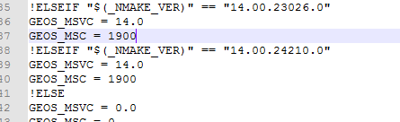

# 1. 整体概述
OSG 三维场景图渲染与调度引擎
osgEarth, 具有GIS功能的, OSG拓展
VPB 一个可以生成高效动态调度地形的OSG拓展

# 2. 环境准备
## 2.1. 版本说明
开发使用Qt5.12.0, VS2015编译
OpenSceneGraph-3.4.0 (3.6版本不再原生支持QT)
osgearth-osgearth-2.9 (2.10版本不再原生支持QT)
proj-6.2.0
gdal-2.2.1
geos-3.5.1 (3.5.1和osgearth2.9兼容, 3.7.2和osgearth2.10.1兼容)

## 2.2. OSG
### 2.2.1. 下载OSG
在中文官网`http://www.osgchina.org/`
下载OSG源码`OpenSceneGraph-3.4.0.zip`
基础数据`OpenSceneGraph-Data-3.0.0.zip`
第三方库`3rdParty-vs2015-64-Full.zip`

### 2.2.2. 解压
解压缩即可, 其中第三方库可以使用环境变量OSG_3RDPARTY_DIR 来指定, 从而让CMAKE自动寻找到

### 2.2.3. 编译OSG
解压源码包, 启动cmake, Configure
设置ACTUAL_3RDPARTY_DIR 为第三方库的路径
设置CMAKE_INSTALL_PREFIX为最终生成物放置的目录
设置GDAL_INCLUDE_DIR为第三方库里的gdal的include路径或自己编译的gdal的include路径
GDAL_LIBRARY 设置为gdal_i.lib文件(重要!!!自己编译的是gdal_i.lib, 第三方的不是, 会编译出错)
GDAL_LIBRARY_DEBUG 可以不设置
GIFLIB, GLUT, JEPG, PNG, TIFF, ZLIB在设置了ACTUAL_3RDPARTY_DIR后, 再次点击Configure, 能够自动填好

在CMake中Generate, OpenProject, 编译Release和Debug即可

### 2.2.4. 环境变量的设置
`OSG_FILE_PATH` 设置为OSG数据的目录, 即`OpenSceneGraph-Data-3.0.0.zip`解压后的目录, 这里是`D:\OSG\data\OpenSceneGraph-Data-3.0.0`

`OSG_SCREEN` 设置为0 表示使用多个显示器时, 使用第0个显示器

`OSG_WINDOW` 设置为`100 100 800 600`
这个参数表明在默认状态下, 窗体显示在哪个位置

`PATH`中加入OSG编译出来源码的bin目录, 这里是
`D:\OSG\OpenSceneGraph-3.4.0\bin`

`OSG_ROOT`设置为OSG文件夹目录, 此目录内应该有bin, include, lib子文件夹.
这里设置为`D:\OSG\OpenSceneGraph-3.4.0`

测试是否OSG环境完备:
`osgviewer glider.osg`

如果出现一个紫色飞行器, 则表示成功


### 2.2.5. 编译OSG中遇到的问题
#### 2.2.5.1. 关于OsgQt
OSG的3.6版本不在原生编译OsgQt, 而自己编译却没有正确生成正确的动态库, 故推荐使用3.4.0, 原生自带编译OsgQt

#### 2.2.5.2. 编译Osg3.4.0时, 无法打开输入文件“optimized.lib”
1, 正常情况下，下图中会多出一项：ZLIB_LIBRARY_RELEASE，之后屡次编译，都提示“无法打开输入文件“optimized.lib””
因为ZLIB_LIBRARY就相当于是ZLIB_LIBRARY_RELEASE，而配置过ZLIB_LIBRARY_RELEASE后会忽略ZLIB_LIBRARY，
实际上，起作用的是ZLIB_LIBRARY，所以会发生错误“无法打开输入文件“optimized.lib””


故让ZLIB_LIBRARY_RELEASE 为空


2, 从OpenSceneGraph-3.4.0\CMakeModules拷贝一份FindZLIB.cmake放到D:\APICenter\OSG\osgEarth2.8.0\CMakeModules

并修改，将红框中的部分删除，即不使用CMake自带的FindZLIB.cmake。


3, 找到编译出问题的项目(osgdb_freetype,osgdb_jpeg)属性，顺便删除debug.lib


## 2.3. 编译sqlite
因为gdal3.0.1版本必须依赖geos库和sqlite，所以首先得把sqlite库编译完成。
### 2.3.1. 下载
下载地址
`https://www.sqlite.org/2019/sqlite-amalgamation-3300100.zip`
`https://www.sqlite.org/2019/sqlite-dll-win64-x64-3300100.zip`
`https://www.sqlite.org/2019/sqlite-tools-win32-x86-3300100.zip`

### 2.3.2. 建立空工程
使用VS2015创建一个Win32应用程序的项目, 将sqlite3.c、sqlite3.h、sqlite3ext.h、sqlite3.def四个文件添加到工程中

### 2.3.3. 设置工程属性
预处理设置：C/C++ --> 预处理器 --> 预处理器定义：设置预定义处理
将内容改为:
```
_USRDLL
SQLITE_ENABLE_RTREE
SQLITE_ENABLE_COLUMN_METADATA
SQLITE_ENABLE_FTS5
SQLITE_ENABLE_UNLOCK_NOTIFY 
```


设置模块定义文件,链接器 --> 输入 --> 模块定义文件：sqlite3.def
修改模块定义文件:在最后追加sqlite3_unlock_notify

配置类型改为静态库lib


### 2.3.4. 生成解决方案
x64\Release文件夹可以找到生成的lib库。在SQLite目录中分别创建include和lib和bin文件夹,将刚才生成的.lib文件放入lib文件夹中,将sqlite3.h、sqlite3ext.h放入include中，将sqlite-tools-win32-x86-3280000.zip中的sqlite3.exe放在bin文件夹中以备后用。

### 2.3.5. 遇到的问题
#### 2.3.5.1. 错误	C1853	“x64\Release\sqlite_project.pch”预编译头文件来自编译器的早期版本，或者预编译头为 C++ 而在 C 
解决方法:
关闭预编译头


## 2.4. 编译proj
下载proj`https://proj.org/download.html`
解压
打开CMAKE, 到proj解压后的目录
CMAKE_INSTALL_PREFIX
EXE_SQLITE3
SQLITE3_INCLUDE_DIR
SQLITE3_LIBRARY
需要如图修改


Configure后Generate
之后OpenProject
编译即可

## 2.5. 编译geos
### 2.5.1. 编译方法
下载geos
`http://download.osgeo.org/geos/`
目前测试3.7.2和3.5.1可以使用此方法, 3.4.0此方法不适用
解压后执行如下命令

Debug版本:
```
cd C:\Program Files (x86)\Microsoft Visual Studio 14.0\VC\bin\amd64 （vcvars64的目录）
vcvars64
cd 到geos目录下
autogen.bat
nmake /f makefile.vc DEBUG=1
nmake /f makefile.vc install
nmake /f makefile.vc devinstall
```

Release版本:
```
cd C:\Program Files (x86)\Microsoft Visual Studio 14.0\VC\bin\amd64 （vcvars64的目录）
vcvars64
cd 到geos目录下
autogen.bat
nmake /f makefile.vc
nmake /f makefile.vc install
nmake /f makefile.vc devinstall
```
最后一条命令会出错, 但似乎不影响最后结果

修改配置文件nmake.opt
如下是该Release还是Debug


如下是改32位还是64位, 这里要改成64位


根据自己编译器的版本号添加，下边是我的


打开CMAKE, 配置CMAKE_INSTALL_PREFIX的目录为存放编译生成产物的地方


Configure, Generate, OpenProject
编译完成

### 2.5.2. 问题
#### 2.5.2.1. CMake提示错误, Unknown CMake command "GenerateSourceGroups"

在如下链接下载GenerateSourceGroups.cmake文件
`https://trac.osgeo.org/geos/browser/trunk/cmake/modules`

将下载后的文件放到使用的cmake安装目录中, 
在本机是`E:\Program Files\CMake\share\cmake-3.15\Modules`
然后点击configure，不再报错

## 2.6. 编译gdal
下载gdal
`http://download.osgeo.org/gdal/2.4.4/gdal244.zip`

解压缩, 修改nmake.opt文件
第41行左右，找到MSVC_VER=设置为1900(VS2015版本应该为1900及以上，视自己编译器而定)。

第57行左右找到GDAL_HOME =将生成文件的路径设置成你想要的位置。

第194行左右找到WIN64=YES，如果生成64位版本取消注释本行。

第218行左右找到DLLBUILD=设置为1启动动态编译、 0为静态编译。这里一定一定要是动态编译!因为osg依赖于动态生成的gdal_i.lib,静态编译生成的好像没有带i结尾的库，这也是我最后编完之后但是无法使用osg或osgearth调用gdal的原因，因为一开始我编译的是静态的。

第238行左右，找到PROJ_INCLUDE PROJ_LIBRARY,分别设置成你刚才生成PROJ时的include和lib文件夹(其中PROJ_INCLUDE的-I后为地址），并将.lib的名称改对。

第613行左右，找到GEOS_DIR,分别设置成你刚才生成GEOS时的include和lib文件夹，并将.lib的名称改对。

第509行左右，找到SQLITE_INC SQLITE_LIB,路径设置同上。至此设置完成，保存文件。
(SQLITE的内容貌似可以不进行编译, 不用设置SQLITE_INCLUDE和SQLITE_LIB)

启动VS2015的"VS2015 x64本机工具命令提示符"


cd到gdal的解压目录
输入以下命令进行release版本编译
```
nmake /f makefile.vc
nmake /f makefile.vc install
nmake /f makefile.vc devinstall
```
如果要进行debug版本就在下面命令makefile.vc后面加上DEBUG=1
```
nmake /f makefile.vc DEBUG=1
nmake /f makefile.vc install
nmake /f makefile.vc devinstall
```

## 2.7. 编译osgEarth
由于2.10版本的osgEarth移除了osgEarthQt, 故需要自己编译, 但目前没有编译成功, 故使用2.9版本
下载`http://osgearth.org/`
解压, 使用CMake进行编译
需要设置的量:
THIRD_PARTY_DIR 第三方库的目录
CMAKE_INSTALL_PREFIX 最终生成物放在那个目录
GDAL_DIR                   gdal目录
GDAL_INCLUDE_DIR   gdal的include目录
GDAL_LIBRARY           gdal的库, 应该指向一个gdal_i.lib文件

GEOS, OSG的目录同理进行设置, 如下图


设置好OSG后, 再次在CMake点击Configure, OSGDB, OSGGA等自动会被设置好

如果是3.4版本
勾选OSGEARTH中的
OSGEARTH_QT_BUILD
OSGEARTH_QT_BUILD_LEGACY_WIDGET
(3.6版本不再原生支持QT)

之后, Generate, Open Project, 编译Debug和Release即可

### 2.7.1. 遇到的问题
#### 2.7.1.1. 无法打开包括文件: “geos/geom/Geometry.h”: No such file or directory	
是geos库和osgearth的版本不匹配导致的
目前发现:
osgearth2.10.1和geos3.7.2匹配
osgearth2.9 和geos3.5.1匹配

## 2.8. 编译OsgQt
如下方法编译出来的动态库没有OsgQt.dll, 原因未知, 推荐使用3.4版本的Osg, 可以避免单独编译OsgQt
下载OsgQt
解压缩
在CMakeLists.txt中加入如下内容
```
SET(DESIRED_QT_VERSION "5.12.0" CACHE STRING "")   
SET(CMAKE_PREFIX_PATH "E:\\Qt\\Qt5.12.0\\5.12.0\\msvc2015_64" CACHE PATH "")
```
如图所示


将FIND_PACKAGE那行的OpenSceneGraph改为合适的版本
改两处, `OpenSceneGraph 3.6.3`和`OPENSCENEGRAPH_SOVERSION 156`
```
FIND_PACKAGE(OpenSceneGraph 3.6.3 REQUIRED osgDB osgGA osgUtil osgText osgViewer osgWidget)
SET(OPENSCENEGRAPH_SOVERSION 156)
```

打开CMAKE
设置CMAKE_INSTALL_PREFIX 为成果物存放目录
设置OPENTHREADS, OSG, OSGDB, OSGGA, OSGTEXT, OSGUTIL, OSGVIEWER, OSGWIDGET, 如下图


在CMake中, Generate, OpenProject
编译Release和Debug版本即可
