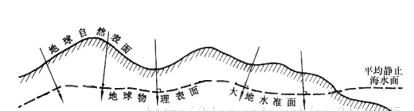
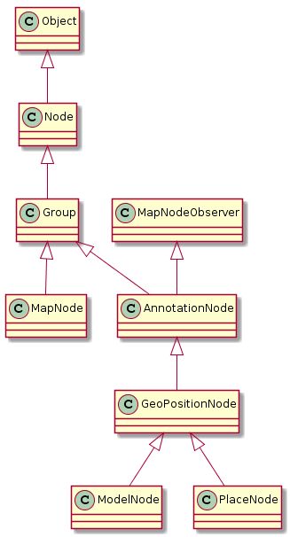
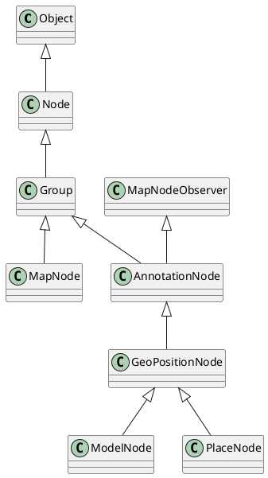
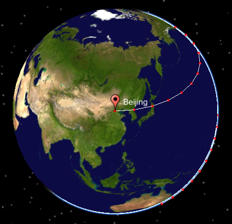
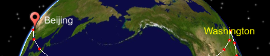
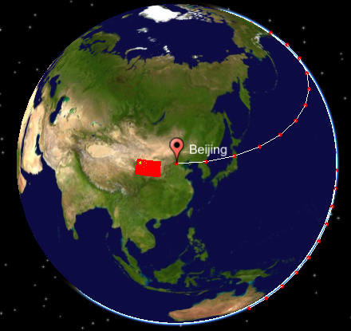
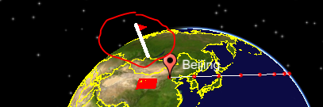

# 1. 地理基础
## 1.1. 基本概念
地理坐标系：为球面坐标。 参考平面地是椭球面，坐标单位：经纬度；
投影坐标系：为平面坐标。参考平面地是水平面，坐标单位：米、千米等；
地理坐标转换到投影坐标的过程可理解为投影。(投影：将不规则的地球曲面转换为平面)

## 1.2. 地理坐标系
### 1.2.1. 地球的三级逼近
#### 1.2.1.1. 大地水准面
 地球的自然表面有高山也有洼地，是崎岖不平的，我们要使用数学法则来描述他，就必须找到一个相对规则的数学面。

大地水准面是地球表面的第一级逼近。假设当海水处于完全静止的平衡状态时，从海平面延伸到所有大陆下部，而与地球重力方向处处正交的一个连续、闭合的曲面，这就是大地水准面。


#### 1.2.1.2. 地球椭球体
大地水准面可以近似成一个规则成椭球体，但并不是完全规则，其形状接近一个扁率极小的椭圆绕短轴旋转所形成的规则椭球体，这个椭球体称为地球椭球体。它是地球的第二级逼近。

#### 1.2.1.3. 大地基准面
确定了一个规则的椭球表面以后，我们会发现还有一个问题，参考椭球体是对地球的抽象，因此其并不能去地球表面完全重合，在设置参考椭球体的时候必然会出现有的地方贴近的好（参考椭球体与地球表面位置接近），有地地方贴近的不好的问题，因此这里还需要一个大地基准面来控制参考椭球和地球的相对位置。 这是地球表面的第三级逼近。

### 1.2.2. 地理坐标
* 经线（子午线）
过旋转轴(地轴) 的平面与椭球面的截线。

* 首（零）子午线
国际上公认通过英国格林尼治天文台的经线。

* 经度的计算
过该点的子午圈截面与起始子午面之交角。 由首子午线起，向东为正，称东经。由0度到+180度。 由首子午线起，向西为负，称西经。由0度到-180度。

* 赤道平面
垂直于地轴并通过地心的平面。

* 赤道
赤道平面与椭球面相交的交线（大圆圈）。

* 纬线（平行圈）
过某一点与赤道面平行的平面,与椭球面的交线（截线）

* 纬度的计算
平行圈的法线与赤道面的交角。 从赤道起，向北为正，称“北纬”。纬度由0度到+90度； 从赤道起，向南为负，称“南纬”。纬度由0度到-90度。

## 1.3. 常用地理常数
|   名称   |                      物理意义                       |      值       |
| ------- | -------------------------------------------------- | ------------- |
| 极半径   | 从地心到北极或南极的距离                             | 6356.9088千米 |
| 赤道半径 | 是从地心到赤道的距离                                 | 6377.830千米  |
| 平均半径 | 地心到地球表面所有各点距离的平均值                     | 6371.393千米  |
| 赤道周长 | 地球表面的点随地球自转产生的轨迹中周长最长的圆周线的长度 | 40075.02千米  |

# 2. osgearth的基本功能
* 实时生成地形
* 矢量图渲染
* 数字城市
* 地形调度

# 3. osg常用类继承关系图



# 4. earth文件
earth文件类似于xml, 是osgearth可以读取的文件
osgearth可以通过读取earth文件来创建场景
earth文件默认是以.earth为后缀的文件

## 4.1. earth文件常用标签
### 4.1.1. map标签
`<map>`标签是earth文件的主标签
-type属性 : 主要标识使用的坐标系统, 是球心坐标系使用Geocentric(球形), 是平面投影的使用Projected(平面)
-version属性 : 标识osgEarth的大版本, 当前大版本是2
-name属性 : map名称

### 4.1.2. heightfield标签
用于定义高程数据
-name : 高程名称
-driver : 驱动
    gdal : 使用gdal来读取高程数据
    vpb : 使用已经使用vpb生成好的地形
    Composite : 使用多纹理或多高程相互叠加
    OSG : 使用osg的reader/writers来读取文件
    AGGLite, ArcGIS, TileCache, TileService, TMS, WCS, WMS

-url : 定义数据来源

### 4.1.3. image标签
定义高程数据纹理
属性和heightfield完全相同

### 4.1.4. cache标签
用来定义缓存, 要定义在options标签内部
-type: 指定缓存类型, 目前只支持filesystem, 其他的包括TMS, sqlite3等都将逐渐不支持
-path : 指定路径

## 4.2. earth文件示例
``` xml
<map name="Globe" type="geocentric" version = "2">
<!--全球影像-->
<image name="GlobeImage" driver="gdal">
	<url>../data/image/globe/world.tif</url>
</image>

<!--文件缓存-->
<options>
    <cache type="filesystem">
		<path>./FileCache</path>
	</cache>
</options>
</map>
```

# 5. 预生成缓存
由于直接加载earth文件会比较慢, 可以提前生成缓存文件
基本格式为:
```
osgearth_cache --seed earth文件名 
```
其他可选参数参照osgearth_cache的usage提示
如果不生成缓存, 第一次启动时也会生成缓存, 之后加载也会使用第一次生成的缓存

# 6. Qt中显示OsgEarth

## 6.1. 基本步骤
1, 读取earth文件`osg::ref_ptr<osg::Node> earthNode = osgDB::readNodeFile("earth file path");`
2, 初始化操作器
3, 显示到Qt窗体

## 6.2. 示例代码
``` C++ 
#include <osg/Notify>
#include <osgViewer/CompositeViewer>
#include <osgEarthUtil/ExampleResources>
#include <osgEarthUtil/EarthManipulator>
#include <osgEarthQt/ViewerWidget>
#include <osgEarth/MapNode>
#include <osgEarthUtil/Sky>
#include <QApplication>
#include <QMainWindow>
#include <QStatusBar>
#include <QMdiArea>
#include <QMdiSubWindow>
#include <QWidget>
#include <QVBoxLayout>

using namespace osgEarth;
using namespace osgEarth::Util;
using namespace osgEarth::QtGui;

int main(int argc, char** argv)
{
    QString strEarthFilePath = "E:\\Develop\\osgearth-workspace\\DigitalEarth\\earthfile\\simple-earth.earth";
    //加载Earth文件
    osg::ref_ptr<osg::Node> earthNode = osgDB::readNodeFile(strEarthFilePath.toStdString().data());
    if (!earthNode.valid())
        return -1;

    osgViewer::Viewer viewer;

    viewer.setThreadingModel( viewer.SingleThreaded );
    viewer.setRunFrameScheme( viewer.ON_DEMAND );

    //初始化操作器
    osg::ref_ptr<osgEarth::MapNode> mapNode;
    osg::ref_ptr<osgEarth::Util::EarthManipulator> em = new EarthManipulator;
    mapNode = dynamic_cast<osgEarth::MapNode*>(earthNode.get());
    if (mapNode.valid())
    {
        em->setNode(mapNode);
    }
    em->getSettings()->setArcViewpointTransitions(true);
    viewer.setCameraManipulator(em);

    osg::Group* root = new osg::Group;
    root->addChild(earthNode.get());

    viewer.setSceneData(root);

    QApplication app(argc, argv);

    //显示到Qt窗体
    QWidget* viewerWidget = new ViewerWidget( &viewer );
    QWidget w;
    w.setLayout(new QVBoxLayout);
    w.layout()->addWidget( viewerWidget );
    w.setGeometry(100, 100, 1024, 800);

    w.show();
    app.exec();
}
```

# 7. 地球操作器
## 7.1. 地球操作器基础
地球操作器`EarthManipulator`主要完成视角相关操作, 继承自`osgGA::CameraManipulator`
视角的移动, 缩放都要使用到地球操作器

## 7.2. 操作器的创建和基本设置
对于操作器, 需要进行如下设置才能让操作器操作的地理坐标正确, 其中mapNode是一个地球模型的Node
``` C++
osg::ref_ptr<osgEarth::Util::EarthManipulator> em = new EarthManipulator;
mapNode = osgEarth::MapNode::findMapNode(earthNode.get());
if (mapNode.valid())
{
    em->setNode(mapNode);
}
```

## 7.3. 视角设置
``` C++
osg::ref_ptr<osgEarth::Util::EarthManipulator> em = new EarthManipulator;
//...设置控制器等操作
//设置视角
em->setViewpoint(osgEarth::Viewpoint("first", 116.22, 39.54,444.02,0,-90,40228182.75), 5);
```

关于`osgEarth::Viewpoint`的参数, 第一个为名称
2, 3, 4个为经纬度和高度, 标记要显示的点在地球上的位置
5, 6, 7个参数为方向旋转, 法线方向旋转, 距离
上面的参数设置效果如下图

116.22, 39.54为北京的经纬坐标
0表示水平不旋转, 故视角还是上北下南
-90表示法线方向旋转到垂直视角俯视

# 8. 在数字地球中增加物体
## 8.1. 添加星空背景
星空使用SkyNode模块, 可以设置时间, 比如设置时间为中午12点, 则直射0度经线

``` C++
//初始化天空
osgEarth::Config skyConf;
SkyNode* skyNode = osgEarth::Util::SkyNode::create(mapNode.get());

DateTime dt(2020, 2, 17, 12);
skyNode->setDateTime(dt);
skyNode->attach(&viewer, 1); //一个光源
skyNode->setAtmosphereVisible(true);
osg::Group* root = new osg::Group;
root->addChild(skyNode);
root->addChild(earthNode.get());

viewer.setSceneData(root);
```
星空背景效果如下图所示


## 8.2. 增加文本
在地图上生成一个文本标签, 可以使用如下步骤:
1. 生成文本风格对象`Style textStyle`
2. 设置文本风格对象属性, 包括居中, 颜色, 如果是Icon风格, 可以设置icon图片
3. 利用生成的文本风格对象创建PlaceNode
4. 将PlaceNode加入整体node或map中

如下代码生成了一个Beijing的标签, 一个Washington的标签, 各使用了不同的样式(Style)


``` Qt
/* 增加固定大小显示的文字 */
Style textStyle;
textStyle.getOrCreate<TextSymbol>()->alignment() = osgEarth::Symbology::TextSymbol::ALIGN_CENTER_CENTER;
textStyle.getOrCreate<TextSymbol>()->fill()->color() = osgEarth::Color::Yellow;
Style placeStyle;
placeStyle.getOrCreate<osgEarth::Symbology::IconSymbol>();
placeStyle.getOrCreate<osgEarth::Symbology::IconSymbol>()->url()->setLiteral( "D:/OSG/osgearth/2.10.1/osgearth-2.10.1/data/placemark32.png" );//设置标记图片
placeStyle.getOrCreate<osgEarth::Symbology::IconSymbol>()->declutter() = true;//动态整理，对图标进行放大缩小，当缩小到一定程度，隐藏文本标签
mapNode->addChild( new osgEarth::Annotation::PlaceNode(mapNode,
                       osgEarth::GeoPoint(mapNode->getMapSRS()->getGeographicSRS(), 116.22, 39.54, 1000, osgEarth::ALTMODE_ABSOLUTE),
                       "Beijing", placeStyle));
mapNode->addChild( new osgEarth::Annotation::PlaceNode(mapNode,
                       osgEarth::GeoPoint(mapNode->getMapSRS()->getGeographicSRS(), -77.04, 38.85, 1000, osgEarth::ALTMODE_ABSOLUTE),
                       "Washington", textStyle));
```

## 8.3. 增加一条线
### 8.3.1. 基本步骤:
1. 创建geometry对象
2. 加入点
3. 根据geometry对象创建featureNode, 并加入整个场景中

``` Qt
//创建geometry对象
osgEarth::Symbology::Geometry *geometry = new osgEarth::Symbology::LineString;
//加入点
geometry->push_back(114.31, 38.02, 100000.);
geometry->push_back(-77.04, 38.85, 100000.);

//根据geometry对象创建featureNode, 并加入整个场景中
osgEarth::Features::Feature *feature = new osgEarth::Features::Feature(geometry, mapNode->getMapSRS()->getGeographicSRS());
feature->geoInterp() = osgEarth::Features::GEOINTERP_GREAT_CIRCLE;
osgEarth::Annotation::FeatureNode *fnode = new osgEarth::Annotation::FeatureNode(mapNode, feature);
mapNode->addChild(fnode);
```

### 8.3.2. 连线方式
`osgEarth::Features::GEOINTERP_GREAT_CIRCLE` 大圆线, 即把地球看做一个球体，通过地面上任意两点和地心做一平面，平面与地球表面相交看到的圆周就是大圆。两点之间的大圆劣弧线是两点在地面上的最短距离。沿着这一段大圆弧线航行时的航线称为大圆航线
`osgEarth::Features::GEOINTERP_RHUMB_LINE` 恒向线, 即地球上两点之间与经线处处保持角度相等的曲线

### 8.3.3. 线的风格
``` Qt
Style pathStyle;
pathStyle.getOrCreate<LineSymbol>()->stroke()->color() = Color::White;
pathStyle.getOrCreate<LineSymbol>()->stroke()->width() = 1.0f;
pathStyle.getOrCreate<LineSymbol>()->tessellationSize() = 750000;    //曲面细分, 越大点越少
pathStyle.getOrCreate<PointSymbol>()->size() = 5;
pathStyle.getOrCreate<PointSymbol>()->fill()->color() = Color::Red;
pathStyle.getOrCreate<AltitudeSymbol>()->clamping() = AltitudeSymbol::CLAMP_ABSOLUTE;
pathStyle.getOrCreate<AltitudeSymbol>()->technique() = AltitudeSymbol::TECHNIQUE_GPU;
osgEarth::Annotation::FeatureNode *fnode = new osgEarth::Annotation::FeatureNode(mapNode, feature, pathStyle);
mapNode->addChild(fnode);
```

对于`pathStyle.getOrCreate<AltitudeSymbol>()->clamping()`属性, 如果要贴在地面上, 使用`CLAMP_TO_TERRAIN`
如果要在线上, 使用`CLAMP_ABSOLUTE`

## 8.4. 增加图片
目前发现支持tga, png文件, 不支持gif文件
``` Qt
/* 增加图片 */
//加载图片
osg::ref_ptr<osg::Image> image = osgDB::readRefImageFile("E:/Develop/osgearth-workspace/DigitalEarth/data/image/flag/china.png");
if (image.valid())
{
    osgEarth::Annotation::ImageOverlay* imageOverlay = new osgEarth::Annotation::ImageOverlay(mapNode, image.get());
    //设置显示范围
    imageOverlay->setBounds(osgEarth::Bounds(100.,35., 110, 40.));
    mapNode->addChild(imageOverlay);
    //图片编辑, 如果想让图片可编辑, 则启用这句
    //mapNode->addChild(new osgEarth::Annotation::ImageOverlayEditor(imageOverlay, true));
}
```
图片显示效果:


## 8.5. 增加模型
增加模型时, 对于模型文件, 例如`red_flag.osg`, 在加载时需要指明放大倍数
如下代码中, `red_flag.osg.50.scale`表明对原模型放大50倍
``` C++
/* 增加模型 */
{
    Style style;
    style.getOrCreate<ModelSymbol>()->autoScale() = true;
    style.getOrCreate<ModelSymbol>()->url()->setLiteral("D:/OSG/osgearth/osgearth-osgearth-2.9/data/red_flag.osg.50.scale");
    osgEarth::Annotation::ModelNode* modelNode = new osgEarth::Annotation::ModelNode(mapNode, style);
    modelNode->setPosition(GeoPoint(mapNode->getMapSRS()->getGeographicSRS(), 100, 52));
    mapNode->addChild(modelNode);
}
```
代码效果:
在东经100度, 北纬52度出现了一个红旗


## 8.6. 添加控件
### 8.6.1. 添加控件的基本步骤
1. 继承`osgGA::GUIEventHandler`, 创建一个事件控制器, 并重写基类的`handle`方法
2. 在viewer中创建控件容器`ControlCanvas`
3. 创建控件
4. 将控件添加到控件容器中
5. 为控件添加事件控制器

### 8.6.2. 创建事件控制器的例子
如下例子中创建的事件控制器继承了`osgGA::GUIEventHandler`, 并重写了`handle`方法
此控制器对两个Label控件进行控制, 一个Label显示鼠标当前位置的坐标, 一个Label显示当前视角所在位置坐标
声明如下:
``` C++
class CLabelControlEventHandle : public osgGA::GUIEventHandler
{
public:
    CLabelControlEventHandle(osgEarth::Util::Controls::LabelControl* lblControl,osgEarth::Util::Controls::LabelControl* mouseControl,osgEarth::MapNode*  mapNode);
    ~CLabelControlEventHandle();

    bool handle(const osgGA::GUIEventAdapter& ea, osgGA::GUIActionAdapter& aa);
private:
    osgEarth::Util::Controls::LabelControl* m_pLblControl;
    osgEarth::Util::Controls::LabelControl* m_pMouseControl;
    osgEarth::MapNode*  m_pMapNode;
    osg::NodePath   m_nodePath;
};
```

实现如下:
``` C++
CLabelControlEventHandle::CLabelControlEventHandle(osgEarth::Util::Controls::LabelControl *lblControl, osgEarth::Util::Controls::LabelControl *mouseControl, osgEarth::MapNode *mapNode)
    :m_pLblControl(lblControl), m_pMouseControl(mouseControl), m_pMapNode(mapNode)
{
    m_nodePath.push_back(m_pMapNode->getTerrainEngine());
}

CLabelControlEventHandle::~CLabelControlEventHandle() {}

bool CLabelControlEventHandle::handle(const osgGA::GUIEventAdapter& ea, osgGA::GUIActionAdapter& aa)
{
    osgViewer::Viewer* viewer = dynamic_cast<osgViewer::Viewer*>(&aa);
    if (viewer)
    {
//        if (ea.getEventType() == ea.MOVE || ea.getEventType() == ea.DRAG)
        if (ea.getEventType() == ea.FRAME)
        {//求交点
            osgUtil::LineSegmentIntersector::Intersections results;
            if (viewer->computeIntersections(ea.getX(),ea.getY(), m_nodePath, results))
            {
                osgUtil::LineSegmentIntersector::Intersection first = *(results.begin());
                osgEarth::GeoPoint lla;
                lla.fromWorld(m_pMapNode->getMapSRS(), first.getWorldIntersectPoint());
                char wsrc[512];
                sprintf(wsrc, "mouse info: lon:%.2f,lat:%.2f,alt:%.2f", lla.x(), lla.y(), lla.z());
                m_pMouseControl->setText(wsrc);
            }
        }
        osgEarth::Util::EarthManipulator* ca = dynamic_cast<osgEarth::Util::EarthManipulator*>(viewer->getCameraManipulator());
        if (ca)
        {
            osgEarth::GeoPoint vp = ca->getViewpoint().focalPoint().value();
            char wsrc[512];
            sprintf(wsrc, "view info: lon:%.2f,lat:%.2f,alt:%.2f", vp.x(), vp.y(), ca->getViewpoint().getRange());
            m_pLblControl->setText(wsrc);
        }
    }
    return false;
}

```

### 8.6.3. 添加控件步骤示例
``` C++
//添加控件容器
osgEarth::Util::Controls::ControlCanvas* canvas = osgEarth::Util::Controls::ControlCanvas::get(&viewer);
mapNode->addChild(canvas);

//添加控件
osgEarth::Util::Controls::LabelControl * lblControl = new osgEarth::Util::Controls::LabelControl("", osg::Vec4f(1.0f, 1.0f, 1.0f, 0.2f));
lblControl->setAlign(osgEarth::Util::Controls::Control::ALIGN_LEFT, osgEarth::Util::Controls::Control::ALIGN_TOP);
canvas->addControl(lblControl);

//为控件添加事件
CLabelControlEventHandle* cleh = new CLabelControlEventHandle(lblControl, mouseControl, mapNode);
viewer.addEventHandler(cleh);
```

## 8.7. 添加国境线
可通过栅格方式或矢量方式添加
推荐使用栅格方式, 加载速度要比矢量方式快
### 8.7.1. 栅格化方式加载
*目前此方法未成功, geos崩溃, 下面记录的是实施步骤*

要栅格化加载文件, 需要在earth文件中添加如下内容

`<image>`标签定义要栅格化的shp文件
    -driver:使用 agglite,将矢量文件栅格成为栅格文件
`<features>`子标签读取shp文件
    driver:使用ogr读取shp文件
    build_ spatialindex_:建立空间索引,是ogr的特性。
    geometry_type:定义要栅格化的类型,
          -line, lines, linestring, point, pointset, points, polygon, polygons
    relative_line_size:定义是否以像素为单位,还是以米等实际尺寸为单位, true为使用像素
    styles:风格标签,定义了点线面的颜色,粗细等诸多要素
    style:样式,采用CSS格式定义了点线面的颜色等
         如果是线有以下属性: stroke代表颜色, stroke-width-代表宽度,
    stroke-opacity-代表透明度
         如果是面有以下属性:fill代表颜色,fill- opacity代表透明度

经过栅格化之后, 颜色等属性不能改变, 因为在启动时已经进行栅格化

在earth文件中加入如下内容:
``` xml
<!--国界线-->
<image name="world_boundaries" driver="agglite">
	<features name="world" driver="ogr">
		<url>../data/shp/world.shp</url>
		<build_spatial_index>true</build_spatial_index>
	</features>

	<geometry_type>line</geometry_type>
	<relative_line_size>true</relative_line_size>
	<styles>
		<style type="text/css">
			world{
				stroke: #ffff00;
				stroke-opacity: 1.0;
				stroke-width: 1.5;
			}
		</style>
	</styles>
</image>
```

### 8.7.2. 矢量方式加载
使用矢量方式加载国境线, 可以采用如下步骤
1. 通过ogr引擎加载数据, 并设置数据属性
2. 定义国境线显示风格(LineSymbol)
3. 创建矢量特征层, 并设置显示风格, 指明数据来源

具体代码如下
``` C++
/* 增加国界线 */
osgEarth::Drivers::OGRFeatureOptions ogrData;
ogrData.url() = "E:/Develop/osgearth-workspace/DigitalEarth/data/shp/world.shp";
//创建一个存放国界线数据的层
osgEarth::Features::FeatureSourceLayerOptions ogrOption;
ogrOption.name() = "vector-data";
ogrOption.featureSource() = ogrData;
osgEarth::Features::FeatureSourceLayer *pFeatureLayer = new osgEarth::Features::FeatureSourceLayer(ogrOption);
mapNode->getMap()->addLayer(pFeatureLayer);
//定义边界线颜色
Style style;
LineSymbol* ls = style.getOrCreateSymbol<LineSymbol>();
ls->stroke()->color() = Color::Yellow;
ls->stroke()->width() = 2.0f;

//使用矢量的特征层
//创建一个特征层, 并指明特征来源为"vector-data", 即之前存放国界线数据的层
osgEarth::Features::FeatureModelLayerOptions fml;
fml.name() = "My Features";
fml.featureSourceLayer() = "vector-data";
fml.styles() = new StyleSheet();
fml.styles()->addStyle(style);
fml.enableLighting() = false;
mapNode->getMap()->addLayer(new osgEarth::Features::FeatureModelLayer(fml));
```

# 9. 对场景施加操作
## 9.1. 移动模型
如果要移动场景内的模型, 可直接操作模型node的指针
如下代码是每次QTimer超时, 让模型的经度增加1度
``` C++
void EarthWidget::slot_runningTimeout()
{
    if (m_pModelNodeRun != nullptr)
    {
        m_dCurLon += 1;
        if (m_dCurLon >= 180.0)
        {
            m_dCurLon -= 360.0;
        }
        m_pModelNodeRun->setPosition(osgEarth::GeoPoint(m_pSr, m_dCurLon, m_dCurLat, m_dCurHeight));
    }
}
```

## 9.2. 切换场景
osgearth可以直接对场景进行修改, 直接调用`osgViewer::Viewer`的`setSceneData()`方法设置新的场景节点即可
如下代码是点击按钮后, 重新读取了新的earth文件, 并生成场景根节点, 将其设置位新的场景数据, 从而实现场景的切换
``` C++
void EarthWidget::on_pushButton_clicked()
{
    QString strEarthFilePath22 = "E:\\Develop\\osgearth-workspace\\DigitalEarth\\earthfile\\simple-earth2.earth";
    //加载Earth文件
    osg::ref_ptr<osg::Node> earthNode = osgDB::readNodeFile(strEarthFilePath22.toStdString().data());
    if (!earthNode.valid())
        return;

    osg::Group* root = new osg::Group;  //整个场景的根节点

    root->addChild(earthNode.get());
    m_pViewer->setSceneData(root);
}
```