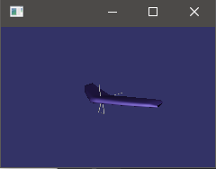
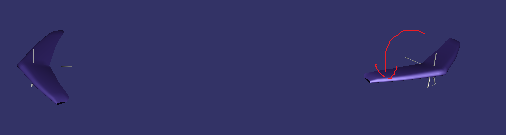
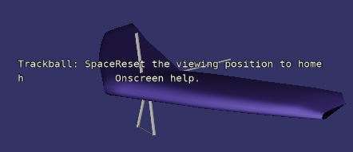
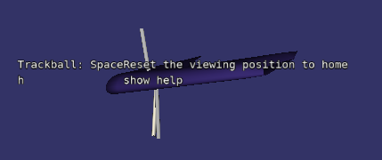
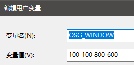
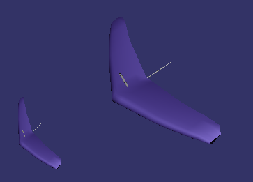
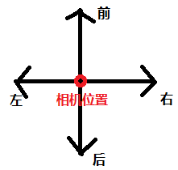

# 1. osg是什么
OpenSceneGraph是一个开源的三维引擎，被广泛的应用在可视化仿真、游戏、虚拟现实、科学计算、三维重建、地理信息、太空探索、石油矿产等领域。OSG采用标准C++和OpenGL编写而成，可运行在所有的Windows平台、OSX、GNU/Linux、IRIX、Solaris、HP-Ux、AIX、Android和FreeBSD 操作系统。OSG在各个行业均有着丰富的扩展，能够与使用OpenGL书写的引擎无缝的结合，使用国际上最先进的图形渲染技术，让每个用户都能站在巨人的肩上。

# 2. 第一个程序
## 2.1. 使用C++原始指针
如下程序运行后, 会读取下载源码时自带的glider.osg文件, 显示一个滑翔翼
``` C++
#include <osgViewer/Viewer>
#include <osgDB/ReadFile>

int main(int argc, char *argv[])
{
    osgViewer::Viewer viewer;
    osg::Node* node = new osg::Node;
    node = osgDB::readNodeFile("glider.osg");
    viewer.setSceneData(node);
    return viewer.run();
}
```
显示效果如下图


## 2.2. 使用osg提供的内置智能指针的版本
``` C++
int main(int argc, char *argv[])
{
    osg::ref_ptr<osgViewer::Viewer> spViewer = new osgViewer::Viewer;
    osg::ref_ptr<osg::Node> spNode = osgDB::readNodeFile("glider.osg");
    spViewer->setSceneData(spNode);
    return spViewer->run();
}
```
效果和上一个示例完全相同

# 3. osg文件
## 3.1. osg, ive文件
osg, ive格式文件直接打开即可

## 3.2. obj文件
从blender导出一个金属方块的模型, 导出为obj格式
在blender显示效果为:


导出后会有一个obj和mlt文件, mlt文件中存储的是材质信息
测试时直接`osgviewer iron.obj`
显示效果如下:


# 4. osg的坐标系统
osg内置坐标系统如下图所示

横向为x轴, 竖直方向为z轴, 屏幕向里的方向为y轴正方向

# 5. 矩阵操作
## 5.1. 平移
如下代码使用矩阵将一个滑翔机移动了5个单位
具体方法为设置一个平移矩阵`mat->setMatrix(osg::Matrix::translate(5.0, 0.0, 0.0));`
``` C++
//矩阵操作
osg::ref_ptr<osg::Node> MatrixOperation()
{
    osg::ref_ptr<osg::Group> group = new osg::Group;
    osg::ref_ptr<osg::MatrixTransform> mat = new osg::MatrixTransform;
    osg::ref_ptr<osg::Node> node = osgDB::readNodeFile("glider.osg");

    mat->addChild(node);
    mat->setMatrix(osg::Matrix::translate(5.0, 0.0, 0.0));

    group->addChild(node);
    group->addChild(mat.get());
    return group;
}
```
显示效果如下图


## 5.2. 旋转
### 5.2.1. 旋转某个角度
直接调用`setMatrix()`方法, 输入矩阵可以通过`osg::Matrix::rotate`生成
``` C++
m_trans->setMatrix(osg::Matrix::rotate(angle, axis));
```
### 5.2.2. 让模型延自己的轴自动自转
让模型产生自转动画, 需要对变换矩阵设置回调`mat->setUpdateCallback`
``` C++
osg::ref_ptr<osg::Node> MatrixOperation()
{
    osg::ref_ptr<osg::Group> group = new osg::Group;
    osg::ref_ptr<osg::MatrixTransform> mat = new osg::MatrixTransform;
    osg::ref_ptr<osg::Node> node = osgDB::readNodeFile("glider.osg");
    mat->addChild(node);
    mat->setUpdateCallback(new osg::AnimationPathCallback(osg::Vec3(0.0, 0.0, 0.0), osg::Z_AXIS, 1.0));
    group->addChild(mat.get());
    return group;
}
```
上面代码中, 设置了模型以自己的(0, 0, 0)点的Z轴进行旋转, 角速度为1

如果要先平移, 后旋转, 是不能直接对mat设置变换矩阵的, 因为设置的更新回调会让变换矩阵不起作用
具体方法为:
创建一个变换节点trans, 设置变换参数, 
让模型作为trans的子节点,
再让trans作为mat的子节点即可
具体代码为:
``` C++
#include <osg/MatrixTransform>
#include <osg/AnimationPath>
//矩阵操作
osg::ref_ptr<osg::Node> MatrixOperation()
{
    osg::ref_ptr<osg::Group> group = new osg::Group;
    osg::ref_ptr<osg::MatrixTransform> mat = new osg::MatrixTransform;
    osg::ref_ptr<osg::Node> node = osgDB::readNodeFile("glider.osg");

    osg::ref_ptr<osg::MatrixTransform> trans = new osg::MatrixTransform;
    trans->setMatrix(osg::Matrix::translate(5.0, 0.0, 0.0));
    trans->addChild(node);
    mat->addChild(trans);

    mat->setUpdateCallback(new osg::AnimationPathCallback(osg::Vec3(5.0, 0.0, 0.0), osg::Z_AXIS, 1.0));

    group->addChild(node);
    group->addChild(mat.get());
    return group;
}
```
显示效果为:


## 5.3. 平移
直接调用`setMatrix()`方法, 输入矩阵可以通过`osg::Matrix::translate`生成
``` C++
m_trans->setMatrix(osg::Matrix::translate(pos));
```

## 5.4. 缩放
直接调用`setMatrix()`方法, 输入矩阵可以通过`osg::Matrix::scale`生成
``` C++
m_trans->setMatrix(osg::Matrix::scale(rate, rate, rate));
```

## 5.5. 变换工具类示例代码
``` C++
#ifndef NODEMATRIX_H
#define NODEMATRIX_H

#include "../Common.h"

class NodeMatrix : public osg::MatrixTransform
{
public:
    NodeMatrix();
    ~NodeMatrix();

public:
    void setModel(osg::Node* node);

    /**
     * @brief 将模型转动一个角度
     * @param angle : 转动的角度, 单位为弧度
     * @param axis : 转动的轴
     */
    void ToRotate(double angle, const osg::Vec3d& axis);

    void ToScale(double rate);

    void ToPosition(const osg::Vec3d & pos);

    void Adapt(const osg::BoundingSphere &bs);

private:
    osg::ref_ptr<osg::MatrixTransform> m_trans;
    osg::Node* m_model;
};

#include "NodeMatrix.h"
#include <QDebug>

NodeMatrix::NodeMatrix()
{
    m_trans = new osg::MatrixTransform;
    addChild(m_trans);
}

NodeMatrix::~NodeMatrix() { }

void NodeMatrix::setModel(osg::Node *node)
{
    m_trans->addChild(node);
    m_model = node;
    qDebug() << "BoundingSphere" << m_model->getBound().center().x() << m_model->getBound().center().y() <<m_model->getBound().center().z();
}

void NodeMatrix::ToRotate(double angle, const osg::Vec3d &axis)
{
    m_trans->setMatrix(osg::Matrix::rotate(angle, axis));
}

void NodeMatrix::ToScale(double rate)
{
    m_trans->setMatrix(osg::Matrix::scale(rate, rate, rate));
}

void NodeMatrix::ToPosition(const osg::Vec3d &pos)
{
    osg::Vec3d curPos = m_model->getBound().center();
    m_trans->setMatrix(osg::Matrix::translate(-curPos));
    m_trans->setMatrix(osg::Matrix::translate(pos));
}

void NodeMatrix::Adapt(const osg::BoundingSphere &bs)
{
    double rate = bs.radius() / m_model->getBound().radius();
    ToScale(rate);
}
#endif // NODEMATRIX_H
```

# 6. osg常用工具类
## 6.1. Timer
Timer类可以进行短时间的计时, 通过`getSecondsPerTick()`可以获取到Timer每次tick间隔1e-7秒, 也就是Timer的精度
如果要测量两次tick的间隔时间, 可以通过`delta_s()`方法
如下代码测试了加载模型的耗时, 打印出来为0.023s左右
``` C++
osg::Timer timer;
qDebug() << timer.getSecondsPerTick(); //tick一次需要多少秒 (1e-07)
osg::ref_ptr<osgViewer::Viewer> spViewer = new osgViewer::Viewer;
osg::Timer_t start_time = timer.tick();
osg::ref_ptr<osg::Node> spNode = osgDB::readNodeFile("glider.osg");
osg::Timer_t end_time = timer.tick();
qDebug() << "read model cost" << timer.delta_s(start_time, end_time);
//打印read model cost 0.0228305
```

第二种测量时间间隔的方法:
先调用`setStartTick()`方法启动计时, 再调用`time_s()`方法可以获取时间间隔

``` C++
osg::Timer timer;
qDebug() << timer.getSecondsPerTick(); //tick一次需要多少秒 (1e-07)
osg::ref_ptr<osgViewer::Viewer> spViewer = new osgViewer::Viewer;
timer.setStartTick();
osg::ref_ptr<osg::Node> spNode = osgDB::readNodeFile("glider.osg");
qDebug() << "read model cost" << timer.time_s();
//打印read model cost 0.0227105
```

# 7. osg基本图元
## 7.1. 立方体
添加立方体, 并设置材质, 纹理
``` C++
#include <osg/Geode>
#include <osg/ShapeDrawable>
#include <osg/Material>
#include <osg/StateSet>
#include <osg/Image>
#include <osg/Texture2D>
osg::ref_ptr<osg::Geode> CreateBox()
{
    osg::ref_ptr<osg::Geode> spGeode = new osg::Geode;
    osg::ref_ptr<osg::TessellationHints> spHints = new osg::TessellationHints;
    osg::ref_ptr<osg::ShapeDrawable> shape =
            new osg::ShapeDrawable(new osg::Box(osg::Vec3(0.0, 0.0, 0.0), 1.0, 1.0, 1.0),
                                   spHints.get());
    //设置材质
    osg::ref_ptr<osg::Material> spMaterial = new osg::Material;
    spMaterial->setAmbient(osg::Material::FRONT_AND_BACK, osg::Vec4(1.0, 1.0, 1.0, 0.5));
    spMaterial->setDiffuse(osg::Material::FRONT_AND_BACK, osg::Vec4(1.0, 1.0, 1.0, 0.5));
    spMaterial->setSpecular(osg::Material::FRONT_AND_BACK, osg::Vec4(1.0, 1.0, 1.0, 0.5));
    spMaterial->setShininess(osg::Material::FRONT_AND_BACK, 6.0);

    //设置纹理
    osg::ref_ptr<osg::Texture2D> spTexture2D = new osg::Texture2D;
    osg::ref_ptr<osg::Image> spImage = osgDB::readImageFile("D:/OSG/res/texture2DTest.png");
    if (spImage.valid())
    {
        spTexture2D->setImage(spImage.get());
    }
    //设置颜色
    //shape->setColor(osg::Vec4(0.5, 0.5, 0.5, 0.5));
    spHints->setDetailRatio(0.5);
    spGeode->getOrCreateStateSet()->setAttributeAndModes(spMaterial.get(), osg::StateAttribute::ON);
    spGeode->getOrCreateStateSet()->setTextureAttributeAndModes(0, spTexture2D.get(), osg::StateAttribute::ON);
    spGeode->getOrCreateStateSet()->setMode(GL_BLEND, osg::StateAttribute::ON); //设置透明度
    spGeode->getOrCreateStateSet()->setMode(GL_DEPTH_TEST, osg::StateAttribute::ON);    //打开深度测试
    spGeode->addDrawable(shape.get());
    return spGeode;
}
```
显示效果如下图


## 7.2. 顶点集合
osg支持顶点集合, 可以输入一组点, 根据这组点生成几何体
如下代码中设置了一个四方形的四个顶点, 并指明要生成四边形
``` C++
geom->addPrimitiveSet(new osg::DrawArrays(osg::PrimitiveSet::Mode::QUADS, 0, 4));   //声明从第0个点开始, 4个点使用四边形进行连接
```
对顶点设置颜色, 法向量后, 加入场景
注意, 如下代码中加入了一个滑翔机, 一个顶点形成的四边形来体现半透明效果, 需要先添加滑翔机才有效果
``` C++
//创建简单图元
osg::ref_ptr<osg::Node> CreateSimple()
{
    osg::ref_ptr<osg::Geode> geode = new osg::Geode;
    osg::ref_ptr<osg::Geometry> geom = new osg::Geometry;
    //顶点数组
    osg::ref_ptr<osg::Vec3Array> coords = new osg::Vec3Array;
    //将点插入数组
    coords->push_back(osg::Vec3(-1.0, 0.0, -1.0));
    coords->push_back(osg::Vec3(1.0, 0.0, -1.0));
    coords->push_back(osg::Vec3(1.0, 0.0, 1.0));
    coords->push_back(osg::Vec3(-1.0, 0.0, 1.0));
    geode->addDrawable(geom);
    //设置顶点
    geom->setVertexArray(coords.get());
    //设置顶点的关联方式
    geom->addPrimitiveSet(new osg::DrawArrays(osg::PrimitiveSet::Mode::QUADS, 0, 4));   //声明从第0个点开始, 4个点使用四边形进行连接

    //颜色
    osg::ref_ptr<osg::Vec4Array> colors = new osg::Vec4Array;
    colors->push_back(osg::Vec4f(1.0, 0.0, 0.0, 0.5));
    colors->push_back(osg::Vec4f(0.0, 1.0, 0.0, 0.5));
    colors->push_back(osg::Vec4f(0.0, 0.0, 1.0, 0.5));
    colors->push_back(osg::Vec4f(1.0, 1.0, 0.0, 0.5));
    geom->setColorArray(colors.get());
    geom->setColorBinding(osg::Geometry::AttributeBinding::BIND_PER_VERTEX);    //设置绑定方式

    //法向量, 设置y轴负方向的法向向量, 可以让正对屏幕的面高亮
    osg::ref_ptr<osg::Vec3Array> norms = new osg::Vec3Array;
    geom->setNormalArray(norms.get());
    geom->setNormalBinding(osg::Geometry::AttributeBinding::BIND_OVERALL);
    norms->push_back(osg::Vec3(0.0, -1.0, 0.0));

    //打开透明度
    geode->getOrCreateStateSet()->setMode(GL_BLEND, osg::StateAttribute::ON);

    return geode;
}

int main(int argc, char *argv[])
{
    Q_UNUSED(argc)
    Q_UNUSED(argv)

    osg::ref_ptr<osgViewer::Viewer> spViewer = new osgViewer::Viewer;
    osg::ref_ptr<osg::Group> group = new osg::Group;
    //需要先加入飞机, 再加入测试平面, 否则测试平面的透明度不会体现
    group->addChild(osgDB::readNodeFile("glider.osg"));
    group->addChild(CreateSimple());

    spViewer->setSceneData(group.get());
    return spViewer->run();
}
```
代码执行效果如下图:


可以用顶点集合实现线框效果, 修改如下代码
``` C++
//设置顶点的关联方式
    geom->addPrimitiveSet(new osg::DrawArrays(osg::PrimitiveSet::Mode::LINE_LOOP, 0, 4));
```
上面代码让输入的四个点按照线框方式显示,
再设置线宽:
``` C++
osg::ref_ptr<osg::LineWidth> width = new osg::LineWidth;
width->setWidth(10.0);
geode->getOrCreateStateSet()->setAttributeAndModes(width.get(), osg::StateAttribute::ON);
```
显示效果如下图


# 8. osgViewer应用基础
## 8.1. 事件
添加事件Handler可以在osgViewer中收到相应的事件时(键盘按下等), 做出对应的响应

### 8.1.1. 添加osg自带的事件Handler
HelpHandler是一个osg自带的事件Handler, 如下代码会将其添加入viewer
``` C++
spViewer->addEventHandler(new osgViewer::HelpHandler);
```
添加后按下H会在屏幕中出现帮助信息


其他自带的Handler演示
``` C++
spViewer->addEventHandler(new osgViewer::StatsHandler); //显示帧率
spViewer->addEventHandler(new osgViewer::WindowSizeHandler);    //全屏与非全屏
spViewer->addEventHandler(new osgViewer::ScreenCaptureHandler); //截屏
```
具体Handler的快捷键可以通过点击H查看

### 8.1.2. 添加自定义事件
自定义事件需要继承`osgGA::GUIEventHandler`, 重写需要的方法, 这里只重写了`getUsage()`方法, 按下H后会显示其中注册的文本
``` C++
class KeyboardHandler : public osgGA::GUIEventHandler
{
public:
    KeyboardHandler() {}
    virtual void getUsage(osg::ApplicationUsage& usage) const
    {
        usage.addKeyboardMouseBinding("h", "show help");
    }
};
```
再将此Handler注册到viewer中
``` C++
spViewer->addEventHandler(new KeyboardHandler);
```

当点击H键后, 显示的内容如下图所示


# 9. 场景漫游
实现场景漫游, 需要自定义相机控制器, 并调用`setCameraManipulator()`设置到viewer的中
自定以相机控制器需要继承`osgGA::CameraManipulator`, 并实现其中的纯虚方法
`setByMatrix()`
`setByInverseMatrix()`
`getMatrix()`
`getInverseMatrix()`

要键盘控制, 则需要实现基类里的`handle()`方法

如下示例代码中, 实现了通过按键WSAD进行前后左右的平移, EQ进行上下升降的操作
```C++
class TravelManipulator : public osgGA::CameraManipulator
{
public:
    TravelManipulator();

public:
    //设置当前视口
    virtual void setByMatrix(const osg::Matrixd& mat);
    //设置当前视口
    virtual void setByInverseMatrix(const osg::Matrixd& mat);
    //得到当前矩阵
    virtual osg::Matrixd getMatrix() const;
    //得到当前的逆矩阵
    virtual osg::Matrixd getInverseMatrix() const;

    virtual bool handle(const osgGA::GUIEventAdapter& ea, osgGA::GUIActionAdapter& us);

    //设置/获取步长
    void SetStep(int step) { m_vStep = step; }
    int GetStep() { return m_vStep; }

    //设置/获取当前视角到某个点
    void SetPosition(const osg::Vec3d& pos) { m_vPosition = pos; }
    osg::Vec3d GetPosition() { return m_vPosition; }

private:
    //视点
    osg::Vec3 m_vPosition;
    //朝向
    osg::Vec3 m_vRotation;
    //移动速度(移动步长)
    int m_vStep;
    //记录鼠标左键按下的坐标
    int m_iLeftX;
    int m_iLeftY;
    bool m_bIsMouseMoving = false;

    void changePosition(const osg::Vec3d& delta);
};

TravelManipulator::TravelManipulator()
{
    m_vPosition = osg::Vec3(0, 0, 2);
    m_vRotation = osg::Vec3(osg::PI_2, 0, 0);
    m_vStep = 2;
}

void TravelManipulator::setByMatrix(const osg::Matrixd &mat) { }
void TravelManipulator::setByInverseMatrix(const osg::Matrixd &mat) { }

osg::Matrixd TravelManipulator::getMatrix() const
{
    osg::Matrixd mat;
    mat.makeTranslate(m_vPosition);
    return osg::Matrixd::rotate(m_vRotation[0], osg::X_AXIS,
            m_vRotation[1], osg::Y_AXIS,
            m_vRotation[2], osg::Z_AXIS) * mat;
}

osg::Matrixd TravelManipulator::getInverseMatrix() const
{
    osg::Matrixd mat;
    mat.makeTranslate(m_vPosition);
    return osg::Matrixd::inverse(osg::Matrixd::rotate(m_vRotation[0], osg::X_AXIS,
                                 m_vRotation[1], osg::Y_AXIS,
                                 m_vRotation[2], osg::Z_AXIS) * mat);
}

bool TravelManipulator::handle(const osgGA::GUIEventAdapter &ea, osgGA::GUIActionAdapter &us)
{
    switch (ea.getEventType())
    {
    case osgGA::GUIEventAdapter::KEYDOWN:
    {
        int iKey = ea.getKey();
        if (iKey == 'w' || iKey == osgGA::GUIEventAdapter::KEY_Up)
        {
            osg::Vec3d dir = osg::Vec3d(m_vStep * cosf(osg::PI_2 + m_vRotation.z()),
                                       m_vStep * sinf(osg::PI_2 + m_vRotation.z()), 0);
            changePosition(dir);
            return true;
        }
        else if (iKey == 's' || iKey == osgGA::GUIEventAdapter::KEY_Down)
        {
            osg::Vec3d dir = osg::Vec3d(-m_vStep * cosf(osg::PI_2 + m_vRotation._v[2]),
                                       -m_vStep * sinf(osg::PI_2 + m_vRotation._v[2]), 0);
            changePosition(dir);
            return true;
        }
        else if (iKey == 'a' || iKey == osgGA::GUIEventAdapter::KEY_Left)
        {
            osg::Vec3d dir = osg::Vec3d(-m_vStep * sinf(osg::PI_2 + m_vRotation._v[2]),
                                       m_vStep * cosf(osg::PI_2 + m_vRotation._v[2]), 0);
            changePosition(dir);
            return true;
        }
        else if (iKey == 'd' || iKey == osgGA::GUIEventAdapter::KEY_Right)
        {
            osg::Vec3d dir = osg::Vec3d(m_vStep * sinf(osg::PI_2 + m_vRotation._v[2]),
                                       -m_vStep * cosf(osg::PI_2 + m_vRotation._v[2]), 0);
            changePosition(dir);
            return true;
        }
        else if (iKey == 'j')
        {
            m_vRotation[2] += 0.2;
            return true;
        }
        else if (iKey == 'k')
        {
            m_vRotation[2] += -0.2;
            return true;
        }
        else if (iKey == 'q')
        {
            changePosition(osg::Vec3d(0, 0, m_vStep));
            return true;
        }
        else if (iKey == 'e')
        {
            changePosition(osg::Vec3d(0, 0, -m_vStep));
            return true;
        }
    }
        break;
    case osgGA::GUIEventAdapter::PUSH:
    {
        if (ea.getButton() == osgGA::GUIEventAdapter::LEFT_MOUSE_BUTTON)
        {
            m_iLeftX = ea.getX();
            m_iLeftY = ea.getY();
            m_bIsMouseMoving = true;
        }
    }
    case osgGA::GUIEventAdapter::DRAG:
    {
        if (m_bIsMouseMoving)
        {
            int deltaX = ea.getX() - m_iLeftX;
            int deltaY = ea.getY() - m_iLeftY;
            m_vRotation[2] -= osg::DegreesToRadians(0.003 * deltaX);
            m_vRotation[0] += osg::DegreesToRadians(0.003 * deltaY);
            if (m_vRotation[0] <= 0)
            {
                m_vRotation[0] = 0;
            }
            else if (m_vRotation[0] > osg::PI)
            {
                m_vRotation[0] = osg::PI;
            }
        }
    }
        break;
    case osgGA::GUIEventAdapter::RELEASE:
    {
        if (ea.getButton() == osgGA::GUIEventAdapter::LEFT_MOUSE_BUTTON)
        {
            m_bIsMouseMoving = false;
        }
    }
        break;
    default:
        break;
    }
    return false;
}

void TravelManipulator::changePosition(const osg::Vec3d &delta)
{
    m_vPosition += delta;
}
```

# 10. 碰撞检测
## 10.1. 通过IntersectionVisitor进行碰撞检测
基本步骤:
1. 创建一条直线碰撞对象`osgUtil::LineSegmentIntersector`
2. 通过直线碰撞对象`osgUtil::LineSegmentIntersector`创建碰撞点访问器`osgUtil::IntersectionVisitor`
3. 调用待检测对象的`accept()`方法, 并传入之前创建的碰撞点访问器
4. 从直线碰撞对象中取出碰撞点

``` C++
int testCollision()
{
    osg::ref_ptr<osgViewer::Viewer> viewer = new osgViewer::Viewer;
    osg::ref_ptr<osg::Group> group = new osg::Group;
    osg::Vec3 start = osg::Vec3(0, 0, 15);
    osg::Vec3 end = osg::Vec3(0, 0, -15);

    osg::ref_ptr<osgUtil::LineSegmentIntersector> ls = new osgUtil::LineSegmentIntersector(start, end);
    osgUtil::IntersectionVisitor iv = osgUtil::IntersectionVisitor(ls);

    group->addChild(CreateBox());
    group->accept(iv);

    //如果有碰撞, 则输出所有交点
    osgUtil::LineSegmentIntersector::Intersections intersections;
    if (ls->containsIntersections())
    {
        intersections = ls->getIntersections();
        for (osgUtil::LineSegmentIntersector::Intersections::iterator iter = intersections.begin(); iter != intersections.end(); iter++)
        {
            osg::Vec3 p = iter->getWorldIntersectPoint();
            qDebug() << p.x() << p.y() << p.z();
        }
    }
    viewer->setSceneData(group);
    return viewer->run();
}

```

## 10.2. 通过IntersectVisitor进行碰撞检测
基本步骤:
1. 创建直线段`osg::LineSegment`和`osgUtil::IntersectVisitor`
2. 将直线段加入到`osgUtil::IntersectVisitor`中
3. 执行待检测物体的`accept()`方法, 并将`osgUtil::IntersectVisitor`传入
4. 从`osgUtil::IntersectVisitor`中取出碰撞点

``` C++
osg::ref_ptr<osg::LineSegment> ls = new osg::LineSegment();
osgUtil::IntersectVisitor iv;
ls->set(p1, p2);    //传入两个点, 构成一条直线
if (ls.valid())
{
    iv.addLineSegment(ls);
    box->accept(iv);    //box是待检测物体
    if (iv.hits())
    {
        //获取碰撞点
        osgUtil::IntersectVisitor::HitList hitList = iv.getHitList(ls);
        osg::NodePath nodePath;
        for (auto iter = hitList.begin(); iter != hitList.end(); ++iter)
        {
            nodePath = iter->getNodePath();
            osg::Vec3 point = iter->getWorldIntersectPoint();   //撞击点
            std::cout << "point :" << point.x() << " " << point.y() << " " << point.z() << std::endl;
            for (auto iterNode = nodePath.begin(); iterNode != nodePath.end(); ++iterNode)
            {
                std::cout << "hit :" << (*iterNode)->getName() << std::endl;
            }
        }
    }
}
```

# 11. 窗口
## 11.1. 获取当前屏幕信息
当前屏幕信息可以通过`osg::GraphicsContext::WindowingSystemInterface`类获取
如下代码显示了当前屏幕的分辨率
``` C++
int testWin()
{
    osg::ref_ptr<osgViewer::Viewer> viewer = new osgViewer::Viewer;
    //在获取WindowingSystemInterface之前, 应该先创建Viewer, 否则会获取失败
    osg::GraphicsContext::WindowingSystemInterface* ws = osg::GraphicsContext::getWindowingSystemInterface();
    if (ws)
    {
        std::cout << "get window system interface sucess" << std::endl;
        osg::GraphicsContext::Traits traits;
        unsigned int width;
        unsigned int height;
        ws->getScreenResolution(traits, width, height);
        //分辨率
        std::cout << "screen resolution: " << width << " " << height << std::endl;
        //是否有边框
        std::cout << "window decoration: " << traits.windowDecoration << std::endl;
    }
    else {
        std::cout << "get window system interface failed" << std::endl;
    }
    osg::ref_ptr<osg::Group> group = new osg::Group;
    viewer->addEventHandler(new WindowHandler());
    viewer->setSceneData(group);
    return viewer->run();
}
```
备注: 在获取WindowingSystemInterface之前, 应该先创建Viewer, 否则会获取失败

## 11.2. 设置当前Viewer的窗口属性
### 11.2.1. 通过环境变量设置
在系统中设置`OSG_WINDOW`环境变量, 可以控制OsgViewer的位置
例如:

如下设置让osg的窗体创建在(100, 100)点, 长宽分别为800和600

### 11.2.2. 在控制器中进行设置
基本步骤如下:
1. 创建一个控制器`WindowHandler`, 继承`osgGA::GUIEventHandler`
2. 实现`handle()`方法
3. 在此方法中, 获取具体的`Window`对象, 设置需要的属性
4. 将此`WindowHandler`设置到viewer中

备注: 目前测试结果为, 必须要在handler中设置viewer的属性, 如果在main函数中设置则不生效, 原因未知

具体代码如下:
``` C++
class WindowHandler : public osgGA::GUIEventHandler
{
public:
    WindowHandler() {}
    bool handle(const osgGA::GUIEventAdapter& ea, osgGA::GUIActionAdapter& aa)
    {
        if (!m_bIsFirst)
        {
            return false;
        }
        osgViewer::Viewer * viewer = dynamic_cast<osgViewer::Viewer*>(&aa);
        osgViewer::Viewer::Windows ws;
        m_bIsFirst = false;
        viewer->getWindows(ws);
        if (!ws.empty())
        {
            osgViewer::Viewer::Windows::iterator iter = ws.begin();
            for (; iter != ws.end(); iter++)
            {
                (*iter)->setWindowRectangle(320, 150, 800, 600);    //设置窗口位置
                (*iter)->setWindowDecoration(false);    //设置无边框
                //(*iter)->useCursor(false);  //窗口中不显示鼠标
                (*iter)->setCursor(osgViewer::GraphicsWindow::WaitCursor);  //设置鼠标类型
            }
        }
        return false;
    }

private:
    bool m_bIsFirst = true;
};
```

设置到viewer中
``` C++
viewer->addEventHandler(new WindowHandler());
```

# 12. 相机
## 12.1. 相机基础
相机Camera是提供渲染的场所, 组成部分如下图所示

名词注解:
深度缓存(DEPTH BUFFER) : 存放的时场景中的对象在各像素的深度值, 当需要判断某个对象是否需要显示时, 需要不计较对象所在的深度值
模版缓存(STENCIL BUFFER): 计算复杂的遮掩操作, 用于判断是否要更新某个像素
颜色缓存(COLOR BUFFER) 实际需要显示的内容
积聚缓存(ACCUMULATION BUFFER): 属于一种高级的颜色缓存, 可用于计算各种复杂的操作, 比如图片叠加
多重采用缓存(MULTISAMPLE BUFFER): 除主要用于实现模版缓存和积聚缓存的功能外, 还能用于多重采样, 从而可以消除锯齿

视口: 即viewport, 表示看到的平面的长和宽
观察矩阵: 从哪里进行观察, 观察点在哪里
投影矩阵: 在观察矩阵的基础上, 把看到的物体投影到一个平面上

关系:
屏幕坐标 = (x , y, z) * 观察矩阵 * 投影矩阵 * 视口矩阵

## 12.2. 创建简单相机
相机的`setViewport()`方法的参数为相机视窗的x坐标, y坐标, 宽度和高度
坐标系如下图所示


测试代码如下:
``` C++
//相机测试
int testCamera()
{
    osg::ref_ptr<osgViewer::Viewer> viewer = new osgViewer::Viewer;
    osg::ref_ptr<osg::Group> group = new osg::Group;
    osg::ref_ptr<osg::Node> node = osgDB::readNodeFile("glider.osg");
    group->addChild(node);
    osg::ref_ptr<osg::Camera> camera = new osg::Camera;
    camera->addChild(node);
    camera->setViewport(0, 0, 200, 200);
    group->addChild(camera);

    viewer->setSceneData(group);

    return viewer->run();
}
```
效果如下图所示, 左下角出现了飞机的另一个视图



## 12.3. 相机的背景色设置
如下代码为相机设置了红色背景
``` C++
osg::ref_ptr<osg::Camera> master = new osg::Camera;
master->setClearColor(osg::Vec4(1.0, 0.0, 0.0, 1.0));
```
效果如下图所示


## 12.4. 多个相机
如下代码除主相机外, 增加了四个相机, 分别观看当前视角的前后左右
前后左右观看角度示意图如下:


``` C++
void createCamera(osgViewer::Viewer* viewer)
{
    if (viewer == nullptr)
    {
        return;
    }
    osg::GraphicsContext::WindowingSystemInterface *wsi = osg::GraphicsContext::getWindowingSystemInterface();
    if (wsi == nullptr)
    {
        return;
    }
    unsigned int width, height;
    wsi->getScreenResolution(osg::GraphicsContext::ScreenIdentifier(), width, height);
    osg::ref_ptr<osg::GraphicsContext::Traits> traits = new osg::GraphicsContext::Traits;
    traits->x = 0;
    traits->y = 0;
    traits->width = width;
    traits->height = height;
    traits->windowDecoration = false;
    traits->doubleBuffer = true;
    traits->sharedContext = nullptr;

    osg::ref_ptr<osg::GraphicsContext> gc = osg::GraphicsContext::createGraphicsContext(traits);
    if (!gc.valid())
    {
        return;
    }
    gc->setClearColor(osg::Vec4(0.5, 0.5, 0.5, 1.0));
    gc->setClearMask(GL_COLOR_BUFFER_BIT);

    osg::ref_ptr<osg::Camera> master = new osg::Camera;
    master->setClearMask(GL_COLOR_BUFFER_BIT | GL_DEPTH_BUFFER_BIT);
    //master->setClearColor(osg::Vec4(1.0, 0.0, 0.0, 1.0));
    master->setGraphicsContext(gc);
    master->setViewport(0, 0, width, height);
    viewer->addSlave(master.get());

    osg::ref_ptr<osg::Camera> frontCamera = new osg::Camera;
    frontCamera->setGraphicsContext(gc);
    frontCamera->setViewport(0, height / 4 * 3, width / 4, height / 4);
    viewer->addSlave(frontCamera);

    osg::ref_ptr<osg::Camera> rightCamera = new osg::Camera;
    rightCamera->setGraphicsContext(gc);
    rightCamera->setViewport(width / 4 * 3, 0, width / 4, height / 4);
    viewer->addSlave(rightCamera, osg::Matrix(), osg::Matrix::rotate(osg::DegreesToRadians(90.0), 0.0, 1.0, 0.0));

    osg::ref_ptr<osg::Camera> leftCamera = new osg::Camera;
    //leftCamera->setClearMask(GL_DEPTH_BUFFER_BIT);
    leftCamera->setGraphicsContext(gc);
    leftCamera->setViewport(0, 0, width / 4, height / 4);
    viewer->addSlave(leftCamera, osg::Matrix(), osg::Matrix::rotate(osg::DegreesToRadians(-90.0), 0.0, 1.0, 0.0));

    osg::ref_ptr<osg::Camera> backCamera = new osg::Camera;
    //leftCamera->setClearMask(GL_DEPTH_BUFFER_BIT);
    backCamera->setGraphicsContext(gc);
    backCamera->setViewport(width / 4 * 3, height / 4 * 3, width / 4, height / 4);
    viewer->addSlave(backCamera, osg::Matrix(), osg::Matrix::rotate(osg::DegreesToRadians(180.0), 0.0, 1.0, 0.0));

    return;
}

//相机测试
int testCamera()
{
    osg::ref_ptr<osgViewer::Viewer> viewer = new osgViewer::Viewer;
    osg::ref_ptr<osg::Group> group = new osg::Group;
    osg::ref_ptr<osg::Node> node = osgDB::readNodeFile("D:/OSG/res/ceep.ive");
    group->addChild(node);
    createCamera(viewer);
    viewer->setSceneData(group);
    return viewer->run();
}
```

效果图如下


## 12.5. 相机参数
上例中对viewer设置相机时使用的接口为: `addSlave()`
``` C++
bool addSlave(osg::Camera* camera, const osg::Matrix& projectionOffset, const osg::Matrix& viewOffset, bool useMastersSceneData=true);
```
参数的具体含义如下:
`osg::Camera* camera` : 相机指针
`const osg::Matrix& projectionOffset` : 投影矩阵, 参考相机基础
`const osg::Matrix& viewOffset` :  观察矩阵, 参考相机基础

## 12.6. HUD
HUD : Head Up Display
HUD本质上是一个Camera, 在其中加入了一些三维物体, 使用二维的方式展示, 不受其他场景的影响, 始终显示在屏幕上.
例如游戏界面中的血条等一直显示的内容

### 12.6.1. 文字HUD
文字HUD即在屏幕中一直显示的文字, 不受场景影响
基本步骤:
1. 创建相机
2. 设置相机属性, 符合HUD要求, 见代码示例
3. 添加一个文字对象, 设置属性

示例代码如下:
``` C++
//HUD
osg::Camera* CreateTextHUD()
{
    osg::ref_ptr<osg::Camera> camera = new osg::Camera;
    camera->setViewMatrix(osg::Matrix::identity()); //设置观察矩阵为单位矩阵
    camera->setRenderOrder(osg::Camera::POST_RENDER);   //设置最后渲染
    camera->setClearMask(GL_DEPTH_BUFFER_BIT);  //清除深度缓存
    camera->setAllowEventFocus(false);  //不接收外界事件
    camera->setReferenceFrame(osg::Transform::ABSOLUTE_RF);
    camera->setProjectionMatrixAsOrtho2D(0, 800, 0, 600); //设置视口

    osg::ref_ptr<osg::Geode> gnode = new osg::Geode;
    gnode->getOrCreateStateSet()->setMode(GL_LIGHTING, osg::StateAttribute::OFF);   //关闭光照
    osg::ref_ptr<osgText::Text> text = new osgText::Text;
    gnode->addDrawable(text);
    text->setFont("Font/msyh.ttf"); //设置微软雅黑字体
    text->setCharacterSize(100);    //设置文字大小
    text->setColor(osg::Vec4(1.0, 1.0, 0.0, 1.0));  //设置字体为黄色
    text->setText("test");
    text->setPosition(osg::Vec3(0.0, 0.0, 0.0));    //设置文字位置

    camera->addChild(gnode);
    return camera.release();
}

int testHUD()
{
    osg::ref_ptr<osgViewer::Viewer> viewer = new osgViewer::Viewer;
    osg::ref_ptr<osg::Group> group = new osg::Group;
    osg::ref_ptr<osg::Node> node = osgDB::readNodeFile("glider.osg");
    group->addChild(node);
    group->addChild(CreateTextHUD());

    viewer->setSceneData(group);
    return viewer->run();
}
```

效果如图所示


### 12.6.2. 图片HUD
图片HUD即创建一个带纹理的平面, 对相机设置HUD相关联的属性, 即可形成图片HUD的效果
示例代码如下:

``` C++
osg::Camera* CreatePicHUD()
{
    osg::ref_ptr<osg::Camera> camera = new osg::Camera;
    camera->setViewMatrix(osg::Matrix::identity()); //设置观察矩阵为单位矩阵
    camera->setRenderOrder(osg::Camera::POST_RENDER);   //设置最后渲染
    camera->setClearMask(GL_DEPTH_BUFFER_BIT);  //清除深度缓存
    camera->setAllowEventFocus(false);  //不接收外界事件
    camera->setReferenceFrame(osg::Transform::ABSOLUTE_RF);
    camera->setProjectionMatrixAsOrtho2D(0, 800, 0, 600); //设置视口

    osg::ref_ptr<osg::Geode> gnode = new osg::Geode;
    gnode->getOrCreateStateSet()->setMode(GL_LIGHTING, osg::StateAttribute::OFF);   //关闭光照

    osg::ref_ptr<osg::Geometry> gm = new osg::Geometry;
    gnode->addDrawable(gm);
    //压入顶点
    osg::Vec3Array *vertex = new osg::Vec3Array;
    vertex->push_back(osg::Vec3(0.0, 0.0, 0.0));
    vertex->push_back(osg::Vec3(100.0, 0.0, 0.0));
    vertex->push_back(osg::Vec3(100.0, 100.0, 0.0));
    vertex->push_back(osg::Vec3(0.0, 100.0, 0.0));
    gm->setVertexArray(vertex);
    //法线
    osg::Vec3Array* norm = new osg::Vec3Array;
    norm->push_back(osg::Vec3(0.0, 0.0, 1.0));
    gm->setNormalArray(norm);
    gm->setNormalBinding(osg::Geometry::BIND_OVERALL);
    //设置纹理坐标
    osg::Vec2Array *coord = new osg::Vec2Array;
    coord->push_back(osg::Vec2(0.0, 0.0));
    coord->push_back(osg::Vec2(1.0, 0.0));
    coord->push_back(osg::Vec2(1.0, 1.0));
    coord->push_back(osg::Vec2(0.0, 1.0));
    gm->setTexCoordArray(0, coord);

    gm->addPrimitiveSet(new osg::DrawArrays(osg::PrimitiveSet::QUADS, 0, 4));
    //贴纹理
    osg::ref_ptr<osg::Image> image = osgDB::readImageFile("Cubemap_snow/posz.jpg");
    osg::Texture2D *t2d = new osg::Texture2D;
    t2d->setImage(0, image);
    gnode->getOrCreateStateSet()->setTextureAttributeAndModes(0, t2d, osg::StateAttribute::ON);

    camera->addChild(gnode);
    return camera.release();
}
```

显示效果如下:


### 12.6.3. 多个HUD叠加显示
如果要一个文字显示在一个矩形上, 可以上矩形的z坐标比文字的小, 既可实现此效果
示例代码如下:
``` C++
//创建一个Camera
osg::ref_ptr<osg::Camera> camera = new osg::Camera;
camera->setViewMatrix(osg::Matrix::identity());
camera->setRenderOrder(osg::Camera::POST_RENDER);
camera->setReferenceFrame(osg::Transform::ABSOLUTE_RF);
camera->setProjectionMatrixAsOrtho2D(0, 80, 0, 20);
camera->setClearMask(GL_DEPTH_BUFFER_BIT);
camera->setAllowEventFocus(false);

camera->setViewport(x, y, w, h);
//创建文字
osg::ref_ptr<osg::Geode> gnode = new osg::Geode;
osg::StateSet* ss = gnode->getOrCreateStateSet();
ss->setMode(GL_LIGHTING, osg::StateAttribute::OFF); //关闭光照
ss->setMode(GL_BLEND, osg::StateAttribute::ON);     //打开透明
osg::ref_ptr<osgText::Text> text = new osgText::Text;
text->setText(str);
text->setCharacterSize(m_textSize);
text->setPosition(osg::Vec3(0, 0, 0));
gnode->addDrawable(text);
camera->addChild(gnode);

//绘制矩形
osg::ref_ptr<osg::Geometry> gm = new osg::Geometry;
gnode->addDrawable(gm);
//压入顶点
osg::Vec3Array *vertex = new osg::Vec3Array;
vertex->push_back(osg::Vec3(0.0, 0.0, -0.1));
vertex->push_back(osg::Vec3(w, 0.0, -0.1));
vertex->push_back(osg::Vec3(w, h, -0.1));
vertex->push_back(osg::Vec3(0.0, h, -0.1));
gm->setVertexArray(vertex);
//法线
osg::Vec3Array* norm = new osg::Vec3Array;
norm->push_back(osg::Vec3(0.0, 0.0, 1.0));
gm->setNormalArray(norm);
gm->setNormalBinding(osg::Geometry::BIND_OVERALL);
//设置颜色
osg::ref_ptr<osg::Vec4Array> bkcolorArray = new osg::Vec4Array;
bkcolorArray->push_back(backgroundColor);
gm->setColorArray(bkcolorArray);
gm->setColorBinding(osg::Geometry::BIND_OVERALL);

gm->addPrimitiveSet(new osg::DrawArrays(osg::PrimitiveSet::QUADS, 0, 4));
```
效果如下图所示:


### 12.6.4. 修改相机背景
基本思路 :
最先绘制背景, 在绘制其他场景时, 不清除颜色缓存
``` C++

osg::Camera* createBackground(std::string strImagePath)
{
    osg::ref_ptr<osg::Camera> camera = new osg::Camera;
    camera->setAllowEventFocus(false);
    camera->setProjectionMatrixAsOrtho2D(0, 800, 0, 600);
    camera->setViewport(0, 0, 800, 600);
    camera->setReferenceFrame(osg::Transform::ABSOLUTE_RF);
    camera->setRenderOrder(osg::Camera::PRE_RENDER);    //设置最先渲染
    camera->setClearMask(GL_DEPTH_BUFFER_BIT | GL_COLOR_BUFFER_BIT);
    camera->setViewMatrix(osg::Matrix::identity());

    osg::ref_ptr<osg::Geode> gnode = new osg::Geode;
    camera->addChild(gnode);
    gnode->getOrCreateStateSet()->setMode(GL_LIGHTING, osg::StateAttribute::OFF);

    osg::ref_ptr<osg::Geometry> gm = new osg::Geometry;
    gnode->addDrawable(gm);
    //压入顶点
    osg::Vec3Array *vertex = new osg::Vec3Array;
    vertex->push_back(osg::Vec3(0.0, 0.0, 0.0));
    vertex->push_back(osg::Vec3(800.0, 0.0, 0.0));
    vertex->push_back(osg::Vec3(800.0, 600.0, 0.0));
    vertex->push_back(osg::Vec3(0.0, 600.0, 0.0));
    gm->setVertexArray(vertex);
    //法线
    osg::Vec3Array* norm = new osg::Vec3Array;
    norm->push_back(osg::Vec3(0.0, 0.0, 1.0));
    gm->setNormalArray(norm);
    gm->setNormalBinding(osg::Geometry::BIND_OVERALL);
    //设置纹理坐标
    osg::Vec2Array *coord = new osg::Vec2Array;
    coord->push_back(osg::Vec2(0.0, 0.0));
    coord->push_back(osg::Vec2(1.0, 0.0));
    coord->push_back(osg::Vec2(1.0, 1.0));
    coord->push_back(osg::Vec2(0.0, 1.0));
    gm->setTexCoordArray(0, coord);
    gm->addPrimitiveSet(new osg::DrawArrays(osg::PrimitiveSet::QUADS, 0, 4));

    osg::ref_ptr<osg::Image> image = osgDB::readImageFile(strImagePath);
    if (image.valid())
    {
        osg::ref_ptr<osg::Texture2D> t2d = new osg::Texture2D;
        t2d->setImage(0, image);
        gnode->getOrCreateStateSet()->setTextureAttributeAndModes(0, t2d, osg::StateAttribute::ON);
    }

    return camera.release();
}

int testHUDBackgroup()
{
    osg::ref_ptr<osgViewer::Viewer> viewer = new osgViewer::Viewer;
    viewer->getCamera()->setClearMask(GL_DEPTH_BUFFER_BIT);
    osg::ref_ptr<osg::Group> group = new osg::Group;
    osg::ref_ptr<osg::Node> node = osgDB::readNodeFile("glider.osg");
    group->addChild(node);

    group->addChild(createBackground("Images/rainbow.jpg"));

    viewer->setSceneData(group);
    return viewer->run();
}
```
显示效果如下:


## 12.7. RTT
RTT:  Render To Texture 渲染到纹理
将一个场景中的物体渲染到一张纹理中, 再用纹理做应用


典型应用场景:
一个房间里放置一台播放节目的电视机
使用RTT的解决方案:
房间和电视为主场景, 而电视节目属于另一个场景, 它作为纹理被显示在电视屏幕的模型上
相当于电视屏幕是一个不断更新着的纹理图片

# 13. osg场景的组织结构
## 13.1. 节点的管理形式
osg采用包围体层次(Bounding Volume Hierarchy)来实现场景图形的管理
osg中的节点父子关系不是单纯的树结构, 节点可能有不止一个父节点存在. 
osg中是一种有向无环图(Directed Acyclic Graph)的形式管理节点
当一个几何体被多次引用, 例如一条街道上有多棵树, 使用共享的子节点要优化的多


## 13.2. 节点的分类
1. 空间变换节点
2. 开关节点
3. 细节层次节点(LOD)
4. 相机节点
5. 投影节点
6. 渲染属性节点
7. 覆盖节点
8. 遮挡裁减节点(Cull)
9. 动态调度节点
10. 关节节点
11. 代理节点(ProxyNode)

## 13.3. 空间变换节点
osg中使用行主序(row-major)的矩阵实现变换, 即表达一个空间矢量使用行向量
因此一个向量v经过矩阵M变换的公式如下:

$v^\prime = v \cdot M$

如果要将某一级局部坐标系下的顶点v转换为世界坐标系下的$v^\prime$, 则需要各级局部坐标系的变换矩阵依次相乘, 即:

$$v^\prime = v \cdot M_n \cdot M_{n-1} \cdot \ldots \cdot M_1 \cdot M_0$$

### 13.3.1. osg::MatrixTransform
矩阵变换节点, 继承关系为:
`MatrixTransfomr -> Transform -> Group -> Node`
此节点支持`setMatrix()`方法设置变换矩阵, 当osg系统遍历到此节点后, 会调用`getMatrix()`方法获取变换矩阵, 进行变换

### 13.3.2. osg::PositionAttitudeTransform
更容易理解的变换节点, 使用的方式为设置位移, 设置旋转, 设置缩放倍数
继承关系为:
`PositionAttitudeTransform -> Transform -> Group -> Node`
基本API
| API名称 | 功能 |
|----------|------|
| setPosition | 设置空间平移 |
| setAttitude | 设置空间旋转的四元数 |
| setScale | 设置缩放倍数 |
| setPivotPoint | 设置旋转或缩放的中心点 |

## 13.4. 开关节点
开关节点Switch的作用:
在场景运行中, 某些节点可以被隐藏, 类似于PS中的"图层"概念

### 13.4.1. 继承关系
`osg::Swithc -> Group -> Node`
### 13.4.2. 常用方法
`addChild(Node* child, bool value)` : 添加一个子节点
value为true则会显示child, 否则隐藏, 第一次调用`addChild`默认的索引为0, 第二次为1, 以此类推
`setValue(unsigned int pos, bool value)` 设置当前值
pos为子节点的索引, value: true-显示 false-隐藏

## 13.5. 细节层次节点(LOD)
LOD即可以对一个物体设置多个细节程度不同的模型, 当物体距离视点比较远的时候, 使用细节程度低的模型, 当距离近时使用细节程度很高的模型

### 13.5.1. 继承关系
`osg::LOD -> Group -> Node`

### 13.5.2. 常用方法
`bool addChild(Node* child, float min, float max` : 添加一个子节点, 并设置其对应的观察范围

### 13.5.3. 使用示例
如果当前有三个模型cow.ive, cow-mid.ive, cow-low.ive, 细节程度依次降低, 可以通过如下方法设置LOD, 其中`FLT_MAX`可理解为无限远
``` C++
osg::ref_ptr<osg::Node> model = osgDB::readNodeFile("cow.ive");
float r = model->getBound().radius();

osg::ref_ptr<osg::LOD> root = new osg::LOD;
root->addChild(osgDB::readNodeFile("cow-low.ive", r * 7, FLT_MAX);
root->addChild(osgDB::readNodeFile("cow-mid.ive", r * 3, r * 7);
root->addChild(model, 0.0, r * 3);

osgViewer::Viewer viewer;
viewer.setSceneData(root);
return viewer.run();
```

## 13.6. 节点的事件回调
节点可以设置回调函数, 设置方法如下:
``` C++
node->setUpdateCallback(NodeCallback*);
```
当节点更新时, 会触发注册的回调函数
回调函数为一个继承自`osg::NodeCallback`的对象地址, 需要实现基类的`operator()`方法, 实现回调时执行的方法

示例:
注册一个旋转的回调函数:
``` C++
#include <osg/PositionAttitudeTransform>
class RotateCallback: public osg::NodeCallback
{
public:
    RotateCallback() {}
    virtual void operator()(osg::Node* node, osg::NodeVisitor* nv)
    {
        osg::PositionAttitudeTransform* pat = dynamic_cast<osg::PositionAttitudeTransform*>(node);
        if (pat)
        {
            osg::Quat quat(osg::DegreesToRadians(m_rotateZ), osg::Z_AXIS);
            pat->setAttitude(quat);
            m_rotateZ += 1.0;
        }
        traverse(node, nv);
    }

private:
    double m_rotateZ = 0.0;
};

int testCallback()
{
    osg::ref_ptr<osgViewer::Viewer> viewer = new osgViewer::Viewer;
    osg::ref_ptr<osg::Node> model = osgDB::readNodeFile("cow.osg");
    osg::ref_ptr<osg::PositionAttitudeTransform> pat = new osg::PositionAttitudeTransform;
    pat->addChild(model);
    pat->setUpdateCallback(new RotateCallback);

    viewer->setSceneData(pat.get());

    return viewer->run();
}
```
效果为一个一直旋转的牛:


# 14. 用户交互
OSG中主要使用osgGA库处理用户的交互动作, GA全称为GUI Abstraction, 即图形接口抽象层
## 14.1. 事件适配器GUIEventAdapter


