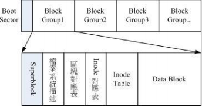
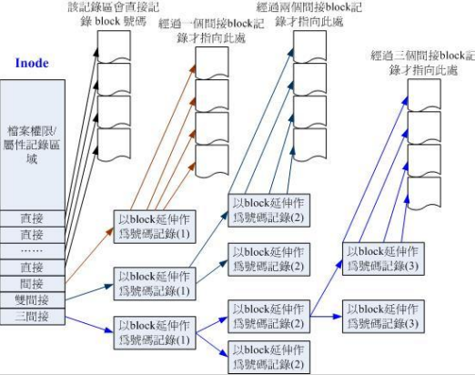

# ext2文件系统

在整体的规划当中，文件系统最前面有一个启动扇区(boot sector)，这个启动扇区可以安装开机管理程序

Block Group:
 Ext2 文件系统在格式化癿时候基本上是区分为多个区块群组 (block group) 的，每个区块群组都有独立的 inode/block/superblock 系统

Data Block:
data block 是用来放置档案内容数据地方，在 Ext2 文件系统中所支持的 block 大小有 1K, 2K 及 4K 三种而已。在格式化时 block的大小就固定了，每个 block 都有编号，以方便 inode 的记录

Inode table:
inode记录了档案的属性和档案数据实际存储在哪个block中
inode 的数量和大小也是在格式化时就已经固定了，
1, 每个 inode 大小均固定为 128 bytes； 
2, 每个档案都仅会占用一个 inode 而已； 
3, 文件系统能够建立的档案数量与 inode 的数量有关； 
4, 系统读叏档案时需要先找到 inode，并分析 inode 所记录的权限和用户是否符合，若符合才能够开始实际读取 block 的内容。

inode中存在12个直接指向block的对照, 1个双间接对照和1个三间接对照

Superblock
Superblock 是记录整个 filesystem 相关信息的地方， 没有 Superblock ，就没有这个 filesystem 
了。他记录的信息主要有： 
1, block 和 inode 的总量； 
2, 未使用与已使用的 inode / block 数量； 
3, block 与 inode 的大小 (block 为 1, 2, 4K，inode 为 128 bytes)； 
4, filesystem 的挂载时间、最近一次写入数据的时间、最近一次检验磁盘 (fsck) 的时间等文件系统
癿相关信息； 
5, 一个 valid bit 数值，若此文件系统已被挂载，则 valid bit 为 0 ，若未被挂载，则 valid bit 为 1 

Filesystem Description (文件系统描述说明) 
这个区段可以描述每个 block group 的开始与结束的block 号码，以及说明每个区段 (superblock, 
bitmap, inodemap, data block) 分别介于哪一个 block 号码之间

block bitmap (区块对照表) 
记录block的使用状况
 
inode bitmap (inode 对照表) 
记录inode的使用状况

查看ext2文件系统信息的方法:
先使用df命令查看所有文件系统,找到要查看的文件系统后(比如/dev/sda1)
输入 dumpe2fs /dev/sda1
即可打印此文件系统信息

