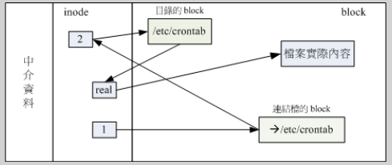

# 硬链接和软链接

## 硬链接
硬链接示意图

建立硬链接(实体链接)/root/crontab到/etc/crontab
则实际上只是在/root/crontab目录的block中添加一笔记录,使之对应到/etc/crontab档案实际的inode,图中为real
硬链接大多数情况下并不会增加inode和block
(但是, 当在目录block添加一笔记录后,刚好填满了此block时,会增加一个新的block)

## 软链接
软链接示意图

建立软链接(符号链接)/root/crontab到/etc/crontab
实际消耗了一个inode(图中为1), 指向一个block, block中存储了要链接的文件/etc/crontab
当使用/root/crontab读取文件时, 从图中1找到存储链接的block, 再找到/etc/crontab目录的inode,找到对应的目录block, 在通过目录找到/etc/crontab文件的inode(图中为real), 最终找到档案/etc/crontab的block

