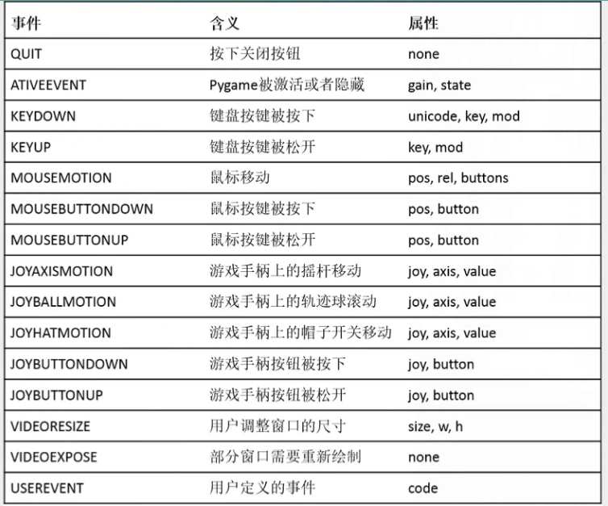

# PyGame事件

## 获得事件的方法
```python
for event in pygame.event.get():
    # print event content
    print(str(event))
    # do something
    pass
```

## 常见事件表


## 用键盘控制图片移动
```
# -*- coding: utf-8 -*-
import pygame
import sys

pygame.init()

screen = pygame.display.set_mode((800, 600))
pygame.display.set_caption("Move By KeyBoard")

clock = pygame.time.Clock()
ball = pygame.image.load("ball.png")

position = ball.get_rect()
speed = [0, 0]

while True:
    for event in pygame.event.get():
        if event.type == pygame.QUIT:
            sys.exit()

        if event.type == pygame.KEYDOWN:
            if event.key == pygame.K_LEFT:
                speed = [-1, 0]
            if event.key == pygame.K_RIGHT:
                speed = [1, 0]
            if event.key == pygame.K_DOWN:
                speed = [0, 1]
            if event.key == pygame.K_UP:
                speed = [0, -1]
        if event.type == pygame.KEYUP:
            speed = [0, 0]

    position = position.move(speed)
    # 填充背景
    screen.fill((0, 0, 0))
    # 更新图像
    screen.blit(ball, position)
    pygame.display.flip()
    # 设置帧率不高于200帧/秒
    clock.tick(200)


```
