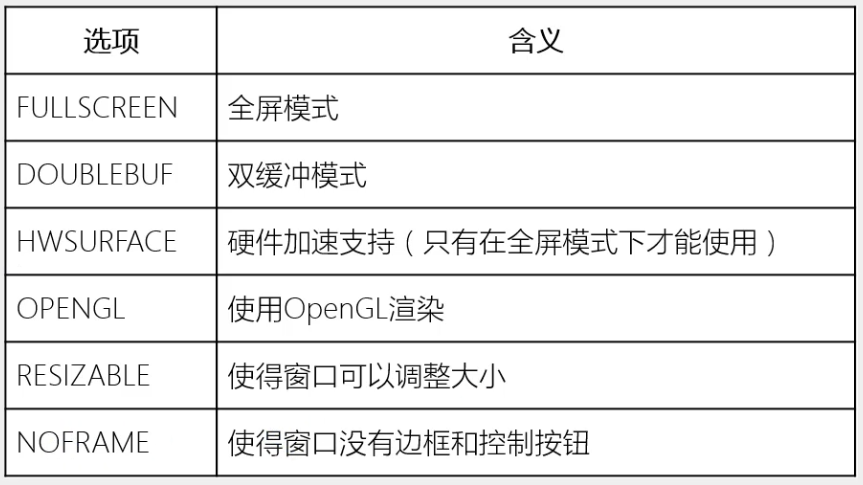

# PyGame初始化窗口

## set_mode方法
set_mode方法返回一个Surface对象, 具体参数为:
`set_mode(resolution = (800, 600), flags = 0, depth = 0) -> Surface`
## 拓展选项
set_mode中的flag可以为以下值


例如, 设置全屏, 并启用硬件加速
```
pygame.init()
screen = pygame.display.set_mode((800, 600))
display_mode = pygame.display.list_modes()
screen = pygame.display.set_mode(display_mode[0], pygame.FULLSCREEN | pygame.HWSURFACE)
```
