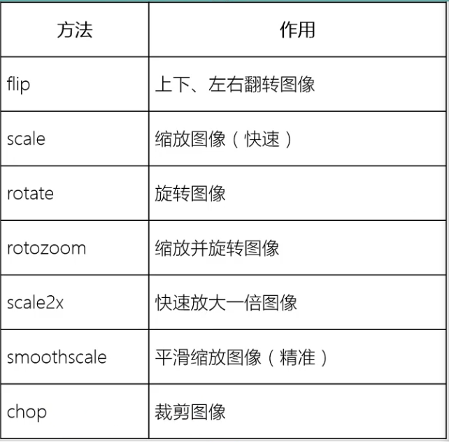

# PyGame图像变换

## 常用方法
PyGame中通常使用transform模块来进行图片的变换


## 实例
### 缩放
按下=放大图片, -缩小图片, 空格还原

```
# -*- coding: utf-8 -*-
import pygame
import sys

pygame.init()
screen = pygame.display.set_mode((800, 600))
pygame.display.set_caption("Scale")

clock = pygame.time.Clock()
origin_ball = pygame.image.load("ball.png")
ball = origin_ball
ball_rect = origin_ball.get_rect()
ratio = 1.0

position = [250, 200]

while True:
    for event in pygame.event.get():
        if event.type == pygame.QUIT:
            sys.exit()

        if event.type == pygame.KEYDOWN:
            # 按下=放大图片, -缩小图片, 空格还原
            if event.key == pygame.K_EQUALS:
                if ratio < 2:
                    ratio += 0.1
            if event.key == pygame.K_MINUS:
                if ratio > 0.5:
                    ratio -= 0.1
            if event.key == pygame.K_SPACE:
                ratio = 1.0
            ball = pygame.transform.smoothscale(origin_ball, \
                (int(ball_rect.width * ratio), int(ball_rect.height * ratio)))
    # 填充背景
    screen.fill((0, 0, 0))
    # 更新图像
    screen.blit(ball, position)
    pygame.display.flip()
    # 设置帧率不高于200帧/秒
    clock.tick(200)

```

### 旋转
旋转函数基本形式
`sur = pygame.transform.rotate(base_sur, angle)`
在base_sur的基础上旋转angle度, angle单位为度(360度一圈), 逆时针为正方向
```
# -*- coding: utf-8 -*-
import pygame
import sys

pygame.init()
screen = pygame.display.set_mode((800, 600))
pygame.display.set_caption("Scale")

clock = pygame.time.Clock()
origin_ball = pygame.image.load("ball.png")
ball = origin_ball
ball_rect = origin_ball.get_rect()
angle = 0

position = [250, 200]

while True:
    for event in pygame.event.get():
        if event.type == pygame.QUIT:
            sys.exit()

        if event.type == pygame.KEYDOWN:
            # 按下右箭头顺时针旋转, 右箭头逆时旋转
            if event.key == pygame.K_LEFT:
                angle += 1
            if event.key == pygame.K_RIGHT:
                angle -= 1
            ball = pygame.transform.rotate(origin_ball, angle)
    # 填充背景
    screen.fill((0, 0, 0))
    # 更新图像
    screen.blit(ball, position)
    pygame.display.flip()
    # 设置帧率不高于200帧/秒
    clock.tick(200)


```


