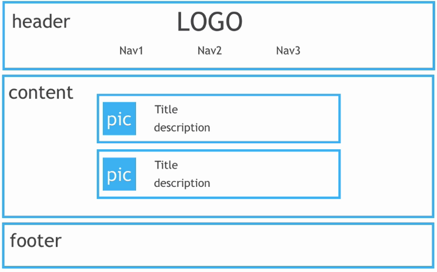

# 爬虫基础

## 爬取内容
主要是html和css
### 常见html标签
#### div
网页中的某个区域
`<div></div>`
#### p
段落
`<p></p>` 
#### li
列表
` <li></li>`
#### img
图片
`</img>`
#### h1
标题
`<h1></h1>`
#### href
链接
`<a href = "">`
### 网页实例


```html
<!DOCTYPE html>
<html lang="en">
<head>
    <meta charset="UTF-8">
    <title>The Title</title>
    <link rel="stylesheet" type="text/css" href="main.css">  <!-- CSS样式 -->
</head>
<body>
	<div class="header">
		
		<ul class="nav">
			<li><a href="#">Home</a></li>
			<li>Site</li>
			<li>Other</li>
		</ul>
	</div>
	<div class="main-content">
		<h2>Article1</h2>
	</div>
	<div class="main-content">
		<h2>Article2</h2>
	</div>
	<div class="footer">
		<p>&copy;google</p>
	</div>
	
</body>
<html>

```


