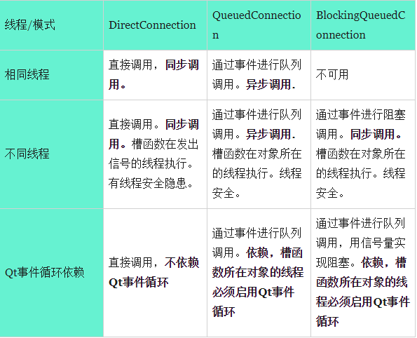

# QT 各种属性的信号槽
## Qt信号槽的几种连接方式和执行方式
官方解释:
```
Qt::AutoConnection	0	自动连接：默认的方式。信号发出的线程和糟的对象在一个线程的时候相当于：DirectConnection， 如果是在不同线程，则相当于QueuedConnection
Qt::DirectConnection	1	直接连接：相当于直接调用槽函数，但是当信号发出的线程和槽的对象不再一个线程的时候，则槽函数是在发出的信号中执行的。
Qt::QueuedConnection	2	队列连接：内部通过postEvent实现的。不是实时调用的，槽函数永远在槽函数对象所在的线程中执行。如果信号参数是引用类型，则会另外复制一份的。线程安全的。
Qt::BlockingQueuedConnection	3	阻塞连接：此连接方式只能用于信号发出的线程（一般是先好对象的线程） 和 槽函数的对象不再一个线程中才能用。通过信号量+postEvent实现的。不是实时调用的，槽函数永远在槽函数对象所在的线程中执行。但是发出信号后，当前线程会阻塞，等待槽函数执行完毕后才继续执行。
Qt::UniqueConnection	0x80	防止重复连接。如果当前信号和槽已经连接过了，就不再连接了。
```
其中有用的也只有三种: DirectConnection, QueuedConnection, BlockingQueuedConnection

具体如下表
