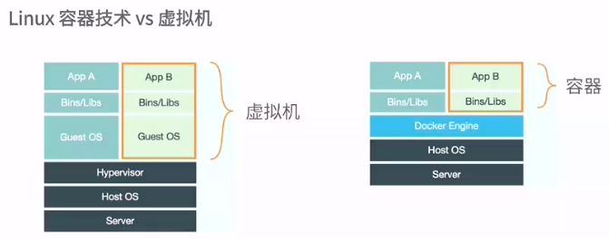

# docker
## 容器和虚拟机的区别

虚拟机是虚拟硬件, 容器则是在操作系统级别的虚拟化

## docker的基本组成
### Docker Client 客户端
### Docker Daemon 守护进程
Docker是一个C/S架构, Daemon相当于Server 
### Docker Image 镜像
是容器的基石
是一个层叠的只读文件系统
### Docker Container 容器
### Docker Registry 仓库

## docker容器技术基础
Docker依赖Linux内核特性
Namespaces 命名空间
Control groups(cgroups) 控制组

### Namespaces
对于编程语言来说, 命名空间实现了代码隔离

对于操作系统而言, 命名空间提供了系统资源的隔离, 例如:
进程, 网络, 文件系统...

### Control groups
用来分配资源
用途: 
资源限制, 比如最多用多少内存
优先级设定
资源计量
资源控制, 将进程挂起等操作

