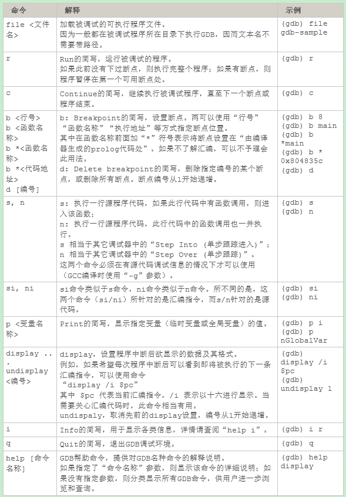

# GDB使用方法

## GDB基础(GDB十分钟教程)
作者: liigo
原文链接: http://blog.csdn.net/liigo/archive/2006/01/17/582231.aspx
日期: 2006年1月16日
本文写给主要工作在Windows操作系统下而又需要开发一些跨平台软件的程序员朋友，以及程序爱好者。
GDB是一个由GNU开源组织发布的、UNIX/LINUX操作系统下的、基于命令行的、功能强大的程序调试工具。
GDB中的命令固然很多，但我们只需掌握其中十个左右的命令，就大致可以完成日常的基本的程序调试工作。



废话不多说，下面开始实践。
先给出一个示例用的小程序，C语言代码，简单的不能再简单了：

```
//此程序仅作为“GDB十分钟教程”的示例代码, by liigo
//Email: liigo@sina.com
//blog: http://blog.csdn.net/liigo
//WebSite: www.liigo.com 

#include <stdio.h>

int nGlobalVar = 0;

int tempFunction(int a, int b)
{
    printf("tempFunction is called, a = %d, b = %d /n", a, b);
    return (a + b);
}

int main()
{
    int n;
    n = 1;
    n++;
    n--;

    nGlobalVar += 100;
    nGlobalVar -= 12;

    printf("n = %d, nGlobalVar = %d /n", n, nGlobalVar);

    n = tempFunction(1, 2);
    printf("n = %d", n);

    return 0;
}

```
请将此代码复制出来并保存到文件 gdb-sample.c 中，然后切换到此文件所在目录，用GCC编译之：
`gcc gdb-sample.c -o gdb-sample -g`
在上面的命令行中，使用 -o 参数指定了编译生成的可执行文件名为 gdb-sample，使用参数 -g 表示将源代码信息编译到可执行文件中。如果不使用参数 -g，会给后面的GDB调试造成不便。当然，如果我们没有程序的源代码，自然也无从使用 -g 参数，调试/跟踪时也只能是汇编代码级别的调试/跟踪。
下面“gdb”命令启动GDB，将首先显示GDB说明，不管它：
```
GNU gdb Red Hat Linux (5.3post-0.20021129.18rh)
Copyright 2003 Free Software Foundation, Inc.
GDB is free software, covered by the GNU General Public License, and you are
welcome to change it and/or distribute copies of it under certain conditions.
Type "show copying" to see the conditions.
There is absolutely no warranty for GDB. Type "show warranty" for details.
This GDB was configured as "i386-redhat-linux-gnu".
(gdb) 
```
上面最后一行“(gdb) ”为GDB内部命令引导符，等待用户输入GDB命令。
下面使用“file”命令载入被调试程序 gdb-sample（这里的 gdb-sample 即前面 GCC 编译输出的可执行文件）：
```
(gdb) file gdb-sample
Reading symbols from gdb-sample...done.
```
上面最后一行提示已经加载成功。
下面使用“r”命令执行（Run）被调试文件，因为尚未设置任何断点，将直接执行到程序结束：
```
(gdb) r
Starting program: /home/liigo/temp/test_jmp/test_jmp/gdb-sample
n = 1, nGlobalVar = 88
tempFunction is called, a = 1, b = 2
n = 3
Program exited normally.
```
下面使用“b”命令在 main 函数开头设置一个断点（Breakpoint）：
```
(gdb) b main
Breakpoint 1 at 0x804835c: file gdb-sample.c, line 19.
```
上面最后一行提示已经成功设置断点，并给出了该断点信息：在源文件 gdb-sample.c 第19行处设置断点；这是本程序的第一个断点（序号为1）；断点处的代码地址为 0x804835c（此值可能仅在本次调试过程中有效）。回过头去看源代码，第19行中的代码为“n = 1”，恰好是 main 函数中的第一个可执行语句（前面的“int n;”为变量定义语句，并非可执行语句）。
再次使用“r”命令执行（Run）被调试程序：
```
(gdb) r
Starting program: /home/liigo/temp/gdb-sample

Breakpoint 1, main () at gdb-sample.c:19
19 n = 1;
```
程序中断在gdb-sample.c第19行处，即main函数是第一个可执行语句处。
上面最后一行信息为：下一条将要执行的源代码为“n = 1;”，它是源代码文件gdb-sample.c中的第19行。
下面使用“s”命令（Step）执行下一行代码（即第19行“n = 1;”）：
```
(gdb) s
20 n++;
```
上面的信息表示已经执行完“n = 1;”，并显示下一条要执行的代码为第20行的“n++;”。
既然已经执行了“n = 1;”，即给变量 n 赋值为 1，那我们用“p”命令（Print）看一下变量 n 的值是不是 1 ：
```
(gdb) p n
$1 = 1
```
果然是 1。（$1大致是表示这是第一次使用“p”命令——再次执行“p n”将显示“$2 = 1”——此信息应该没有什么用处。）
下面我们分别在第26行、tempFunction 函数开头各设置一个断点（分别使用命令“b 26”“b tempFunction”）：
```
(gdb) b 26
Breakpoint 2 at 0x804837b: file gdb-sample.c, line 26.
(gdb) b tempFunction
Breakpoint 3 at 0x804832e: file gdb-sample.c, line 12.
```
使用“c”命令继续（Continue）执行被调试程序，程序将中断在第二个断点（26行），此时全局变量 nGlobalVar 的值应该是 88；再一次执行“c”命令，程序将中断于第三个断点（12行，tempFunction 函数开头处），此时tempFunction 函数的两个参数 a、b 的值应分别是 1 和 2：
```
(gdb) c
Continuing.

Breakpoint 2, main () at gdb-sample.c:26
26 printf("n = %d, nGlobalVar = %d /n", n, nGlobalVar);
(gdb) p nGlobalVar
$2 = 88
(gdb) c
Continuing.
n = 1, nGlobalVar = 88

Breakpoint 3, tempFunction (a=1, b=2) at gdb-sample.c:12
12 printf("tempFunction is called, a = %d, b = %d /n", a, b);
(gdb) p a
$3 = 1
(gdb) p b
$4 = 2
```
上面反馈的信息一切都在我们预料之中，哈哈~~~
再一次执行“c”命令（Continue），因为后面再也没有其它断点，程序将一直执行到结束：
```
(gdb) c
Continuing.
tempFunction is called, a = 1, b = 2
n = 3
Program exited normally.
```
有时候需要看到编译器生成的汇编代码，以进行汇编级的调试或跟踪，又该如何操作呢？
这就要用到display命令“display /i $pc”了（此命令前面已有详细解释）：
```
(gdb) display /i $pc
(gdb) 
```
此后程序再中断时，就可以显示出汇编代码了：
```
(gdb) r
Starting program: /home/liigo/temp/test_jmp/test_jmp/gdb-sample

Breakpoint 1, main () at gdb-sample.c:19
19 n = 1;
1: x/i $pc 0x804835c <main+16>: movl $0x1,0xfffffffc(%ebp)
```
看到了汇编代码，“n = 1;”对应的汇编代码是“movl $0x1,0xfffffffc(%ebp)”。
并且以后程序每次中断都将显示下一条汇编指定（“si”命令用于执行一条汇编代码——区别于“s”执行一行C代码）：
```
(gdb) si
20 n++;
1: x/i $pc 0x8048363 <main+23>: lea 0xfffffffc(%ebp),%eax
(gdb) si
0x08048366 20 n++;
1: x/i $pc 0x8048366 <main+26>: incl (%eax)
(gdb) si
21 n--;
1: x/i $pc 0x8048368 <main+28>: lea 0xfffffffc(%ebp),%eax
(gdb) si
0x0804836b 21 n--;
1: x/i $pc 0x804836b <main+31>: decl (%eax)
(gdb) si
23 nGlobalVar += 100;
1: x/i $pc 0x804836d <main+33>: addl $0x64,0x80494fc
```
接下来我们试一下命令“b *<函数名称>”。
为了更简明，有必要先删除目前所有断点（使用“d”命令——Delete breakpoint）：
```
(gdb) d
Delete all breakpoints? (y or n) y
(gdb)
```
当被询问是否删除所有断点时，输入“y”并按回车键即可。
下面使用命令“b *main”在 main 函数的 prolog 代码处设置断点（prolog、epilog，分别表示编译器在每个函数的开头和结尾自行插入的代码）：
```
(gdb) b *main
Breakpoint 4 at 0x804834c: file gdb-sample.c, line 17.
(gdb) r
The program being debugged has been started already.
Start it from the beginning? (y or n) y
Starting program: /home/liigo/temp/test_jmp/test_jmp/gdb-sample

Breakpoint 4, main () at gdb-sample.c:17
17 {
1: x/i $pc 0x804834c <main>: push %ebp
(gdb) si
0x0804834d 17 {
1: x/i $pc 0x804834d <main+1>: mov %esp,%ebp
(gdb) si
0x0804834f in main () at gdb-sample.c:17
17 {
1: x/i $pc 0x804834f <main+3>: sub $0x8,%esp
(gdb) si
0x08048352 17 {
1: x/i $pc 0x8048352 <main+6>: and $0xfffffff0,%esp
(gdb) si
0x08048355 17 {
1: x/i $pc 0x8048355 <main+9>: mov $0x0,%eax
(gdb) si
0x0804835a 17 {
1: x/i $pc 0x804835a <main+14>: sub %eax,%esp
(gdb) si
19 n = 1;
1: x/i $pc 0x804835c <main+16>: movl $0x1,0xfffffffc(%ebp)
此时可以使用“i r”命令显示寄存器中的当前值———“i r”即“Infomation Register”：
(gdb) i r
eax 0xbffff6a4 -1073744220
ecx 0x42015554 1107383636
edx 0x40016bc8 1073834952
ebx 0x42130a14 1108544020
esp 0xbffff6a0 0xbffff6a0
ebp 0xbffff6a8 0xbffff6a8
esi 0x40015360 1073828704
edi 0x80483f0 134513648
eip 0x8048366 0x8048366
eflags 0x386 902
cs 0x23 35
ss 0x2b 43
ds 0x2b 43
es 0x2b 43
fs 0x0 0
gs 0x33 51
```
当然也可以显示任意一个指定的寄存器值：
```
(gdb) i r eax
eax 0xbffff6a4 -1073744220
```
最后一个要介绍的命令是“q”，退出（Quit）GDB调试环境：
```
(gdb) q
The program is running. Exit anyway? (y or n) y
 
```

版权所有：liigo.com
转载请事先征得作者liigo同意。
liigo@sina.com
www.liigo.com
http://blog.csdn.net/liigo/
QQ: 175199125

## 调试带启动参数的程序
假设要调试的程序为test
要设置的启动参数为10 20 30 40
```
gdb
file test
set args 10 20 30 40
show args    <- 显示刚才设置的启动参数

r
```

## 调试段错误

```
1.	编译程序添加 -g
2.	截获SIGPIPE信号
handle SIGPIPE stop print
3.	使用gdb运行程序ndkDemo
gdb ./ndkDemo
GNU gdb 5.1.1
Copyright 2002 Free Software Foundation, Inc.
GDB is free software, covered by the GNU General Public License, and you are
welcome to change it and/or distribute copies of it under certain conditions.
Type "show copying" to see the conditions.
There is absolutely no warranty for GDB. Type "show warranty" for details.
This GDB was configured as "i386-suse-linux"...
4.	(gdb) r <--------------------- 运行程序，run 命令简写
5.	(gdb) l<--------------------- 运行程序，查看源码
6.	(gdb) break 1804
7.	Breakpoint 1 at 0x804d1d0: file ndkDemo.c, line 1804.
8.	(gdb) r
Starting program: /opt/addtcp/测试程序/5.源程序/ndkDemo/ndkDemo 
[Thread debugging using libthread_db enabled]
ndkDemo started
bhinit-172.16.4.77 1 5 1
recv cmd = bhinit-172.16.4.77 1 5 1

9.	Breakpoint 1, main () at ndkDemo.c:1804
1804			if(ParseInput(pInStr,chCmd,chParam) == 0)
10.	 (gdb) print pInStr<--------------------- 打印pInStr变量值
11.	$1 = 0xbffff1dc "bhinit-172.16.4.77 1 5 1"
12.	 (gdb) n<--------------------- 继续运行程序，单行执行next。
1810			nCmdLen = strlen(chCmd);
13.	(gdb) c <--------------------- 继续运行程序，continue 命令简写。
14.	(gdb) bt <--------------------- 查看函数堆栈。
15.	(gdb) finish <--------------------- 退出函数。
16.	(gdb) c <--------------------- 继续运行。

17.	(gdb) q <--------------------- 退出gdb。
```

## 死机问题调试

### 查看死机时的堆栈
直接使用
`backtrace`

### 操作手顺

```
1. 编译时，需要增加gcc–g调试选项（可能位于MAKEFILE或COMMON_HEADER.MK等文件中）；
2. 在程序中必须截获SIGPIPE信号
3. 在交叉编译环境的/bin目录下，确认存在gdb工具；
 
 
Core文件调试：
1. 在开发板上，执行ulimit  -c unlimited，取消core文件大小限制；
2. 执行程序，查看调试程序目录下是否生成了core文件，如果已经生成，则程序执行正常；
3. 使用gdb工具，打开core文件，观察异常的产生情况，分析异常原因；
4. Gdb执行程序文件名 –c 打开core文件；
5. 在gdb下，执行bt命令看其退出位置；
 
 
Eclipse跟踪调试：
1. 启动目标程序，执行命令：【gdbserver 192.168.10.202:10000 ./av_server.out DM368 NTSC TI2A AEWB 720P H264 4000000 VBR AUTO H264 512000 VBR AUTO MENUOFF &】；其中，192.168.10.202为调试设备IP，10000为TCP调试通讯端口；
2. 在虚拟机中，使用eclipse打开工程：
点击Debug->Debug Configurations…
3. 选择C/C++ Application，并在其下选择待调试工程；
4. 右侧Main页内，点击Browse…按钮，选择待调试程序（NFS目录下）；
5. 选择Debugger页内：
	a) 选择Debugger：gdbserver
	b) 勾选Stop on startup at:main
	c) 选择Debugger Options下Main标签，选择GDB debugger：选择交叉编译环境下的gdb调试工具
	d) 选择Connection：Type选择TCP，Host name or IP address为设备IP地址，Port number为上面调试命令中的端口号。
	e) Ctrl+Shift+B：设置，取消断点。
	f) F5：Step in， F6：Step Over，F8：Run。

```

### 产生core文件，和不产生core文件的条件(Linux)

```
linux下，产生core文件，和不产生core文件的条件： 

当我们的程序崩溃时，内核有可能把该程序当前内存映射到core文件里，方便程序员找到程序出现 
问题的地方。最常出现的，几乎所有C程序员都出现过的错误就是“段错误”了。也是最难查出问题原 
因的一个错误。下面我们就针对“段错误”来分析core文件的产生、以及我们如何利用core文件找到 
出现崩溃的地方。 

何谓core文件 

当一个程序崩溃时，在进程当前工作目录的core文件中复制了该进程的存储图像。core文件仅仅是 
一个内存映象(同时加上调试信息)，主要是用来调试的。 

当程序接收到以下UNIX信号会产生core文件： 

 名字         说明               ANSI C POSIX.1 SVR4 4.3+BSD    缺省动作 

 SIGABRT    异常终止(abort)      .       .      .      .        终止w/core 

 SIGBUS     硬件故障             .              .      .        终止w/core 

 SIGEMT     硬件故障                            .      .        终止w/core 

 SIGFPE     算术异常             .       .      .      .        终止w/core 

 SIGILL     非法硬件指令           .       .      .      .        终止w/core 

 SIGIOT     硬件故障                            .      .        终止w/core 

 SIGQUIT    终端退出符            .              .      .        终止w/core 

 SIGSEGV    无效存储访问           .       .      .      .        终止w/core 

 SIGSYS     无效系统调用                          .      .        终止w/core 

 SIGTRAP    硬件故障                            .      .        终止w/core 

 SIGXCPU    超过CPU限制                         .      .        终止w/core 

            (setrlimit) 

 SIGXFSZ    超过文件长度限制                        .      .        终止w/core 

            (setrlimit) 

在系统默认动作列，“终止w/core”表示在进程当前工作目录的core文件中复制了该进程的存储图像 
 （该文件名为core，由此可以看出这种功能很久之前就是UNIX功能的一部分）。大多数UNIX调试 
程序都使用core文件以检查进程在终止时的状态。 

core文件的产生不是POSIX.1所属部分,而是很多UNIX版本的实现特征。UNIX第6版没有检查条件 
(a)和(b)，并且其源代码中包含如下说明：“如果你正在找寻保护信号，那么当设置­用户­ID命令执 
行时，将可能产生大量的这种信号”。4.3 + BSD产生名为core.prog的文件，其中prog是被执行 
的程序名的前1 6个字符。它对core文件给予了某种标识，所以是一种改进特征。 

表中“硬件故障”对应于实现定义的硬件故障。这些名字中有很多取自UNIX早先在DP­11上的实现。 
请查看你所使用的系统的手册，以确切地确定这些信号对应于哪些错误类型。 

下面比较详细地说明这些信号。 

· SIGABRT 调用abort函数时产生此信号。进程异常终止。 

· SIGBUS 指示一个实现定义的硬件故障。 

· SIGEMT 指示一个实现定义的硬件故障。 

EMT这一名字来自PDP­11的emulator trap 指令。 

· SIGFPE 此信号表示一个算术运算异常，例如除以0，浮点溢出等。 

· SIGILL 此信号指示进程已执行一条非法硬件指令。 

4.3BSD由abort函数产生此信号。SIGABRT现在被用于此。 

· SIGIOT 这指示一个实现定义的硬件故障。 

IOT这个名字来自于PDP­11对于输入／输出TRAP(input/output TRAP)指令的缩写。系统V的早 
期版本，由abort函数产生此信号。SIGABRT现在被用于此。 

· SIGQUIT 当用户在终端上按退出键 （一般采用Ctrl­\）时，产生此信号，并送至前台进 

程组中的所有进程。此信号不仅终止前台进程组 （如SIGINT所做的那样），同时产生一个core文 
件。 

· SIGSEGV 指示进程进行了一次无效的存储访问。 

名字SEGV表示“段违例 （segmentation violation）”。 

· SIGSYS 指示一个无效的系统调用。由于某种未知原因，进程执行了一条系统调用指令， 

但其指示系统调用类型的参数却是无效的。 

· SIGTRAP 指示一个实现定义的硬件故障。 

此信号名来自于PDP­11的TRAP指令。 

· SIGXCPU SVR4和4.3+BSD支持资源限制的概念。如果进程超过了其软C P U时间限制，则产 
生此信号。 

· SIGXFSZ 如果进程超过了其软文件长度限制，则SVR4和4.3+BSD产生此信号。 

摘自《UNIX环境高级编程》第10章 信号。 

使用core文件调试程序 

看下面的例子： 

/*core_dump_test.c*/ 

1 #include <stdio.h> 

2 

3 const char *str   “test”; 

4 

5 void core_test() 

6 { 

7     str[1]   ‘T’; 

8 } 

9 

10 int main() 

11 { 

12     core_test(); 

13 

14     return 0; 

15 } 

编译： 

[zhanghua@localhost core_dump]$ gcc –g core_dump_test.c ­o core_dump_test 

如果需要调试程序的话，使用gcc编译时加上­g选项，这样调试core文件的时候比较容易找到错误 
的地方。 

执行： 

[zhanghua@localhost core_dump]$ ./core_dump_test 

段错误 

运行core_dump_test程序出现了“段错误”，但没有产生core文件。这是因为系统默认core文件的 
大小为0，所以没有创建。可以用ulimit命令查看和修改core文件的大小。 

[zhanghua@localhost core_dump]$ ulimit ­c 

0 

[zhanghua@localhost core_dump]$ ulimit ­c 1000 

[zhanghua@localhost core_dump]$ ulimit ­c 

1000 

­c 指定修改core文件的大小，1000指定了core文件大小。也可以对core文件的大小不做限制， 
如： 

[zhanghua@localhost daemon]# ulimit ­c unlimited 

[zhanghua@localhost daemon]# ulimit ­c 

unlimited 

如果想让修改永久生效，则需要修改配置文件，如 .bash_profile、/etc/profile 
或/etc/security/limits.conf。 

再次执行： 

[zhanghua@localhost core_dump]$ ./core_dump_test 

段错误 (core dumped) 

[zhanghua@localhost core_dump]$ ls core.* 

core.6133 

可以看到已经创建了一个core.6133的文件.6133是core_dump_test程序运行的进程ID。 

调式core文件 

core文件是个二进制文件，需要用相应的工具来分析程序崩溃时的内存映像。 

[zhanghua@localhost core_dump]$ file core.6133 

core.6133: ELF 32­bit LSB core file Intel 80386, version 1 (SYSV), SVR4­style, from 
‘core_dump_test’ 

在Linux下可以用GDB来调试core文件。 

[zhanghua@localhost core_dump]$ gdb core_dump_test core.6133 

GNU gdb Red Hat Linux (5.3post­0.20021129.18rh) 

Copyright 2003 Free Software Foundation, Inc. 

GDB is free software, covered by the GNU General Public License, and you are 

welcome to change it and/or distribute copies of it under certain conditions. 

Type “show copying” to see the conditions. 

There is absolutely no warranty for GDB.  Type “show warranty” for details. 

This GDB was configured as “i386­redhat­linux­gnu”… 

Core was generated by `./core_dump_test’. 

Program terminated with signal 11, Segmentation fault. 

Reading symbols from /lib/tls/libc.so.6…done. 

Loaded symbols for /lib/tls/libc.so.6 

Reading symbols from /lib/ld­linux.so.2…done. 

Loaded symbols for /lib/ld­linux.so.2 

#0  0×080482fd in core_test () at core_dump_test.c:7 

7           str[1]   ‘T’; 

(gdb) where 

#0  0×080482fd in core_test () at core_dump_test.c:7 

#1  0×08048317 in main () at core_dump_test.c:12 

#2  0×42015574 in __libc_start_main () from /lib/tls/libc.so.6 

GDB中键入where，就会看到程序崩溃时堆栈信息（当前函数之前的所有已调用函数的列表 （包括 
当前函数），gdb只显示最近几个），我们很容易找到我们的程序在最后崩溃的时候调用了 


core_dump_test.c 第7行的代码，导致程序崩溃。注意：在编译程序的时候要加入选项­g。您也 
可以试试其他命令，  如  fram、list等。更详细的用法，请查阅GDB文档。 

core文件创建在什么位置 

在进程当前工作目录的下创建。通常与程序在相同的路径下。但如果程序中调用了chdir函数，则有 
可能改变了当前工作目录。这时core文件创建在chdir指定的路径下。有好多程序崩溃了，我们却找 
不到core文件放在什么位置。和chdir函数就有关系。当然程序崩溃了不一定都产生core文件。 

什么时候不产生core文件 

在下列条件下不产生core文件： 

( a )进程是设置­用户­ID，而且当前用户并非程序文件的所有者； 

( b )进程是设置­组­ID，而且当前用户并非该程序文件的组所有者； 

a，b可以通过设置/proc/sys/kernel/suid_dumpable来改变，这样suid的也可以产生core文件 

( c )用户没有写当前工作目录的许可权； 

( d )文件太大。core文件的许可权(假定该文件在此之前并不存在)通常是用户读/写，组读和其他 
读。 

利用GDB调试core文件，当遇到程序崩溃时我们不再束手无策。 


```


