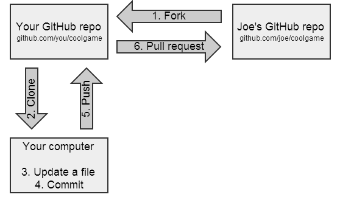

# GitHub基础
## 推送至GitHub(push)
### 准备工作
假设在Github上建立的仓库名为`HelloWorld`
在本地git中执行如下命令
`git remote add origin https://github.com/用户名/HelloWorld.git`
如果想删掉origin, 可以使用如下命令:
`git remote remove origin`
### 推送
如下命令将master分支推送到github上, 执行过程中需要用户名和密码
`git push -u origin master`

## 从GitHub上获取改动(pull)
如果已经有一个本地代码仓库, 但是GitHub上的较新, 可以使用pull命令
`git pull origin`

## 从GitHub上克隆(clone)
从无到有的完全从GitHub上复制, 可以使用clone命令
在GitHub上地址通常如下
`https://github.com/用户名/HelloWorld`
可以执行如下命令获取
`git clone https://github.com/用户名/HelloWorld`

## Fork 和 pull request
fork: 把别人的库复制一份放到自己的库中, 自己可以正常的push, 如果想要把自己的改动提交给原作者, 可以pull request, 对方可以接受, 也可以不接受

