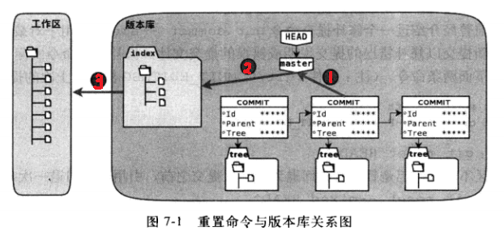

# git笔记

## Git的安装和基础理论
1. 安装git（https://git-scm.com/download/win）
2. 进入命令行，配置Git
	输入:
	        `git config --global user.name "caoxy"`
			`git config --global user.email "sxinyus@126.com"`

    完成后可以通过 `git config --list`进行查看
    如果想让git输出彩色的字符, 可以使用如下选项
    `git config --global color.ui auto`
    此命令会使`~/.gitconfig`中追加相关配置项

3. SVN等其他版本控制系统记录的是每一次的变动，但是git记录的整个变动的文件
4. Git的核心框架：Git本地仓库中维护的三棵树
	三棵树： 工作区域（Working Directory） 暂存区域（Stage(Index)） Git仓库（Repository(HEAD)）
	工作区域（Working Directory）：平时放项目代码的地方。
	暂存区域（Stage）用于临时存放改动。（其实是一个文件，保存即将提交的文件列表信息）
	Git仓库（Repository）：存放数据的位置，包括提交的版本数据。

5. Git的工作流程；
	1. 在工作路径中添加修改文件
	2. 将需要进行版本管理的文件放入暂存区
	3. 将暂存区域的文件提交到Git仓库
	故：Git管理的文件有三种状态：已修改（modified）,已暂存（staged），已提交（committed）

## Git的最基础操作(init, add, commit)
1. 初始化Git
		在之前已经配置完毕的基础上（git config --XXX），在命令行上cd到工程目录下，输入`git init`
		完成后会出现一个.git的隐藏文件夹
2. 将文件添加到暂存区域
3. 假如工作目录上存在一个文件`README.md`，在命令行上输入`git add README.md`
将所有被修改的文件一次性提交到暂存区：
`git add .`
4. 将文件提交到Git仓库
输入`git commit -m "add a readme file"`	将所有暂存区域中的文件提交到Git仓库中
如果说明很多, 可以使用如下方法写多行说明
```
git commit -m '
1.line1
2.line2
'
```

总结：
将工作目录的文件放到Git仓库的步骤
`Step One -> git add 文件名`
`Step Two -> git commit -m "你做了什么"`

## Git的克隆操作：复制其他的Git库
cd到你想要复制到的目录，输入：
`git clone 某地址`
即可
比如：`git clone https://github.com/n0tr00t/Sreg`
即可得到他的全部库

## 查看Git库状态
常规命令:
`git status`
精简的命令:
`git status -s` <-此命令显示的内容更精简

把最新放入暂存区域的文件取出，既把暂存区域恢复到先前状态
	`git reset HEAD`
把指定文件取出暂存区域
	`git reset HEAD filename.c`

[撤销修改]
使用命令:
	`git checkout —- filename.c`
对应如下两种情况:
	1, 文件修改后尚未放入暂存区域, 此时会将最后一次提交(git commit)的恢复到工作目录
	2, 文件已经添加到暂存区域, 但又做了修改, 此时会将添加到暂存区(git add)之后的修改撤销

总结:让这个文件回到最后一次`git commit`或`git add`的状态

如果已经被放入暂存区的文件再次被修改，此时commit只是将暂存区的版本进行了提交。如果要提交新修改的文件，需要再次add

## 查看Git提交记录(log reflog)
### git log
查看历史版本
`git log`
或者想让每一个版本只显示一行:
`git log --pretty=oneline`
用图表形式显示
`git log --graph`
查看某个文件的提交日志:
`git log filename`
### git reflog
查看所有提交记录
`git reflog`

## 回到过去

### 版本间切换(reset)
回到上一个版本
`git reset HEAD~`
HEAD表示最新的，~表示上一个快照，可以多个~~~~表示四个快照之前的
HEAD~就是HEAD的上一个版本
执行此命令后，HEAD指向了过去HEAD~的版本
并且，改动被放到了暂存区，工作区域的文件没有发生变化。git log中少了一个（只能看到HEAD之后的）

reset的选项
`git reset --mixed HEAD~`
默认使用mixed
此命令：
    1，移动HEAD的指向，将其指向上一个快照
    2，将HEAD移动后指向的快照回滚到暂存区域

`git reset —-soft HEAD~`
此命令：仅移动HEAD指向，指向上一个快照，不修改暂存区域。相当于撤销上一次提交

`git reset —-hard HEAD~`
此命令：
		1，移动HEAD的指向，将其指向上一个快照
		2，将HEAD移动后指向的快照回滚到暂存区域
		3，将暂存区的文件还原到工作目录(危险)

回滚到指定快照
`git reset 版本号ID（git log里看到的）`

回滚指定文件
`git reset 版本快照 文件名`

#### hard, soft, mixed差异总结
hard, soft, mixed示意图

图中的1, 2, 3的意义:
1: 替换引用指向
2: 替换暂存区, 替换后, 暂存区的内容和引用指向的内容一致
3: 替换工作区, 替换后, 工作区和暂存区的内容一致

hard会执行图中的1, 2, 3
soft执行图中的1
mixed执行图中的1, 2

### 修改提交信息
如果上一次的提交信息写错了, 可以通过如下命令修改
`git commit --amend`
执行后会弹出编辑器, 输入提交信息后保存即可
(也可以加入`-m`选项)

### 更改历史
当一次commit并不重要, 比如拼写错误, 可以和上一次记录合并
执行命令:
`git rebase -i HEAD~2`
编辑器中弹出:
```
pick 7a34294 Some Import Fix
pick 6fba227 Little Fix Want To Erase
# ...后面省略
```
可以将第二行的`pick`改为`fixup`
之后保存即可
此时那次commit为"Little Fix Want To Erase"会消失, 和"Some Import Fix"完成了合并

## 回到未来
`git reset 版本号ID（git log里看到的）`
可以通过git reflog看到HEAD之前的版本

## 版本对比(diff)
比较工作目录和暂存区域
`git diff`

比较暂存区域和HEAD
`git diff --cached`

工作区和HEAD比较
`git diff HEAD`

比较两个历史快照
		`git diff 快照1的ID 快照2的ID`

比较工作目录和仓库中的某个版本
		`git diff 快照ID`

比较暂存区域和仓库中的某个版本
		`git diff —-cached 快照ID`

修改最后一次提交的提交说明
	    `git commit —-amend`

## 文件操作
删除文件
	`git rm 文件名`

重命名文件
	`git mv oldname newname`

## 分支(branch)

### 查看分支
`git branch`

### 建立分支
建立一个名为test的分支
`git branch test`

切换到该分支上
`git checkout test`

将该分支的HEAD切换到上一次的提交上
`git reset --hard HEAD^1`

删除分支
`git reset --hard HEAD^1`

### 合并分支
如果想把`test_branch`分支和主分支`master`进行合并, 并且当前处于master分支
`git merge --no-ff test_branch`
其中选项 `--no-ff` 的意义为: 在历史记录中明确记录下本次分支合并
#### 解决冲突
如果在合并时, 两个版本出现了冲突
在执行`git merge test_branch`后, 会提示冲突(这里冲突文件为`welcome.txt`)
```
CONFLICT (content): Merge conflict in welcome.txt
Automatic merge failed; fix conflicts and then commit the result.
```
此时再打开冲突文件, 冲突文件`welcome.txt`,会有如下的内容
```
<<<<<<< HEAD
"this is master" 
=======
"This is test_branch" 
>>>>>>> test_branch
```
可根据提示修改文本文件后, 进行commit
本次commit就会相当于merge
`git log`中也会提示本次commit为merge
`git log --graph`中显示的路径信息也会合并


