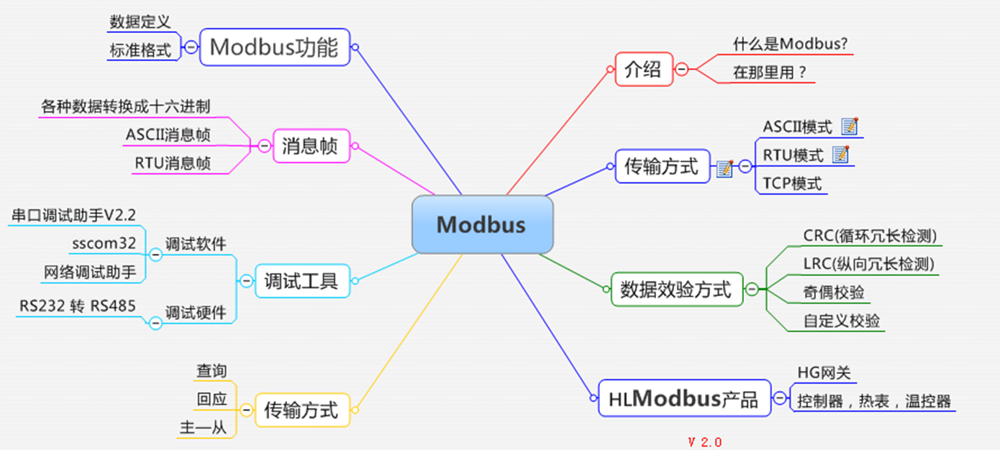
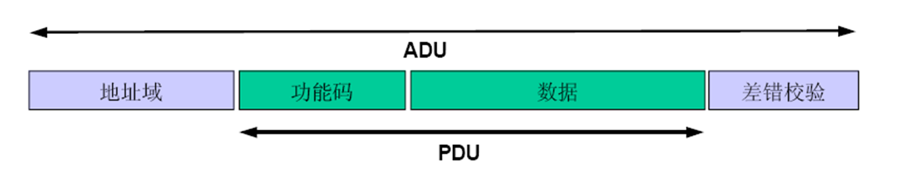

# Modbus

## 是什么
Modbus 协议是应用于电子控制器上的一种通用语言。通过此协议，控制器相互之间、控制器经由网络（例如以太网）和其它设备之间可以通信。Modbus 协议定义了一个控制器能认识使用的消息结构,而不管它们是经过何种网络进行通信的。它制定了消息域格局和内容的**公共格式**。
Modbus 是一个请求/应答协议

### Modbus消息帧

ADU： 应用数据单元
PDU： 协议数据单元

### 传输的三种方式
1, ASCII模式
2, RTU模式
3, TCP模式

### RTU消息帧

