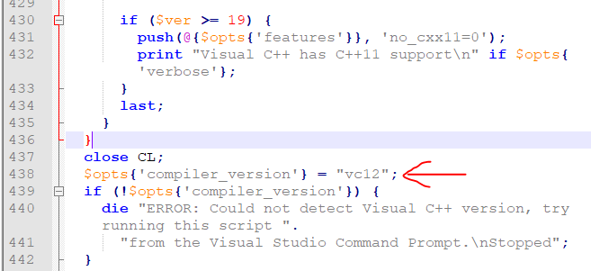
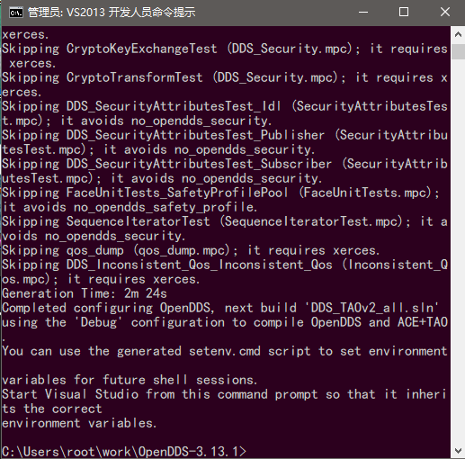

# OpenDDS
## 是什么
OpenDDS 是一个开源的 C++ 实现的 对象管理组织 OMG 的 数据分布式服务 (DDS) 。OpenDDS利用自适应通信环境（ACE）提供一个跨平台的环境。

## 编译过程(Windows平台下)
### 准备过程
下载OpenDDS [http://opendds.org/downloads.html](OpenDDS)
下载Perl [https://www.perl.org/get.html](Perl)

### 环境
使用的环境为VS2013, OpenDDS-3.13.1
ActivePerl-5.26.3.2603-MSWin32-x64
操作系统为Win10

### 配置
在开始菜单中找到[Visual Studio 2013]->[Visual Studio Tools]
用管理员权限运行`VS2013 开发人员命令提示`
在运行的VS2013开发人员命令提示中, cd到OpenDDS的目录下, 输入:
`.\configure.cmd`
如果提示`Could not detect Visual C++ version...`
并提示了问题所在的行数, 则是没有找到正确的VS版本, 
在`configure`文件中报错的行数, 添加代码:
```
$opts{'compiler_version'} = "vc12";
```
备注, 这里是VS2013, 所以用的vc12, 如果是VS2015, 则应该是vc14等等
添加的大概位置为:


再次执行, 如果出现:
```
Downloading ACE+TAO 2.2a with latest patches
```
或类似内容, 则开始自动下载ACE+TAO, 等待下载完成, 并停止工作后, 大概输出如下内容:


则表示`configure.cmd`脚本成功运行

### 设置环境变量
在OpenDDS的目录上,将会生成`setenv.cmd`
在`VS2013 开发人员命令提示`中执行:
```
.\setenv.cmd
```
执行完毕后
可以用一下命令验证设置是否正确
```
echo %ACE_ROOT%
echo %MPC_ROOT%
echo  %TAO_ROOT%
```
例如得到如下输出

```
C:\Users\root\work\OpenDDS-3.13.1>echo %ACE_ROOT%
C:\Users\root\work\OpenDDS-3.13.1\ACE_wrappers

C:\Users\root\work\OpenDDS-3.13.1>echo %MPC_ROOT%
C:\Users\root\work\OpenDDS-3.13.1\ACE_wrappers\MPC

C:\Users\root\work\OpenDDS-3.13.1>echo %TAO_ROOT%
C:\Users\root\work\OpenDDS-3.13.1\ACE_wrappers\TAO
```

### 启动VS开始编译
需要在`VS2013 开发人员命令提示`中启动vs
`.\DDS_TAOv2_all.sln`
编译即可

注意, 必须是在`VS2013 开发人员命令提示`中启动VS, 会出现各种环境变量问题.
