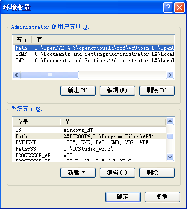
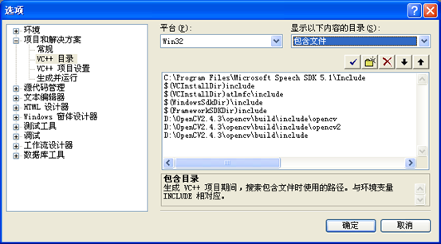

# MFC搭建opencv环境

配置说明（对于工程中使用到了opcv相关库或函数时，工程拿到本地没有opcv环境，编译通不过的情况下，需要进行配置的具体配置说明）如下：
1.首先保证对应的opcv文件（这里以OpenCV2.4.3为例）已经拿到手，且放置在对应的目录下（这里使用D盘的根目录下为例）

2.配置环境变量
环境变量需要在“我的电脑”->“属性”->“高级”页签->下方“环境变量”按钮
1）如果当前已有与OpenCV有关的环境变量,包括系统path和用户path中的，请先进行清除，防止配置混乱导致问题。
2）在环境变量中“新建”如下所示，变量和系统变量中的Path保持一致即可，对应的值写如下路径，D:\OpenCV2.4.3\opencv\build\x86\vc9\bin;
	

1. 配置VS2008（OpenCV2.4.3不支持VC6.0了，只能在VS上使用）
1） 在VS2008界面下，“菜单栏”->“工具”下拉菜单最后一项“选项”->在弹出的对话框中左侧树形分支选择"项目和解决方案"分支->“VC++目录”，然后在右侧进行对应的设置

2） 在“显示以下内容的目录”下拉框中选择“包含文件”和“库文件”，在包含文件和库文件中添加如下项（最末空白行双击即可进行添加选择），如果已经有和opcv有关的设置项请先进行清除，并按提示重新进行设置，以免因设置混乱导致问题。
	包含文件: 
	D:\OpenCV2.4.3\opencv\build\include\opencv
	D:\OpenCV2.4.3\opencv\build\include\opencv2
	D:\OpenCV2.4.3\opencv\build\include
	库文件
	D:\OpenCV2.4.3\VS_static\lib\Debug
	D:\OpenCV2.4.3\VS_static\lib\Release
	 
1. 自己的工程属性的设置：
	1） 在对应的工程当前项目上->“右键”->“属性”->右侧树形分支中选择第二项“配置属性”->"C/C++"->"代码生成"，右侧“运行库”项所在行
	将C/C++->代码生成中的"运行时库"改成: release时用"多线程(/MT)",debug时用"多线程调试(/MTd)"
	2） 在对应的工程当前项目上->“右键”->“属性”->右侧树形分支中选择第二项“配置属性”->“常规”，右侧默认值部分可设置“项目默认值”->“MFC的使用”
	将常规->MFC的使用选成"在静态库中使用 MFC",debug和release都要改 
	 
	5.配置完毕，再次编译工程即可通过编译了，如果仍通不过，可能需要注销一下用户重新登录，如果还是不行，可尝试重启电脑试试，再不行你就自己看着办吧。

