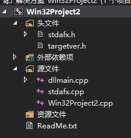

# VS编写动态库

新建项目->Win32项目
在弹出的向导中: [应用程序类型]选择 DLL
确定后, 会生成如下文件:


在Win32Project2.cpp(自动生成的项目名称的文件)中就可以写代码了
例如:

``` C++
// Win32Project2.cpp : 定义 DLL 应用程序的导出函数。
//

#include "stdafx.h"

extern "C" _declspec(dllexport) int testFunc(int a, int b)
{
	return a + b;
}

```

编译后即可使用了.
