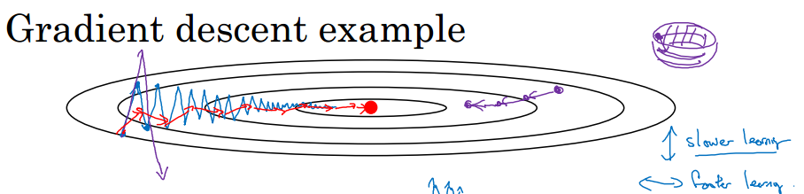

# 加快深度学习算法
## Mini-Batch梯度下降法
当训练集极大时, 一次处理所有训练集会消耗巨大的资源, 所以
将训练集分解为小块, 第一次在第一个小块上进行一次正向传播和一次反向传播, 之后切换下一个小块进行一次正向传播和反向传播
在遍历一次训练集后, 叫做`1 epoch`
不断按照上面的方法遍历训练集, 来进行深度学习

Mini-Batch梯度下降法的成本函数可能会随着训练上下波动, 但整体向下
Mini-Batch的大小要根据CPU/GPU 内存来进行选择

常用的Mini-Batch大小为64, 128, 256, 512

## 指数加权平均
### 基本形式
使用指数加权平均可以让 当前值 约等于前面几个值的平均值
原始数据为:
```
a1 = 40
a2 = 49
a3 = 45
...
a180 = 60
a181 = 56
...
```
加权平均为:
```
v0 = 0
v1 = beta * v0 + (1 - beta) * a1
v2 = beta * v1 + (1 - beta) * a2
...
vn = beta * v(n-1) + (1 - beta) * an
```
其中beta范围是(0, 1)
这样, vn相当于an附近的平均值

### 偏差修正
按照上面的计算方式, 在计算刚开始时, 偏差很大
例如
```
beta = 0.9
v0 = 0
v1 = 0.9 * v0 + 0.1 * a1 = 4
而a1 = 40, 偏差很大
```
故可以使用
vt = vt / (1 - beta^t)
可以修正偏差

## 动量梯度下降法
```
Vdw = beta * Vdw + (1 - beta) * dW
Vdb = beta * Vdb + (1 - beta) * db
W = W - alpha * Vdw
b = b - aplha * Vdb
```
使用上面的方法来代替过去的反向传播, 可以让学习速度加快
直观理解:
当学习过程发生震荡时, 使用这种方法, 由于平均了前几次的学习方向, 所以震荡会被抹平, 使得学习的路径更直接
可参考下图


## RMSprop优化算法
和动量梯度算法类似
```
Sdw = beta2 * Sdw + (1 - beta2) * dW^2
Sdb = beta2 * Sdb + (1 - beta2) * db^2
W = W - alpha * dW / (sqrt(Sdw) + ε)
b = b - alpha * db / (sqrt(Sdb) + ε)
```

## Adam优化算法
Adam算法结合了动量梯度下降法和RMSprop算法
```
# 利用动量梯度下降和RMSprop计算V和S
Vdw = beta1 * Vdw + (1 - beta1) * dW
Vdb = beta1 * Vdb + (1 - beta1) * db
Sdw = beta2 * Sdw + (1 - beta2) * dW^2
Sdb = beta2 * Sdb + (1 - beta2) * db^2
# 进行修正
Vdw_c = Vdw / (1 - beta1^t)
Vdb_c = Vdb / (1 - beta1^t)
Sdw_c = Sdw / (1 - beta2^t)
Sdb_c = Sdb / (1 - beta2^t)
# 更新W和b
W = W - alpha * Vdw_c / (sqrt(Sdw_c) + ε)
b = b - alpha * Vdb_c / (sqrt(Sdb_c) + ε)
```
关于超参数选择, 论文中推荐值如下
beta1 = 0.9
beta2 = 0.999
ε = 10^(-8)
alpha需要自行尝试调整

## 学习率衰减
可以采用的方法
```
alpha = alpha0 / (1 + decay_rate * epoch_num) 
```
其中, alpha0为学习率的初值, decay_rate为衰减率, epoch_num表示第几遍扫过训练集
其他方法:
```
alpha = 0.95^epoch_num * alpha0
alpha = k * alpha0 / sqrt(epoch_num)
```

## 局部最优问题
在训练神经网络时, 通常不会遇到局部最优
因为神经网络的维度极大, 导数为0的点通常是鞍点, 到达鞍点后会沿着其他方向下降


