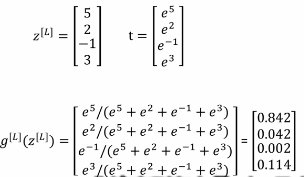

# 超参数调试_归一化_优化(L2W3)
## 超参数调试
在一个DNN中, 可能有很多超参数, 重要程度可能不同
可能 学习率alpha高度重要
隐藏层个数, 每层的神经元个数其次重要
Adam优化中的ε的重要程度可能很低

所以推荐的尝试方法为随机选取超参数进行尝试
当发现结果比较好的数个点后, 在其附近继续随机选取

## 为超参数选取合适的范围
有时, 随机选取超参数的值可能并不合适
比如, 学习率alpha通常在0.0001到1之间, 而随机选取会让绝大多数值落在0.1-0.9之间
而0.0001-0.1之间只有很少的值

可以采用随机指数的方式
```
r = (-4) * np.random.rand() # r在[-4, 0]
alpha = 10^r # 此时alpha在[0.0001到1之间]
```

## 熊猫调试和鱼子酱调试
当计算资源不足时, 可以使用一个模型, 在不同阶段采用不同的超参数进行, 精心维护, 称为熊猫调试
当计算资源充足时, 同是进行很多不同超参数的模型, 选择最优的, 称为鱼子酱调试

## 深层神经网络的归一化(Batch Norm)
### 基本形式
在L2W1中提及了归一化输入, 而可以使用类似的方式, 为神经网络的每一层的输入进行归一化
```
# 对于每一层的z = wa + b
u = sum(zi) / m # m是zi的总数, i从1到m, 即u是z的均值
v = sum((zi - u)^2)/m    # v是z的方差
zi_norm = (zi - u) / sqrt(v^2 + ε)
zi_final = gama * zi_norm + beta
```
最终使用上面的zi_final最为进入激活函数的值
gama和beta存在的意义: 
    有时不想让数据的均值为0, 方差为1, 所以使用这两个超参数来进行均值和方差的调整

在归一化时, 无论参数b是多少, 在计算均值和方差时都会失去意义, 所以可以去掉b或让b恒为零
### 直观理解Batch Norm
在较深的一层, 当前面几层发生变化时, 会影响到此层, 而使用Batch Norm后, 前几层无论怎么变化, 输入给本层的数据的均值和方差相同, 从而减小了前几层对本层的影响

## Softmax回归
### Softmax的用途
之前讨论的都是对输入进行二分, 如猫和非猫
而在输出有多个值时, 可以使用Softmax回归

### 例子
一个DNN输入一张图片, 输出为:
0-其他 1-猫 2-狗 3-鸡
在设置输出层时, 通常让输出层有四个节点, 分别表示:
其他的概率`P(其他)`
猫的概率`P(猫)`
`P(狗)`
`P(鸡)`
并且要求`P(其他) + P(猫) + P(狗) + P(鸡) = 1`
在最后一层计算yhat时, 计算方式如下:
```
t = e^z # 将计算出的z(z = wa + b)当做自然对数e的指数进行一级运算
ai = ti / sum(ti) # 用刚才算出来的t(nl行1列)中每个元素所占的比例, 即输出概率, 且满足上面的和为1的要求
yihat = ai # 最后一层的激活值就是输出yhat
```
填入具体数值如下图


### Softmax名字的来源
与之相对的hardmax的意义为:
将向量中最大的元素置为1, 其他为0
而softmax更加柔和, 输出了概率而非绝对的0, 1

### 实际计算
softmax的损失函数Loss function定义如下
```
L(yhat, y) = -sum(yi * log yhati)
```
成本函数定义为:
```
J(wi, bi) = sum(L(yhati, yi)) / m
```
Z的导数为:
```
dz = yhat - y
```


