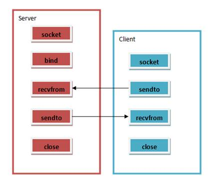

# UDP通信Server/Client示例
UDP C/S编程的步骤如下图所示



与TCP C/S通信的区别在于：
服务端没有设置监听和等待连接的过程。客户端没有连接服务端的过程。
基于UDP的通信时不可靠地，面向无连接的，发送的数据无法确切知道对方收到没有，就算对方根本不存在，也可以发送数据出去。
这样的通信通常用在对可靠性、安全性要求不高的地方，比如语音通信（没听清楚可以让对方再说一遍）。
下面是一个简单的例子：
server
```
#include <sys/types.h>
#include <sys/socket.h>
#include<pthread.h>
#include <netinet/in.h>
#include <stdio.h>
#include <string.h>
#include <unistd.h>
#include <stdlib.h>
 
int main(int argc, char **argv)
{
    if (argc != 2)
    {
        printf("Usage: %s port\n", argv[0]);
        exit(1);
    }
    printf("Welcome! This is a UDP server, I can only received message from client and reply with same message\n");
    
    struct sockaddr_in addr;
    addr.sin_family = AF_INET;
    addr.sin_port = htons(atoi(argv[1]));
    addr.sin_addr.s_addr = htonl(INADDR_ANY);
 
    int sock;
    if ( (sock = socket(AF_INET, SOCK_DGRAM, 0)) < 0)
    {
        perror("socket");
        exit(1);
    }
    if (bind(sock, (struct sockaddr *)&addr, sizeof(addr)) < 0)
    {
        perror("bind");
        exit(1);
    }
    char buff[512];
    struct sockaddr_in clientAddr;
    int n;
    int len = sizeof(clientAddr);
    while (1)
    {
        n = recvfrom(sock, buff, 511, 0, (struct sockaddr*)&clientAddr, &len);
        if (n>0)
        {
            buff[n] = 0;
            printf("%s %u says: %s\n", inet_ntoa(clientAddr.sin_addr), ntohs(clientAddr.sin_port), buff);
            n = sendto(sock, buff, n, 0, (struct sockaddr *)&clientAddr, sizeof(clientAddr));
            if (n < 0)
            {
                perror("sendto");
                break;
            }
        }
        else
        {
            perror("recv");
            break;
        }
    }
    return 0;
}
```

client

```
#include <sys/types.h>
#include <sys/socket.h>
#include<pthread.h>
#include <netinet/in.h>
#include <stdio.h>
#include <string.h>
#include <unistd.h>
#include <stdlib.h>
 
 
int main(int argc, char **argv)
{
    if (argc != 3)
    {
        printf("Usage: %s ip port", argv[0]);
        exit(1);
    }
    printf("This is a UDP client\n");
    struct sockaddr_in addr;
    int sock;
 
    if ( (sock=socket(AF_INET, SOCK_DGRAM, 0)) <0)
    {
        perror("socket");
        exit(1);
    }
    addr.sin_family = AF_INET;
    addr.sin_port = htons(atoi(argv[2]));
    addr.sin_addr.s_addr = inet_addr(argv[1]);
    if (addr.sin_addr.s_addr == INADDR_NONE)
    {
        printf("Incorrect ip address!");
        close(sock);
        exit(1);
    }
 
    char buff[512];
    int len = sizeof(addr);
    while (1)
    {
        gets(buff);
        int n;
        n = sendto(sock, buff, strlen(buff), 0, (struct sockaddr *)&addr, sizeof(addr));
        if (n < 0)
        {
            perror("sendto");
            close(sock);
            break;
        }
        n = recvfrom(sock, buff, 512, 0, (struct sockaddr *)&addr, &len);
        if (n>0)
        {
            buff[n] = 0;
            printf("received:");
            puts(buff);
        }
        else if (n==0)
        {
            printf("server closed\n");
            close(sock);
            break;
        }
        else if (n == -1)
        {
            perror("recvfrom");
            close(sock);
            break;
        }
    }
    
    return 0;
}
```
