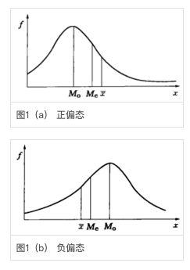

# 基本概念
## 集中量数
### 平均数
#### 基本公式
$$ \bar X = {{\sum_{i=1}^n X_i} \over n} $$

#### 使用 估计平均数 计算 平均数
当数据都很大时, 直接计算平均数繁琐, 可以先估计大概的平均数AM, 使用每个数据减去AM后, 结果记为$x^{'}$, 即:

$$ x^{'} = x - AM $$

计算平均数公式为:

$$ \bar X = AM + {\Sigma x^{'} \over N} $$

### 中数
又称中位数, 排序后中间的位置的数, 
中位数要求: 在这组数据中, 有一半比中位数大, 一半比中位数小
如果数据总共有奇数个, 则中位数为中间的数, 如果为偶数个, 则中位数为中间两个数的平均数

### 众数
数据中出现次数最多的数据为众数

### 平均数, 中位数, 众数的关系
在正态分布中, 三者相等
正偏态分布: 平均数 > 中位数 > 众数
正态分布的最高点向负轴方向偏移

负偏态分布: 平均数 < 中位数 < 众数
正态分布的最高点向负轴方向偏移

如下图所示, 其中Mo表示众数, 最多的数据就是曲线的最高峰, Me表示中位数

## 差异量数
差异量数中, 标准差和方差应用最广泛, 成为高效差异量
### 全距
说明数据离散程度的最简单统计量, 用最大值减去最小值即为全距, 记为R

$$ R = X_{max} - X_{min} $$

### 百分位差
#### 百分位数
又叫百分位点
表示: 在此点之下的数据占全部数据的百分比
如果一个点以下的数据占据了总数的50%, 则记为$P_{50}$, 也就是中位数

#### 百分等级
和百分位数基本一样, 某人考试成绩的百分等级$P_R$为80, 则意味着他的成绩比79%的人要好, 比20%的人要差

### 四分位差
百分位差的一种, 使用符号Q表示
意义: 中间50%的数据距离的一半
定义: 
第一四分位 $Q_1 = P_{25}$
第二四分位 $Q_2 = P_{50}$
第三四分位 $Q_3 = P_{75}$

四分位数计算方法为: 

$$ Q = {Q_3 - Q_2 \over 2} = {P_{75} - P_{25}\over 2} $$

### 平均差
一般用A.D表示

$$ A.D. = {{ \Sigma \vert X_i - \bar X \vert } \over N} $$

### 标准差和方差
方差使用$s^2$表示, 标准差使用s表示

$$ s^2 = { \Sigma ( X_i - \bar X \vert )^2 \over N } $$

### 标准分数(Z分数)
$$ Z = {X- \bar X \over s} $$
对样本进行Z分数运算相当于对原始数据进行一次平移(减去均值), 再进行一次缩放(除标准差)
由X生成的Z分数集合的平均数为0, 标准差为1

