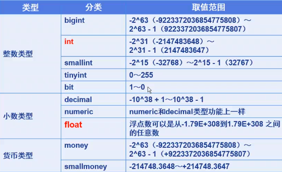
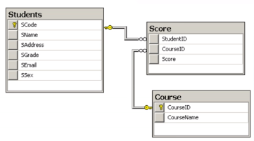

# SQL Server笔记
## 登录SQL Server
有两种登录方式:
1, 使用Windows账号登录, 这种方式只要能登录windows, 就能登录此SQL Server
2, 使用SQL Server的账号密码
SQL Server内置了一个超级管理员账号sa, 它的密码在SQL Server2017中, 不在安装时设置
参看笔记<SQL Server sa账户登录>

## SQL Server基础
使用SQL Server一定要多刷新!!! 否则各种乱七八糟的错误

### 数据库的文件
数据文件
主要数据文件, 有且只有一个, 后缀名推荐为.mdf
次要数据文件, 零个或多个, 后缀名推荐为.ndf

日志文件, 至少一个, 推荐后缀定为.ldf

### 创建
#### 创建数据库
在<数据库>上右键->新建数据库 即可
#### 创建表
在<表>上右键->新建表 即可
新建完成后, 需要在树状图中右键刷新才能显示出来

### 分离和附加
数据库分离后, 可以移动到其他地方(在数据库上右键->任务->分离)
再想添加回来, 可以使用附加(数据库 右键->附加)

### SQL Server的数据类型
#### 数字类型


#### 字符类型

备注:
nvarchar和varchar的区别
varchar(20)能够存储20个字母, 10个汉字
nvarchar(20)能够存储20个字母, 20个汉字

固定长度char()表示存储的字符串一定要达到指定长度
例如char(10), 存储一个字符a, 也会自动扩充为"a         "
固定长度牺牲存储空间, 提高了性能
变长varchar(10)最大不超过10个字符, 可以允许小于
牺牲性能, 节约了空间

使用时更推荐使用nvarchar

#### 日期时间类型


### 键的基本概念
#### 主键
能唯一决定一条记录
允许有多个主键

选择主键的原则
最少性: 尽量选择单个键作为主键
稳定性: 尽量选择数值更新少的列作为主键
无意义性: 尽量选择没有意义的键作为主键

#### 外键
##### 简单示例
有三个表格, 学生表, 分数表, 课程表
内容如下图

其中分数表中的studentid和courseid必须是学生表和课程表中的数据
将studentid和courseid称为外键
student和course表称为主表
score称为从表

##### 建立外键的步骤
在从表想要建立外键的列上, 右键->关系...->添加->表和列规范->选择主表和从表的键

##### 建立后的注意事项
1. 当主表中没有对应的记录时, 不能将记录添加到子表
2. 不能修改主表中的值而导致子表中的记录孤立
3. 子表存在与主表对应的记录时, 不能从主表中删除该行
4. 删除主表前, 先删子表

### SQL Server中的自增列(标志列)
在列属性中, 可以设置标志规范, 设置后, 此列的值将实现自增长
标志列通常可以作为主键, 插入数据时系统自动生成

### 数据库关系图
当数据库关系比较复杂后, 可以使用生成数据库关系图的功能
在数据库下, 找到"数据库关系图", 右键"新建数据库关系图", 将需要的表选中, 确认即可
如果这个方法不行, 就重启SMS吧 fuck microsoft

## 表和约束
### 数据完整性
创建表的时候, 就要保证以后数据输入是正确的, 错误的数据, 不符合要求的数据不允许输入
数据完整性包括:
1. 域完整性
2. 实体完整性
3. 引用完整性
4. 自定义完整性

#### 域完整性
某一列的数据有限制, 比如不能为负数, 不能是某个范围外的数据等等
约束方法: 检查约束, 默认值, 非空约束

#### 实体完整性
要求: 不能出现重复行
约束方法: 唯一约束, 主键约束, 标识列

#### 引用完整性
要求: 表A中的数据收到表B中某数据的限制
约束方法: 外键约束

#### 自定义完整性
暂不讨论

### 约束
#### 非空约束
在表的"允许Null值中直接勾选即可

#### 默认约束
在列属性中添加默认值即可

#### 外键约束
参照外键建立方法

#### 检查约束
某个列需要满足一定的条件
例如email列中的值, 必须有@
可以按照如下方式创建
在email的列, 右键->CHECK约束->添加->修改"表达式"
可以按照如下写法
```
email like '%@%'
```

##### 检查约束示例
长度大于等于6: 
```
len(loginwd)>=6
```

性别只能为男或女
```
sex='男' or sex='女'
```

学时大于0
```
classhour>0
```

学生分数可以为空, 或介于0和100之间
```
score is null or (score>=0 and scroe<=100)
```
