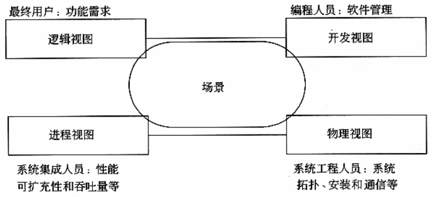
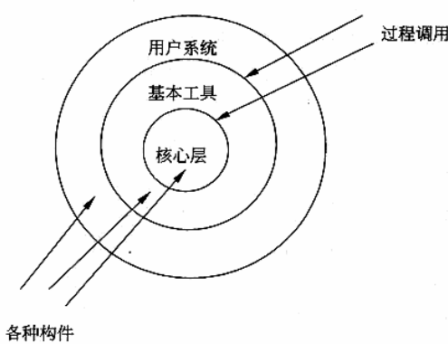
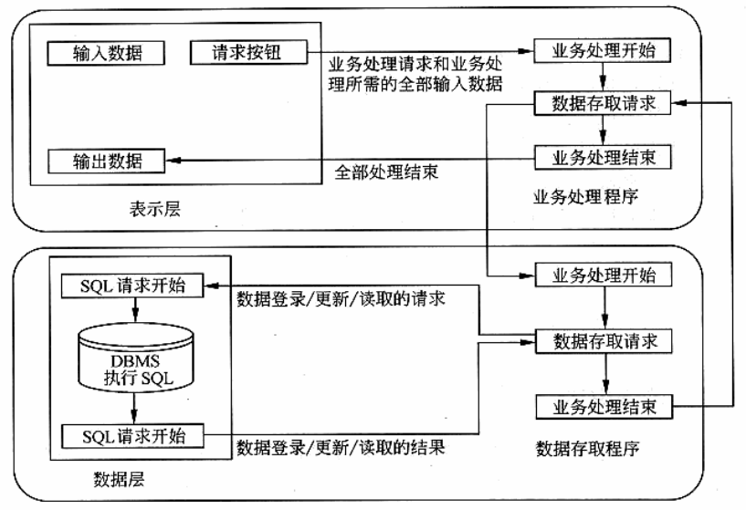
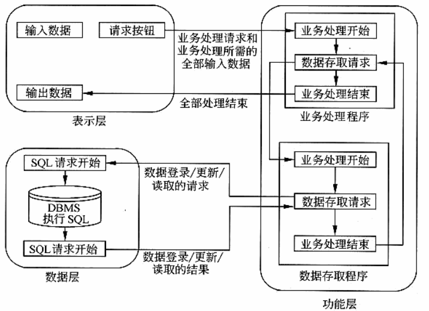

# 软件架构设计

## 软件架构模型:
结构模型(常用)
框架模型
动态模型(常用)
过程模型
功能模型

Kruchten提出的"4+1"的视图模型


## 经典软件架构风格
### 管道/过滤器
每一个构件都有自己的输入和输出, 构件读入输入的数据流, 经过处理, 产生输出数据流. 这里的构件通常被称为过滤器.
例如UNIX shell编写的程序
```
cat test.txt | grep something
```

### 面向对象风格
这种风格的构件是对象, 具有OO的普遍优点

### 基于事件的隐式调用
构件不直接调用一个过程, 而是触发一个事件(广播), 系统中其他构件的过程在事件中注册.
当事件被触发时, 系统自动调用注册的过程

### 分层系统
每一层为上一层提供服务, 作为下一层的客户


### 仓库系统和知识库

### C2风格
C2即Component-Connector

### 客户端/服务器风格
#### 二层C/S架构


服务器为多个客户应用程序管理数据, 而客户程序发送,请求和分析从服务器接收的数据
是一种胖客户端(fat client), 瘦服务器(thin server)的结构
这种架构下, 客户端程序臃肿, 设计复杂

#### 三层C/S架构
增加一个应用服务器, 可以将应用逻辑驻留在服务器上, 只有表示层存在与客户端上, 被称为瘦客户端(thin client)



