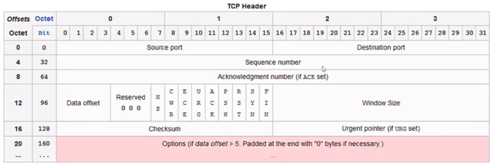
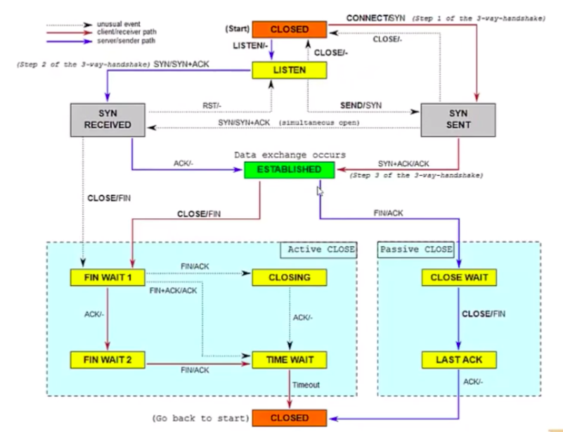
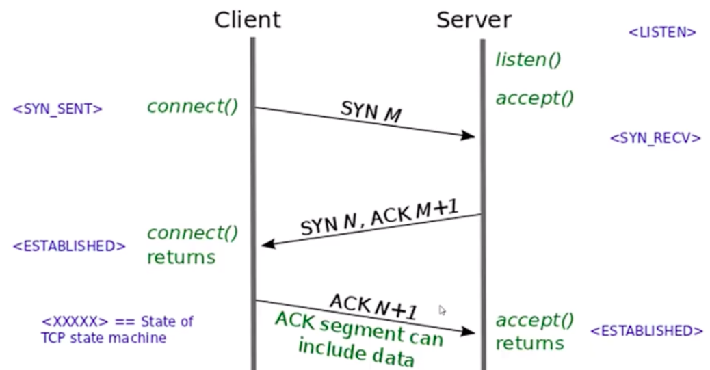
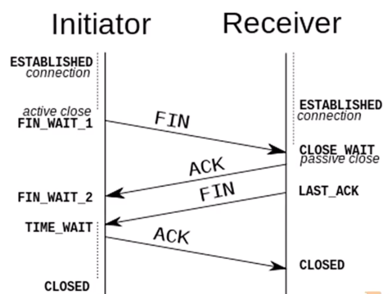

# TCP协议
## TCP如何利用IP实现自己的目的
TCP要利用IP的无连接和不可靠实现有连接和可靠
TCP利用的方法:
数据分割
定时器
延迟确认
校验和
流量控制

## TCP首部

Source port 发送者的端口号
Destination port 接手执端口号
Sequence number 数据被分割后, 数据的顺序号
Data offset 从哪里开始是数据, 确定头部有多长
Reserved 保留位
NS~FIN 标记位
Window Size 

## TCP状态变迁
### 整体状态迁移

### TCP连接建立
三次握手

### TCP断开
四次握手

### 为什么连接3次握手, 断开4次握手?
TCP是一个全双工协议, 故在关闭的时候需要双方都发送终止(FIN)消息
单方发FIN也是允许的, 另一个方向可以正常工作

关闭一个方向需要发送一个FIN, 返回一个ACK
故关闭两个方向的连接需要四次握手

## TCP使用的定时器
重传定时器
坚持定时器(Persist)  在双方通信中, 一方缓冲满了, 另一方定时询问对方时使用的定时器
保活定时器(KeepAlive) TCP中实现的类似心跳的定时器, 不推荐打开
2MSL定时器(TIME_WAIT), 两倍的最大生存时间, 在主动关闭socket时, 端口被占用的时间