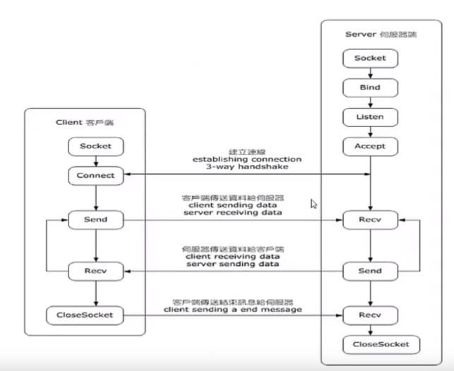

# BSD socket API
## 常用头文件
``` C
sys/socket.h //相关API函数和数据结构的定义
netinet/in.h    //IPv4和IPv6相关协议族需要的信息
arpa/inet.h    //处理数字从操作系统字节序到网络字节序
```

## API函数
``` C
socket()
bind()
listen()
connect()
accept()
send() recv() write() read()
close()
gethostbyname() gethostbyaddr() // IPv4专用
```

``` C
select() poll()
getsocketopt()
setsocketopt()
```

## socket编程
### 基本流程图


### server和client示例
server对每个连接的客户端发送一个固定的hello world字符串
#### server.c
``` C
#include <sys/types.h>
#include <sys/socket.h>
#include <netinet/in.h>
#include <arpa/inet.h>
#include <stdio.h>
#include <stdlib.h>
#include <string.h>
#include <unistd.h>

int main(int argc, char** argv) {
    printf("starting server\n");
	char hello[] = "hello world";
	struct sockaddr_in sa;
	int fd = socket(PF_INET, SOCK_STREAM, IPPROTO_TCP);
	if (-1 == fd) {
		perror("cannot create socket");
		exit(EXIT_FAILURE);
	}
	memset(&sa, 0, sizeof(sa));

	sa.sin_family = AF_INET;
    sa.sin_port = htons(2222);
    sa.sin_addr.s_addr = htonl(INADDR_ANY);

    if (-1 == bind(fd, (struct sockaddr*)&sa, sizeof(sa))) {
        perror("bind failed");
        close(fd);
        exit(EXIT_FAILURE);
    }
    
    printf("start listening\n");
    if (-1 == listen(fd, 10)) {
        perror("listen failed");
        close(fd);
        exit(EXIT_FAILURE);
    }

    for (;;) {
        int clientFd = accept(fd, NULL, NULL);
        if (0 > clientFd) {
            perror("accept failed");
            close(fd);
            exit(EXIT_FAILURE);
        }
        int writeSize = 0;
        int totalWrite = 0;
        while (totalWrite <  sizeof(hello)) {
            writeSize = write(clientFd, hello + totalWrite, sizeof(hello) - totalWrite);
            if (-1 == writeSize) {
                perror("write failed");
                close(clientFd);
                close(fd);
                exit(EXIT_FAILURE);
            }
            totalWrite += writeSize;
        }

        if (-1 == shutdown(clientFd, SHUT_RDWR)) {
            perror("shutdown failed");
            close(clientFd);
            close(fd);
            exit(EXIT_FAILURE);
        }
    }
}
```

#### client.c
``` C
#include <sys/types.h>
#include <sys/socket.h>
#include <netinet/in.h>
#include <arpa/inet.h>
#include <stdio.h>
#include <stdlib.h>
#include <string.h>
#include <unistd.h>

int main(int argc, char** argv) {
    struct sockaddr_in sa;
    int res;
    int fd = socket(PF_INET, SOCK_STREAM, IPPROTO_TCP);

    if (-1 == fd) {
        perror("cannot create socket");
        exit(EXIT_FAILURE);
    }

    memset(&sa, 0, sizeof(sa));
    sa.sin_family = AF_INET;
    sa.sin_port = htons(2222);
    res = inet_pton(AF_INET, "127.0.0.1", &sa.sin_addr);

    if (-1 == connect(fd, (struct sockaddr*)&sa, sizeof(sa))) {
        perror("connect failed");
        close(fd);
        exit(EXIT_FAILURE);
    }

    char buffer[512];
    int totalRead = 0;
    for (;;) {
        int readSize = 0;
        readSize = read(fd, buffer + totalRead, sizeof(buffer) - totalRead);
        if (readSize == 0) {
            // read all
            break;
        } else if (readSize == -1) {
            perror("read failed");
            close(fd);
            exit(EXIT_FAILURE);
        }
        totalRead += readSize;
    }
    buffer[totalRead] = 0;
    printf("get from server: %s\n", buffer);

    (void)shutdown(fd, SHUT_RDWR);
    close(fd);
    return EXIT_SUCCESS;
}
```