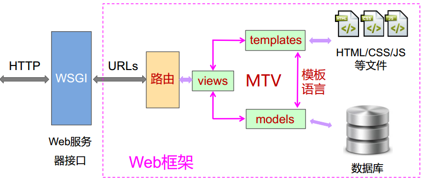

# Python+Django打造云端系统
Python云端系统开发入门(嵩天)笔记
## 安装
`pip3 install django`

查看django版本
`python -m django --version`
需要要求python为3.x版本, Django为2.x版本

## Django的基本概念
Django是一个Web框架, 即一个建设Web应用的半成品
采用了MTV(Model-Template-View)模型组织

## Django框架最小程序
### 建立一个工程
`django-admin startproject mysite` 
这里会创建一个名为mysite的工程
工程的基本目录结构为:
```
mysite/
    mysite/
        __init__.py
        settings.py <- 部署和配置整个工程的配置文件
        urls.py <- url路由的声明文件
        wsgi.py
    manage.py
```
### 运行Web框架
`python manage.py runserver`

此时, 用浏览器就可以访问该网页了
本机可以使用如下url进行浏览
`http://127.0.0.1:8080/`

### 建立具体应用
`python manage.py startapp helloapp`
上面创建了一个名为helloapp的应用
(上面命令中manage.py在工程目录下)

#### 工程(project)和应用(app)之间的关系
工程对应于一个网站, 包含多个应用
应用对应于特定功能, 是具体功能的载体

### 添加对HTTP请求的响应
在应用目录下的views.py文件中, 添加如下内容
``` python
from django.shortcuts import render

# Create your views here.
from django.http import HttpResponse

def hello(request):
    return HttpResponse("Hello World! I am coming...")
```
### 修改url路由
在工程(mysite)下找到urls.py文件, 在其中添加如下内容
``` python
from django.contrib import admin
from django.urls import path
from helloapp import views
urlpatterns = [
    path('index/', views.hello),
    path('admin/', admin.site.urls),
]
```

其中, `path('index/', 'views.hello)`表示
将url index/ 和views.py中的hello函数进行关联
此时, 再运行工程后, 访问`http://127.0.0.1:8080/index`就可以看到刚才的应用了

### 创建最小程序总结
1, 新建工程`django-admin startproject mysite`
2, 创建具体应用
3, 修改应用中的views.py文件, 添加对具体url的响应
4, 修改URL路由, 指定URL和响应之间的关系
5, 运行工程 `python manage.py runserver`

## Django的MTV开发模式
### MTV基本概念
#### M: Models模型
于数据组织相关的功能

#### V: Views视图
针对请求选取数据的功能
选择哪些数据用于展示, 指定显示模板, 每个url对应一个回调函数
(有点类似于控制逻辑)

#### T: Templates模板
与表现相关的所有功能
页面展示风格和方式, 与具体数据分离, 用于定义表现风格
### Django中的MTV


## 让应用返回html页面
1, 建立一个新应用hello2app
`python manage.py startapp hello2app`
2, 做一个html文件, 例如demo.html, 修改views.py
``` python
from django.shortcuts import render
def hello(request):
    return render(request, "demo.html")
```
3, 在hello2app应用中, 新增urls.py(本地路由文件)
``` python
from django.urls import path
from . import views
urlpatterns = [
    path('', views.hello)
]
```
4, 在全局路由文件中增加对本应用路由文件的引用
在mysite/urls.py中, 追加如下内容
``` python
from django.contrib import admin
from django.urls import include, path
from helloapp import views
urlpatterns = [
    path('index2/', include('hello2app.urls')),
    path('index/', views.hello),
    path('admin/', admin.site.urls),
]
```
5, 设置模板路径, 让django框架找到模板所在目录
在mysite.py/settings.py中追加如下内容
``` python
TEMPLATES = [
    {
        'BACKEND':     'django.template.backends.django.DjangoTemplates',
        'DIRS': [os.path.join(BASE_DIR, 'hello2app/templates')],
        'APP_DIRS': True,
        'OPTIONS': {
            'context_processors': [
                'django.template.context_processors.debug',
                'django.template.context_processors.request',
                'django.contrib.auth.context_processors.auth',
                'django.contrib.messages.context_processors.messages',
            ],
        },
    },
]
```
6, 将demo.html放入刚才指定的hello2app/templates文件夹中
7, 运行即可

