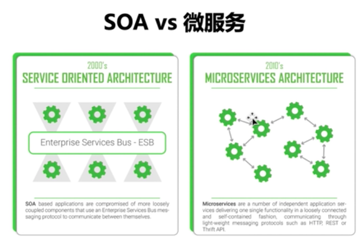

# 微服务

## 互联网架构演进之路
单体架构 -> 垂直架构 -> SOA架构 -> 微服务架构
单体架构: 所有代码放到一个应用里, 弄成一坨
垂直架构: 模块化, 使用一些基本的思想, 如MVC等
SOA架构: Service-Oriented Architecture 面向服务的架构. 把项目拆成组件, 每一个组件提供相应的服务
微服务架构: 面向业务, 把每一个业务拆作为一个服务

SOA和微服务的区别


每个齿轮作为一个服务, 在SOA中, 服务之间通过ESB进行通信, 微服务之间进行自己的通信.

## 微服务架构介绍
### 特点: 小, 独, 轻, 松

小: 每一个微服务根据业务划分, 很小
独: 每个微服务作为一个**进程**存在
轻: 使用轻量级通信
松: 松耦合, 每个微服务都能单独部署, 互不影响

### 优势
松耦合
独立发布
快速迭代
故障隔离

### 微服务架构带来的挑战
DevOps要求变高, 开发, 运维成本变高
系统复杂性提高
数据一致性
测试复杂性

### 微服务架构技术选型
Java系: Spring Cloud, 阿里开源的Dubbo
Go系: Go Micro, Go Kit, Kite

## Go语言微服务架构最佳实践
### 技术使用
微服务框架: Go Micro
通信格式: Protobuf/Thrift
服务发现: Consul/ETCD
配置管理: ETCD
服务监控: Prometheus Grafana

### 微服务架构6大核心
1, API Gateway : API网管
2, 进程间通信
3, 服务注册发现
4, 事件驱动的数据管理
5, 微服务部署策略
6, 微服务化改造 <- 可以使用渐进式来进行改造, 先用微服务实现新的功能, 优先改造重要模块

## Go语言天生并发性
用Go实现并发, 只需要一个关键字: go
``` Go
func hello(i int) {
    fmt.Println("hello goroutine", i)
}

func main() {
    for (i := 0; i < 1000000; i++) {
        go hello(i)
    }
    time.Sleep(time.Second)
}
```