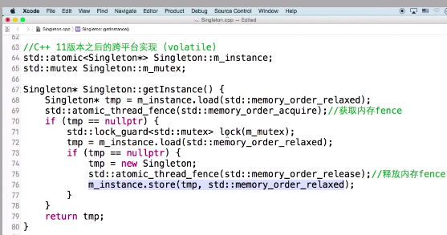

# 单例模式
## 理念
确保一个类只有一个实例, 并提供一个全局访问点

## 例子
特征:
1. 构造函数私有
2. 存在私有静态指针
3. 存在共有获取单例的接口, 下例中为:`getInstance`

### 原始代码版本, 线程不安全
``` C++
#include <iostream>

using namespace std;

class Singleton
{
private:
    Singleton() {};
    Singleton(const Singleton& other);
    static Singleton* m_instance = nullptr;
public:
    static Singleton* getInstance()
    {
        //此函数需要根据系统环境添加合适的同步锁
        if (m_instance == NULL)
            m_instance = new Singleton();
        return m_instance;
    }
};

Singleton* Singleton::m_instance = NULL;

int main(int argc, char* argv[])
{
    Singleton* pS = Singleton::getInstance();
    /* Do Something */
    return 0;
}
```

### 双检查锁版本, 但对于内存读写reorder不安全
``` C++
Singleton* Singleton::getInstance() 
{
    if (m_instance == nullptr)
    {
        QLocker locker(&m_mutex);
        if (m_instance == nullptr) 
        {
            m_instance = new Singleton();
        }
    }
    return m_instance;
}
```

内存reorder的解释:
`m_instance = new Singleton();`
这行代码, 不一定会按照想象的执行, 想象中:
1, 申请内存
2, 执行构造函数
3, 指针赋值
但是可能被优化为:
1, 申请内存
2, 指针赋值
3, 执行构造函数

从而导致m_instance已经不是nullptr, 但内存指向的位置没有执行构造函数, 从而不可使用

### 考虑内存reorder后的代码
