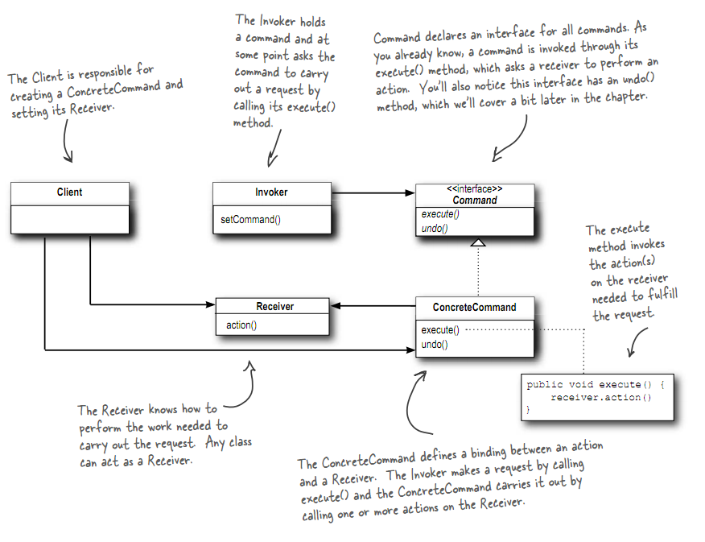

# 命令模式
## 理念
将"请求"封装成对象, 以便使用不同的请求, 队列或者日志来参数化其他对象. 命令模式也支持可撤销的操作

## 类图


## 例子
下例中, 简单遥控器(SimpleRemoteControl)相当于Invoker, 电灯(Light)和车库门(GarageDoor)相当于Receiver, 来具体执行命令
```C++
#include <iostream>

using namespace std;

class Light
{
public:
    void on() { cout << "Light On" << endl; }
    void off() { cout << "Light Off" << endl; }
};

class GarageDoor
{
public:
    void up() { cout << "Garage Door Up" << endl; }
    void down() { cout << "Garage Door Down" << endl; }
};

class Command
{
public:
    virtual void execute() = 0;
};

class LightOnCommand: public Command
{
private:
    Light light;
public:
    LightOnCommand(Light light)
    {
        this->light = light;
    }
    void execute()
    {
        light.on();
    }
};

class GarageDoorOpenCommand: public Command
{
private:
    GarageDoor garageDoor;
public:
    GarageDoorOpenCommand(GarageDoor garageDoor)
    {
        this->garageDoor = garageDoor;
    }
    void execute()
    {
        garageDoor.up();
    }
};

class SimpleRemoteControl
{
private:
    Command* pSlot;
public:
    SimpleRemoteControl() {}
    void setCommand(Command* pCmd)
    {
        pSlot = pCmd;
        if (pSlot == NULL)
            cout << "Init Failed" << endl;
    }
    void buttonWasPressed()
    {
        if (pSlot != NULL)
            pSlot->execute();
    }
};

int main(int argc, char* argv[])
{
    SimpleRemoteControl rc;
    Light light;
    LightOnCommand loc(light);
    GarageDoor garageDoor;
    GarageDoorOpenCommand gdoc(garageDoor);
    rc.setCommand(&loc);
    rc.buttonWasPressed();
    rc.setCommand(&gdoc);
    rc.buttonWasPressed();
    return 0;
}
```
