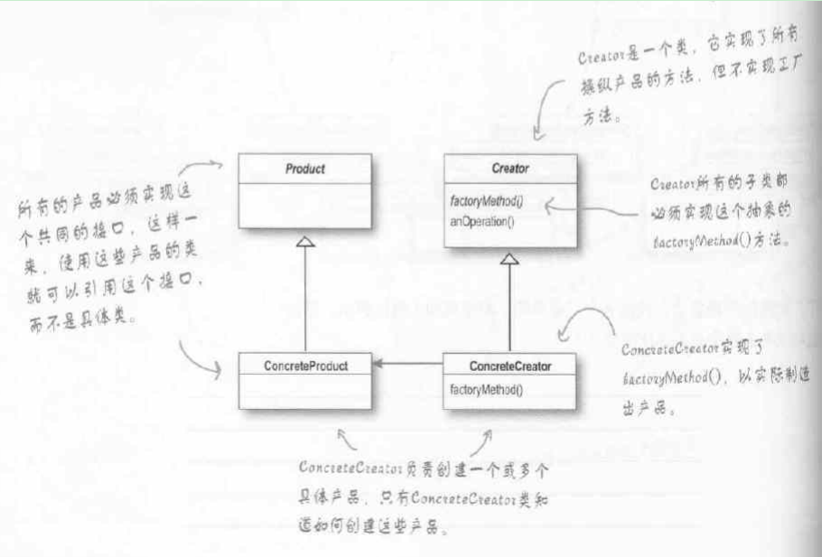
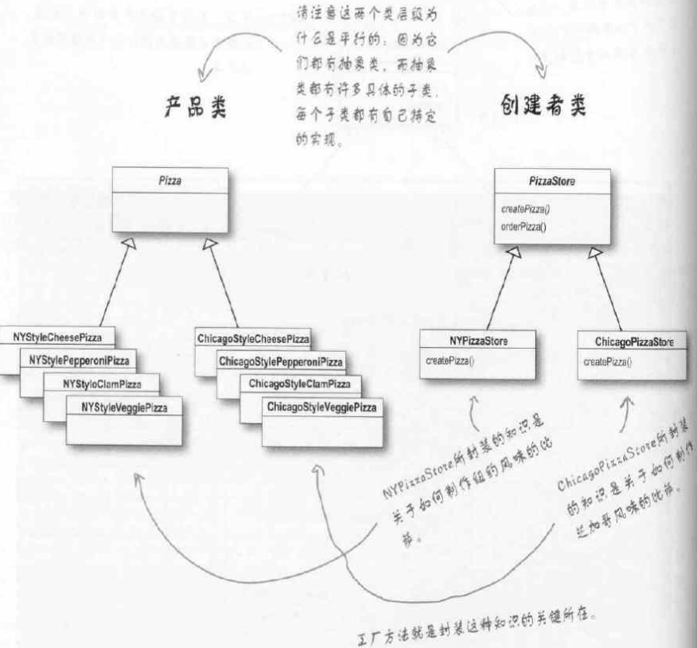

# 工厂模式
## 工厂方法:
### 理念
定义一个创建对象的接口, 但由子类决定要实例化的类是哪一个. 工厂方法让类把实例化推迟到子类

下面类图中, 产品是抽象的, 创建者提供了一个抽象的工厂方法(Factory Method)作为接口, 实体创建者实现工厂方法, 进行产品的生产



### 例子1
一个文件分割器, 可以分割二进制文件, 图片和视频
``` C++
#include <QDebug>

/* 抽象的东西 */
//抽象产品
class ISplitter
{
public:
    virtual void split() = 0;
    virtual ~ISplitter() {}
};

//抽象工厂
class SplitterFactory
{
public:
    virtual ISplitter* createSplitter() = 0;
    virtual ~SplitterFactory();
};

/* 具体的东西 */
//具体产品, 二进制分割器
class BinSplitter: public ISplitter
{
public:
    void split() { qDebug() << "split bin"; }
};

//具体产品, 图片分割器
class PicSplitter: public ISplitter
{
public:
    void split() { qDebug() << "split pic"; }
};

//具体工厂, 二进制分割器工厂
class BinSplitterFactory: public SplitterFactory
{
public:
    virtual ISplitter* createSplitter() {
        return new BinSplitter();
    }
};

//具体工厂, 图片分割器工厂
class PicSplitterFactory: public SplitterFactory
{
public:
    virtual ISplitter* createSplitter() {
        return new PicSplitter();
    }
};

//业务函数
void TaskFunction(SplitterFactory* factory)
{
    ISplitter* splitter = factory->createSplitter();
    splitter->split();
}
```

### 例子2
#### 总述
下例中Pizza是产品(抽象的), 
实体产品为:
纽约风味的芝士比萨(NYStyleCheesePizza)
芝加哥风味芝士比萨(ChicagoStyleCheesePizza)

抽象创建者为比萨店(PizzaStore), 接口为`createPizza`(工厂方法)
实体创建者为:
纽约比萨店(NYPizzaStore)
芝加哥比萨店(ChicagoPizzaStore)

#### 代码
```C++
#include <iostream>
#include <string>
#include <vector>

using namespace std;

// 抽象产品
class Pizza
{
protected:
    string name;
    string dough;
    string sauce;
    vector<string> toppings;
public:
    void prepare()
    {
        cout << "Preparing " << name << endl;
        cout << "Tossing dough..." << endl;
        cout << "Adding sauce..." << endl;
        cout << "Adding toppings: " << endl;
        for (int i = 0; i < toppings.size(); ++i)
            cout << "   " << toppings[i] << endl;
    }
    virtual void bake()
    {
        cout << "Bake for 25 minutes..." << endl;
    }
    virtual void cut()
    {
        cout << "Cutting the pizza into diagonal slices" << endl;
    }
    virtual void box()
    {
        cout << "Place pizza in official PizzaStore box" << endl;
    }
    string getName() { return name; }
};

//具体产品
class NYStyleCheesePizza: public Pizza
{
public:
    NYStyleCheesePizza()
    {
        name = "NY Style Sauce and Cheese Pizza";
        dough = "Thin Crust Dough";
        sauce = "Marinara Sauce";
        toppings.push_back("Grated Reggiano Cheese");
    }
};

//具体产品
class ChicagoStyleCheesePizza: public Pizza
{
public:
    ChicagoStyleCheesePizza()
    {
        name = "Chicago Style Sauce and Cheese Pizza";
        dough = "Extra Thick Crust Dough";
        sauce = "Plum Tomato Sauce";
        toppings.push_back("Shredded Mozzarella Cheese");
    }
    void cut()
    {
        cout << "Cutting the pizza into square slices" << endl;
    }
};

//抽象工厂
class PizzaStore
{
public:
    virtual Pizza* createPizza(string type) = 0;
    Pizza* orderPizza(string type)
    {
        Pizza* pizza = createPizza(type);
        if (pizza != NULL)
        {
            pizza->prepare();
            pizza->bake();
            pizza->cut();
            pizza->box();
        }
        return pizza;
    }
};

//具体工厂
class NYPizzaStore: public PizzaStore
{
public:
    Pizza* createPizza(string type)
    {
        Pizza* pizza = NULL;
        if (type == "cheese")
            pizza = new NYStyleCheesePizza();
        return pizza;
    }
};

//具体工厂
class ChicagoPizzaStore: public PizzaStore
{
public:
    Pizza* createPizza(string type)
    {
        Pizza* pizza = NULL;
        if (type == "cheese")
            pizza = new ChicagoStyleCheesePizza();
        return pizza;
    }
};

int main(int argc, char* argv[])
{
    // 通过两个
    PizzaStore* pNYPizzaStore = new NYPizzaStore();
    PizzaStore* pChicagoPizzaStore = new ChicagoPizzaStore();
    
    if (pNYPizzaStore == NULL || pChicagoPizzaStore == NULL)
    {
        cout << "Create Store Error" << endl;
        return -1;
    }
    
    Pizza* pizza = pNYPizzaStore->orderPizza("cheese");
    if (pizza != NULL)
        cout << "Tom got a " << pizza->getName() << endl;
    else
        cout << "Order pizza failed" << endl;
    if (pizza != NULL)
        delete pizza;
    
    cout << "----------------------------" << endl;
    
    pizza = pChicagoPizzaStore->orderPizza("cheese");
    if (pizza != NULL)
        cout << "Jimmy got a " << pizza->getName() << endl;
    else
        cout << "Order pizza failed" << endl;
    if (pizza != NULL)
        delete pizza;
    delete pNYPizzaStore;
    delete pChicagoPizzaStore;
    
    return 0;
}
```

输出为:
```
Preparing NY Style Sauce and Cheese Pizza
Tossing dough...
Adding sauce...
Adding toppings: 
   Grated Reggiano Cheese
Bake for 25 minutes...
Cutting the pizza into diagonal slices
Place pizza in official PizzaStore box
Tom got a NY Style Sauce and Cheese Pizza
----------------------------
Preparing Chicago Style Sauce and Cheese Pizza
Tossing dough...
Adding sauce...
Adding toppings: 
   Shredded Mozzarella Cheese
Bake for 25 minutes...
Cutting the pizza into square slices
Place pizza in official PizzaStore box
Jimmy got a Chicago Style Sauce and Cheese Pizza
```

#### 类图


## 抽象工厂
### 理念
提供一个接口, 用于创建相关或依赖对象的家族, 而不需要明确指定具体类
当需要创建产品家族, 或想让相关产品集合起来时, 可以使用抽象工厂

### 例子
待做


